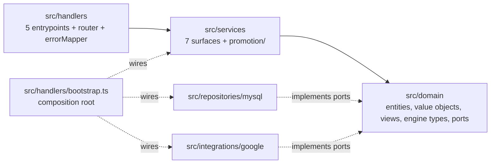

# PR Walkthrough — the `slatwall-ts` Lambda port

## 1. Purpose and how to use this walkthrough

This pull request ports a bounded **catalog + promotions/pricing** slice of **Slatwall 3.1.39** (the
release in the repository-root `version.txt`) from its CFML/Hibachi host to strict-mode TypeScript
for the AWS Lambda `nodejs20.x` runtime. The port lives in one new subtree, `slatwall-ts/`, reads and
writes the existing `Sw*` MySQL tables unchanged, and leaves the legacy CFML tree untouched. It is
written for the engineer reviewing the PR: it says what the change delivers, how the change set is
organised, what order to read it in, where the behaviour-preservation evidence lives, how to
reproduce every gate, and what is still open. It is a guided tour, not a second copy of the detail:
[`slatwall-ts/README.md`](../../slatwall-ts/README.md) is the operator and contributor reference, and
[`Project Guide.md`](Project%20Guide.md) is the delivery status report. Every figure below was
measured from the tree at the head of this branch; where it differs from the Agent Action Plan
(AAP), the measured figure is stated and the AAP figure is noted.

## 2. The PR at a glance

| Item                         | Value                                                                                                            |
| ---------------------------- | ---------------------------------------------------------------------------------------------------------------- |
| Base                         | `origin/master` @ `073b02c28` (`git merge-base HEAD origin/master` = `073b02c2898b6f80cbc2ae00d5b16c7bbaa65b84`) |
| Head before this walkthrough | `8be4d3e2d` — 46 commits, 175 files changed, 235,648 insertions, 0 deletions                                     |
| Added by this walkthrough    | one file (this one) in one commit — 47 commits and 176 files in total                                            |
| Change type                  | additions only: every entry of `git diff --name-status` is `A`; none is `M`, `D` or `R`                          |
| Tracked files in the subtree | 174 (`git -C slatwall-ts ls-files \| wc -l`)                                                                     |
| Legacy tree after the change | 418 `.cfc` and 562 `.cfm` files outside `slatwall-ts/`, none modified                                            |

### Files by area (before this walkthrough)

| Area                                      |   Files | Lines added | Contents                                                                                                                               |
| ----------------------------------------- | ------: | ----------: | -------------------------------------------------------------------------------------------------------------------------------------- |
| `slatwall-ts/` root artifacts             |      13 |       8,170 | manifests, lockfile (3,339 lines), compiler/lint/format/test/bundle config, `.env.example`, `.gitignore`, `README.md`, `NOTICE-GPL.md` |
| `slatwall-ts/src/domain/`                 |      40 |      19,492 | 18 entities, 3 value objects, 3 order views, 3 engine type contracts, 13 ports                                                         |
| `slatwall-ts/src/services/`               |      16 |      11,137 | 7 service surfaces and the 9-module promotion decomposition                                                                            |
| `slatwall-ts/src/repositories/`           |      13 |      15,012 | pool, dialect, 6 MySQL repositories, 5 extracted SQL builders                                                                          |
| `slatwall-ts/src/handlers/`               |       8 |      14,302 | composition root, router, error mapper, 5 capability entrypoints                                                                       |
| `slatwall-ts/src/integrations/`           |       5 |       2,262 | integration contract and the 4-module Google feed adapter                                                                              |
| `slatwall-ts/src/lib/`                    |       7 |       4,561 | configuration, logger, 5 CFML semantic-parity helpers                                                                                  |
| `slatwall-ts/tests/unit/`                 |      58 |     118,422 | isolated unit suites                                                                                                                   |
| `slatwall-ts/tests/integration/`          |       7 |      23,572 | SQL shape and parameter-binding suites (no live server)                                                                                |
| `slatwall-ts/tests/fixtures/`, `setup.ts` |       6 |      10,001 | 5 fixture factories and the shared setup module                                                                                        |
| `slatwall-ts/tests/traceability/`         |       1 |       8,112 | `legacyTestMap.ts`, the executable traceability register (173 tests)                                                                   |
| `blitzy/documentation/Project Guide.md`   |       1 |         605 | delivery status report                                                                                                                 |
| **Total**                                 | **175** | **235,648** |                                                                                                                                        |

Outside `slatwall-ts/` the PR adds exactly two files, both documentation:
`blitzy/documentation/Project Guide.md` and this walkthrough.

### What did NOT change

- **No existing file is modified, renamed or deleted** — not a `.cfc`, `.cfm`, `.json`, the root
  `readme.md`, the root `.gitignore`, nor anything under `org/Hibachi/`.
- **No schema change.** No migration, DDL, new table or column change exists in the change set; the
  subtree ships no schema definition and must be pointed at an existing `Sw*` database.
- **No infrastructure or pipeline.** No Terraform, CDK, SAM, `serverless.yml`, CloudFormation,
  Dockerfile or CI workflow is added. "Deployable" means `npm run package` succeeds.

### Commit timeline

The 46 commits before this walkthrough, grouped by phase in the order they landed (numbers are
positions in `git log --reverse 073b02c28..HEAD`):

| #     | Dates (2026)  | Phase                             | What landed                                                                                                                                                 |
| ----- | ------------- | --------------------------------- | ----------------------------------------------------------------------------------------------------------------------------------------------------------- |
| 1–5   | 07-31         | Setup                             | Node 20.20.2 pin, manifests, strict TypeScript/ESLint/Prettier, Vitest, esbuild packaging, environment contract, licence notice                             |
| 6–7   | 07-31         | Foundations                       | configuration, structured logging, build/test/lint gates; domain ports, CFML parity helpers, MySQL dialect resolver                                         |
| 8–10  | 07-31         | Domain                            | catalog/promotion entities, money value objects, HTTP routing, MySQL access; pricing and promotion entities and their suites                                |
| 11    | 07-31         | Foundations hardening             | log redaction and failure-tolerant log emission                                                                                                             |
| 12–20 | 07-31 – 08-01 | Services, promotion, repositories | option and rounding-rule services, extracted SQL, remaining entities, feed renderer and service, all six repositories, the nine promotion modules, fixtures |
| 21–23 | 08-03         | Hardening and promotion facade    | persistence/security/currency hardening, the `PromotionService` facade, QA fixes in price-group/rounding                                                    |
| 24–28 | 08-04         | Composition root                  | `bootstrap.ts`, promotion characterization suites, review and QA fixes on the composition surface                                                           |
| 29–35 | 08-05         | Handlers and packaging            | the five capability entrypoints, their suites, the archive stage, review/QA fixes, README and traceability completion                                       |
| 36–45 | 08-06 – 08-07 | Review and QA hardening           | configuration, authorization and persistence fidelity; code and security review rounds; SKU-code conflict safety (409)                                      |
| 46    | 08-07         | Project Guide                     | `blitzy/documentation/Project Guide.md`                                                                                                                     |

## 3. Architecture map

The subtree is ports-and-adapters (hexagonal). Dependencies point inward to the domain; the adapters
implement the domain's ports; one module wires the two halves together.



| Concern                     | Where it is enforced                                                                                                                                                                                                                                                                                                                                                                         |
| --------------------------- | -------------------------------------------------------------------------------------------------------------------------------------------------------------------------------------------------------------------------------------------------------------------------------------------------------------------------------------------------------------------------------------------- |
| Composition root            | [`src/handlers/bootstrap.ts`](../../slatwall-ts/src/handlers/bootstrap.ts) — `bootstrapCompositionRoot` builds the wiring once per container; `createRequestGraph` builds request-scoped services per invocation. Replaces the DI/1 convention scan.                                                                                                                                         |
| Dependency rule             | [`eslint.config.mjs`](../../slatwall-ts/eslint.config.mjs) — `OUTWARD_LAYERS = ['repositories', 'handlers', 'integrations']` and `OUTWARD_PACKAGE_PATTERNS` (`mysql2`, `dotenv`, `aws-lambda`, `@types/aws-lambda`, `@aws-sdk/**`) are forbidden to `src/domain/**/*.ts` through `no-restricted-imports` at severity `error`. `tsconfig.json` declares no `paths`/`baseUrl` to slip past it. |
| No barrels                  | the same file's `BARREL_PATTERNS` (`**/index.{ts,js,mts,mjs,cts,cjs}`) is applied to every `.ts` file; the tree contains zero `index.*` files.                                                                                                                                                                                                                                               |
| Anti-corruption order views | [`src/domain/views/`](../../slatwall-ts/src/domain/views/) — `orderView.ts`, `orderItemView.ts`, `orderFulfillmentView.ts` are read-only inputs. The out-of-scope order aggregate drives the engines without being ported or mutated; the engines return intents.                                                                                                                            |

The six transformation rules, each tied to the files that carry it:

| Rule | Legacy construct                                                | Target construct and files                                                                                                                                                                                  |
| ---- | --------------------------------------------------------------- | ----------------------------------------------------------------------------------------------------------------------------------------------------------------------------------------------------------- |
| T1   | DI/1 convention scan of `property name="xService";`             | constructor parameters typed to ports, wired once in `src/handlers/bootstrap.ts`                                                                                                                            |
| T2   | `getService("…")` locator calls inside entities                 | ports injected into `src/domain/entities/sku.ts` and `product.ts`; README "The T2 count, scoped" lists the ten legacy call sites                                                                            |
| T3   | Hibernate ORM, `ORMExecuteQuery`, `<cfquery>`, lazy collections | `src/repositories/mysql/*.ts` over `mysql2` prepared statements; complex statements in `src/repositories/mysql/sql/*.sql.ts`; associations materialized at hydration                                        |
| T4   | `precisionEvaluate` and CFML numeric duality                    | [`src/domain/valueObjects/money.ts`](../../slatwall-ts/src/domain/valueObjects/money.ts) (`Money` over `decimal.js`) as the only arithmetic surface, with `src/lib/cfml/precision.ts` and `numberFormat.ts` |
| T5   | FW/1 subsystem routing and the `.cfm` feed view                 | `ROUTE_TABLE` in [`src/handlers/router.ts`](../../slatwall-ts/src/handlers/router.ts) and the pure `renderGoogleProductFeed` in `src/integrations/google/rssFeedRenderer.ts`                                |
| T6   | ambient `getHibachiScope()` / `getSlatwallScope()`              | explicit context parameters, e.g. `PriceGroupService.calculateSkuPriceBasedOnCurrentAccount(sku, context)` and the `FeedCriteria` (`feedHost`, `now`) passed to `generateProductFeed`                       |

Module-scope mutable state is limited to five bindings, none holding request data:
`memoizedPool` and `memoizedExecutor` (`src/repositories/mysql/connection.ts`),
`memoizedCompositionRoot` (`src/handlers/bootstrap.ts`), `memoizedConfiguration`
(`src/lib/config.ts`) and `adoptedThreshold` (`src/lib/logger.ts`). Every legacy component-level
cache became request-scoped.

## 4. Guided reading order

Read bottom-up: tooling, then the helpers everything imports, then the domain, services, adapters,
the entrypoints that wire them, and finally the tests. Paths below are relative to `slatwall-ts/`
unless they start with a legacy directory (`model/`, `integrationServices/`, `config/`, `meta/`).

### 4.1 Tooling and root manifests

- **Files:** `package.json`, `package-lock.json`, `.nvmrc`, `tsconfig.json`, `tsconfig.build.json`,
  `eslint.config.mjs`, `.prettierrc.json`, `vitest.config.ts`, `esbuild.config.mjs`, `.env.example`,
  `.gitignore`, `README.md`, `NOTICE-GPL.md` — 13 files.
- **Legacy source:** none for the manifests; the CFML tree has no package manifest.
  `.env.example` follows `config/configApplication.cfm` (datasource name `Slatwall`) and
  `config/configORM.cfm` (dialect probe); `NOTICE-GPL.md` carries forward the attribution and the
  License section of `readme.md`.
- **Look for:**
  - 13 direct dependencies, all exact pins: runtime `decimal.js` 10.6.0, `mysql2` 3.23.1, `zod` 4.4.3;
    development `typescript` 5.9.3, `@types/node` 20.19.43, `@types/aws-lambda` 8.10.162, `vitest`
    4.1.10, `@vitest/coverage-v8` 4.1.10, `esbuild` 0.28.1, `eslint` 10.8.0, `typescript-eslint`
    8.65.0, `prettier` 3.9.6, `dotenv` 17.4.2.
  - Node pin `20.20.2` in `.nvmrc`; `engines` `node ">=20.19.0 <21"`, `npm ">=10.8.2"`.
  - `tsconfig.json`: `target` ES2022, `module`/`moduleResolution` NodeNext, `strict`,
    `noUncheckedIndexedAccess`, `exactOptionalPropertyTypes`, `noImplicitOverride`, `noUnusedLocals`,
    `skipLibCheck: false`.
  - `esbuild.config.mjs`: `platform: 'node'`, `target: 'node20'`, `format: 'cjs'`, `.cjs` output,
    `sourcesContent: true`, `minify: false`, `legalComments: 'inline'`; the `--zip` stage writes one
    archive per entrypoint with `NOTICE-GPL.md` at its root, using `node:zlib`.
  - `vitest.config.ts`: coverage floors lines 80, statements 80, functions 80, branches 70, whole-tree
    (`perFile: false`).
  - `.env.example`: 19 variables — 18 deployable plus the harness-only `TEST_LIVE_DATABASE` — and no
    credential.
- **Pinned by:** `tests/traceability/legacyTestMap.ts` — `A16` (the Node pin across every artifact
  that states it, against `FROZEN_NODE_VERSION = '20.20.2'`), `A17` (package shape), `A29` (the
  4,096-byte Lambda environment budget), `A22` (README accuracy).

### 4.2 `src/lib/` — CFML parity helpers, configuration, logger

| File                           | Exports                                                                       | Legacy semantics it reproduces                                                                                                   |
| ------------------------------ | ----------------------------------------------------------------------------- | -------------------------------------------------------------------------------------------------------------------------------- |
| `src/lib/cfml/truthiness.ts`   | `isNullish`, `cfLen`, `cfTruthy`, `cfBoolean`                                 | `isNull()` / `len()` truthiness, e.g. the eligibility gate `if(len(setting('skuEligibleCurrencies')))` in `model/entity/Sku.cfc` |
| `src/lib/cfml/list.ts`         | `listLen`, `listGetAt`, `listAppend`, `listToArray`, `listFindNoCase`         | CFML comma lists; comma-list parameters and returns are kept for signature parity                                                |
| `src/lib/cfml/struct.ts`       | `structKeyExists`, `structFindKey`, `cfFoldKey`, `structKeyList`, `structGet` | case-insensitive struct keys                                                                                                     |
| `src/lib/cfml/numberFormat.ts` | `numberFormat`, `cfNumberToString`, `cfNumericEquals`, `toDecimalString`      | `numberFormat(v,"0.00")` and CFML trailing-zero stringification, which `roundValue` depends on                                   |
| `src/lib/cfml/precision.ts`    | `add`, `subtract`, `multiply`, `divide`, `absolute`, `fromInteger`            | `precisionEvaluate` over decimals                                                                                                |
| `src/lib/config.ts`            | `appConfig`, `parseHostAuthority`                                             | `config/configApplication.cfm` and `config/configORM.cfm`; the only runtime reader of `process.env` under `src/`                 |
| `src/lib/logger.ts`            | `logger`                                                                      | net-new: structured JSON to stdout, fail-closed redaction, no imports                                                            |

- **Look for:** configuration reports every problem at once and never echoes a value;
  `DB_TLS_MODE=disabled` is refused unless `DB_HOST` is a literal loopback address; `logger.ts` reads
  no environment variable (the threshold is handed over by the composition root).
- **Pinned by:** `tests/unit/lib/cfml/{truthiness,list,struct,numberFormat,precision}.test.ts`,
  `tests/unit/lib/config.test.ts`, `tests/unit/lib/logger.test.ts`.

### 4.3 `src/domain/` — value objects, entities, views, engine types, ports

**Value objects** (`src/domain/valueObjects/`): `money.ts` (`Money`, the only arithmetic surface for
money), `currencyCode.ts` (branded three-letter code), `materializedIdPath.ts` (comma-delimited ID
path walking for `productTypeIDPath`, `priceGroupIDPath` and `categoryIDPath`). Pinned by
`tests/unit/domain/valueObjects/{money,currencyCode,materializedIdPath}.test.ts`.

**Entities** (`src/domain/entities/`, 18 classes, one per legacy entity, each pinned by
`tests/unit/domain/entities/<name>.test.ts`):

| Target                                                                                       | Legacy source                                                                                      | What to look for                                                                                                                                                                                |
| -------------------------------------------------------------------------------------------- | -------------------------------------------------------------------------------------------------- | ----------------------------------------------------------------------------------------------------------------------------------------------------------------------------------------------- |
| `sku.ts` (`Sku`)                                                                             | `model/entity/Sku.cfc`                                                                             | `getCurrencyDetails()` four-step cascade; `getPriceByCurrencyCode` / `getListPriceByCurrencyCode` / `getRenewalPriceByCurrencyCode` return `Money \| undefined`; `getPriceByPromotion(): never` |
| `product.ts` (`Product`)                                                                     | `model/entity/Product.cfc`                                                                         | `getSkuBySelectedOptions` / `getSkusBySelectedOptions`; `getProductURL`; `getBrandName` memo divergence                                                                                         |
| `skuCurrency.ts`, `productType.ts`, `brand.ts`, `category.ts`, `option.ts`, `optionGroup.ts` | `SkuCurrency.cfc`, `ProductType.cfc`, `Brand.cfc`, `Category.cfc`, `Option.cfc`, `OptionGroup.cfc` | `productTypeIDPath`; `Category`'s inert CMS columns (`cmsCategoryID`, `site`); option-group sort order                                                                                          |
| `promotion.ts`, `promotionCode.ts`, `promotionPeriod.ts`                                     | `Promotion.cfc`, `PromotionCode.cfc`, `PromotionPeriod.cfc`                                        | current/deletable flags; `PromotionPeriod.isCurrent(now?: Date)` under an explicit UTC policy                                                                                                   |
| `promotionQualifier.ts`, `promotionReward.ts`                                                | `PromotionQualifier.cfc`, `PromotionReward.cfc`                                                    | the include/exclude collections; `amount` as `Money`; the `promtionRewards` permission typo                                                                                                     |
| `promotionApplied.ts`, `promotionAccount.ts`                                                 | `PromotionApplied.cfc`, `PromotionAccount.cfc`                                                     | order foreign keys as opaque string IDs; no service, legacy or ported, references `PromotionAccount`                                                                                            |
| `priceGroup.ts`, `priceGroupRate.ts`, `roundingRule.ts`                                      | `PriceGroup.cfc`, `PriceGroupRate.cfc`, `RoundingRule.cfc`                                         | `getPriceGroupIDPath`; the `preInsert`/`preUpdate` hooks as explicit path maintenance; `RoundingRule.roundValue(value: Money)`                                                                  |

**Order views** (`src/domain/views/orderView.ts`, `orderItemView.ts`, `orderFulfillmentView.ts`) and
**engine types** (`src/domain/promotionEngine/qualificationTypes.ts`, `rewardUsageTypes.ts`,
`qualifiedDiscountTypes.ts`) are type-only shapes derived from the `order.*` accessors and local structs
the engines use in `model/service/PromotionService.cfc` and `PriceGroupService.cfc`. Being type-only,
they are exempt from coverage by construction.

**Ports** (`src/domain/ports/`, 13 interfaces, type-only): `productRepository`, `skuRepository`,
`optionRepository`, `productTypeRepository`, `promotionRepository`, `priceGroupRepository` (one per
legacy DAO under `model/dao/`), `settingsProvider` (four keys: `skuCurrency`, `skuEligibleCurrencies`,
`globalURLKeyProduct`, `globalURLKeyProductType`), `currencyConverter`, `addressZoneEvaluator`,
`urlTitleGenerator`, `imageStore` and `subscriptionTermProvider` (stub ports for out-of-scope
branches), and `productFeedPort` (`generateProductFeed(criteria: FeedCriteria): Promise<string>`).
Look for: no port imports anything outward, and `priceGroupRepository` documents its read-only
reach-through to the subscription tables.

### 4.4 `src/services/` — seven surfaces and the promotion decomposition

| Target                   | Legacy source                           | What to look for                                                                                                                                                | Suite                                             |
| ------------------------ | --------------------------------------- | --------------------------------------------------------------------------------------------------------------------------------------------------------------- | ------------------------------------------------- |
| `productService.ts`      | `model/service/ProductService.cfc`      | `getProductSkusBySelectedOptions`; `findProducts` (was `getProductSmartList`); `productUpdateSkusSchema` (zod, from `model/validation/Product_UpdateSkus.json`) | `tests/unit/services/productService.test.ts`      |
| `skuService.ts`          | `model/service/SkuService.cfc`          | `createSkus` cartesian product; `getSortedProductSkus`; `findSkus` (was `getSkuSmartList`)                                                                      | `tests/unit/services/skuService.test.ts`          |
| `brandService.ts`        | `model/service/BrandService.cfc`        | `saveBrand` with the URL-title port                                                                                                                             | `tests/unit/services/brandService.test.ts`        |
| `optionService.ts`       | `model/service/OptionService.cfc`       | three methods; comma-list parameter kept                                                                                                                        | `tests/unit/services/optionService.test.ts`       |
| `priceGroupService.ts`   | `model/service/PriceGroupService.cfc`   | the five-level rate chain; the parent-recursion and rounding-rule asymmetries; `updateOrderAmountsWithPriceGroups` returns `PriceGroupAppliedIntent[]`          | `tests/unit/services/priceGroupService.test.ts`   |
| `roundingRuleService.ts` | `model/service/RoundingRuleService.cfc` | `roundValue` reproduces the decimal-string algorithm and returns a branded decimal string                                                                       | `tests/unit/services/roundingRuleService.test.ts` |
| `promotionService.ts`    | `model/service/PromotionService.cfc`    | the facade over the nine modules below; `updateOrderAmountsWithPromotions` returns `PromotionAppliedIntent[]`; the `issue #1766` no-op                          | `tests/unit/services/promotionService.test.ts`    |

The nine promotion modules decompose the legacy `updateOrderAmountsWithPromotions`
(`model/service/PromotionService.cfc:L58`) and its private helpers. Each has a characterization suite
of the same name under `tests/unit/services/promotion/`:

| Module (`src/services/promotion/`) | Exported unit                           | Legacy logic                                                                                                                                                   |
| ---------------------------------- | --------------------------------------- | -------------------------------------------------------------------------------------------------------------------------------------------------------------- |
| `salePriceSeeding.ts`              | `SalePriceSeeder`                       | seeding sale-price rewards into the usage ledger                                                                                                               |
| `promotionPeriodQualification.ts`  | `PromotionPeriodQualificationEvaluator` | `getPromotionPeriodQualificationDetails` (L549), `getPromotionPeriodQualifiedFulfillmentIDList` (L752), `getPromotionPeriodOrderItemQualificationCount` (L783) |
| `qualifierQualification.ts`        | `QualifierQualificationEvaluator`       | `getQualifierQualificationDetails` (L629)                                                                                                                      |
| `orderItemMembership.ts`           | `OrderItemMembership`                   | `getOrderItemInQualifier` (L852) and `getOrderItemInReward` (L921)                                                                                             |
| `discountAmount.ts`                | `DiscountAmountCalculator`              | `getDiscountAmount` (L987)                                                                                                                                     |
| `rewardUsageLedger.ts`             | `RewardUsageLedger`                     | the mutable `promotionRewardUsageDetails` ledger and its two opposing insertion sorts                                                                          |
| `overUseStripping.ts`              | `stripOverUsedRewardDiscounts`          | the over-use correction loop starting at L468                                                                                                                  |
| `promotionApplication.ts`          | `applyBestOrderItemDiscounts`           | applying only the best discount per order item                                                                                                                 |
| `twoPassRewardIterator.ts`         | `TwoPassRewardIterator`                 | the loop-counter reset that runs order-level rewards as a second pass (`orderRewards = true`, L460)                                                            |

### 4.5 `src/repositories/mysql/` — MySQL adapters and extracted SQL

| File                                                                                                                                                                             | Legacy source                                                                                                            |
| -------------------------------------------------------------------------------------------------------------------------------------------------------------------------------- | ------------------------------------------------------------------------------------------------------------------------ |
| `connection.ts` (one module-scope pool, prepared-statement executor)                                                                                                             | `config/configApplication.cfm`                                                                                           |
| `dialect.ts` (`materializedIdPathLikePatternFragment`, `singleRowLimitFragments`, `optionGroupOdometerPowerFragment`)                                                            | `config/configORM.cfm`; the three dialect-branching SQL sites                                                            |
| `mysqlProductRepository.ts`, `mysqlSkuRepository.ts`, `mysqlOptionRepository.ts`, `mysqlProductTypeRepository.ts`, `mysqlPromotionRepository.ts`, `mysqlPriceGroupRepository.ts` | `model/dao/ProductDAO.cfc`, `SkuDAO.cfc`, `OptionDAO.cfc`, `ProductTypeDAO.cfc`, `PromotionDAO.cfc`, `PriceGroupDAO.cfc` |
| `sql/skusBySelectedOptions.sql.ts` (`buildSkusBySelectedOptionsStatement`)                                                                                                       | `SkuDAO.getSkusBySelectedOptions` (`model/dao/SkuDAO.cfc:L107`)                                                          |
| `sql/sortedProductSkus.sql.ts`, `sql/salePricePromotionRewards.sql.ts`, `sql/promotionUseCounts.sql.ts`, `sql/accountSubscriptionPriceGroups.sql.ts`                             | `SkuDAO.cfc`, `PromotionDAO.cfc`, `PriceGroupDAO.cfc`                                                                    |

- **Look for:** every statement is a prepared statement; the in-engine query-of-queries in
  `PromotionDAO` becomes CTEs in `salePricePromotionRewards.sql.ts`; AND-of-EXISTS option matching in
  `skusBySelectedOptions.sql.ts` (one `EXISTS` per selected option); `getActivePromotionRewards`
  applies no `ORDER BY`, exactly as `model/dao/PromotionDAO.cfc` does not, so reward order at a tie
  stays unspecified; SKU-code uniqueness is guarded in application code with `select ... for update`
  in `mysqlSkuRepository.ts`, because an index would be DDL.
- **Pinned by:** `tests/integration/repositories/mysql{Product,Sku,Option,ProductType,Promotion,PriceGroup}Repository.test.ts`,
  `tests/integration/repositories/skusBySelectedOptions.test.ts` and
  `tests/unit/repositories/connection.test.ts`. `dialect.ts` and the four other SQL builders are
  exercised through the repository suites. None of these suites needs a live server: they assert
  statement text and parameter binding against a capturing executor.

### 4.6 `src/handlers/` — router, error mapper, composition root, entrypoints

| File                             | Exported unit                                                                              | Route (`ROUTE_TABLE`)                                              | Admission                                                                                                            |
| -------------------------------- | ------------------------------------------------------------------------------------------ | ------------------------------------------------------------------ | -------------------------------------------------------------------------------------------------------------------- |
| `catalogQueryHandler.ts`         | `handler`, `createCatalogQueryHandler`                                                     | `GET,POST /catalog/products` → `queryCatalog`                      | `accountID` (else 401) and `adminAccountFlag` (else 403)                                                             |
| `skuResolutionHandler.ts`        | `handler`, `createSkuResolutionHandler`                                                    | `GET /catalog/skus` → `resolveSkus`                                | `accountID` (else 401)                                                                                               |
| `promotionApplicationHandler.ts` | `handler`, `createPromotionApplicationHandler`                                             | `POST /promotions/application` → `applyPromotions`                 | `accountID` (else 401) and `serviceScope` naming `promotionApplication` (else 403)                                   |
| `priceResolutionHandler.ts`      | `handler`, `createPriceResolutionHandler`                                                  | `POST /prices/resolution` → `resolvePrices`                        | `accountID`, except the one operation in `ANONYMOUS_PERMITTED_OPERATIONS` (`calculateSkuPriceBasedOnCurrentAccount`) |
| `productFeedHandler.ts`          | `handler`, `createProductFeedHandler`                                                      | `GET /feeds/google/products` → `generateProductFeed`               | no principal; the request `Host` must be in `FEED_ALLOWED_HOSTS`                                                     |
| `router.ts`                      | `ROUTE_TABLE`, `resolveRoute`, `routeRequestFromEvent`                                     | reference port of `getSubsystemDirPrefix` (`Application.cfc:L129`) | none — dispatch only                                                                                                 |
| `errorMapper.ts`                 | `resolveRequestPrincipal`, `principalHasServiceScope`, response builders                   | —                                                                  | reads claims only from `event.requestContext.authorizer`                                                             |
| `bootstrap.ts`                   | `bootstrapCompositionRoot`, `resetCompositionRoot`, `EuropeanCentralBankCurrencyConverter` | —                                                                  | —                                                                                                                    |

- **Look for:** the operation travels as a required `operation` parameter, spelled as the ported
  method; `updateOrderAmountsWithPriceGroupsThenPromotions` in `bootstrap.ts` runs the price-group
  pass before the promotion pass; the currency converter takes its rates from `ECB_REFERENCE_RATES`
  and opens no socket; unknown routes answer 404 and no refusal echoes caller input.
- **Pinned by:** `tests/unit/handlers/{bootstrap,bootstrapStatements,router,errorMapper,catalogQueryHandler,skuResolutionHandler,promotionApplicationHandler,priceResolutionHandler,productFeedHandler}.test.ts`.

### 4.7 `src/integrations/` — the Google product feed

| File                             | Exported unit             | Legacy source                                                                                           |
| -------------------------------- | ------------------------- | ------------------------------------------------------------------------------------------------------- |
| `integrationInterface.ts`        | types only                | `integrationServices/IntegrationInterface.cfc` (type vocabulary `shipping \| payment \| fw1 \| custom`) |
| `google/integration.ts`          | `GoogleIntegration`       | `integrationServices/google/Integration.cfc` and `integrationServices/BaseIntegration.cfc`              |
| `google/googleFeedRepository.ts` | `GoogleFeedRepository`    | `integrationServices/google/model/dao/FeedDAO.cfc` and the filters of `controllers/feed.cfc`            |
| `google/rssFeedRenderer.ts`      | `renderGoogleProductFeed` | `integrationServices/google/views/feed/product.cfm`                                                     |
| `google/googleFeedService.ts`    | `GoogleFeedService`       | net-new orchestration; implements `generateProductFeed`                                                 |

- **Look for:** `GoogleIntegration` publishes eight members (`init`, `getIntegrationTypes` →
  `'fw1'`, `getDisplayName` → `"Google"`, `getSettings`, `getIntegratedSettings`, `getSettingOptions`
  → `undefined`, `getEventHandlers`, `getAdminNavbarHTML`); the feed contract lives on
  `ProductFeedPort`, not on the integration interface; `FEED_ORIGIN_SCHEME_PREFIX = 'http://'` and the
  empty `<g:google_product_category>` element are preserved; no call to Google is made and no
  credential is read.
- **Pinned by:** `tests/unit/integrations/google/{integration,googleFeedRepository,googleFeedService,rssFeedRenderer}.test.ts`.

### 4.8 `tests/` — suites, fixtures, traceability

- **Layout on disk:** 58 unit suites, 7 integration suites, 5 fixture factories
  (`tests/fixtures/{product,sku,promotion,priceGroup,orderView}Fixtures.ts`), `tests/setup.ts` (pins
  `TZ` to UTC and validates `TEST_LIVE_DATABASE`) and the register `tests/traceability/legacyTestMap.ts`
  — 66 test files and 6,719 tests.
- **Legacy-extended versus net-new:** exactly two suites extend legacy coverage —
  `tests/unit/domain/entities/brand.test.ts` (`defaults_are_correct`, from
  `meta/tests/unit/entity/BrandTest.cfc`) and `tests/unit/domain/entities/product.test.ts`
  (`productUrlIsCorrectlyFormatted` with the `nike-air-jorden` fixture, from
  `meta/tests/unit/entity/ProductTest.cfc`). `meta/tests/functional/admin/entity/ProductTest.cfc` is an
  empty stub counted as a gap. Everything else is net-new and labelled so (`A7`, `A8`, `A10`).
- **The register:** `legacyTestMap.ts` runs 173 tests in `describe` blocks labelled `A0` to `A30`
  (there is no `A26`). It partitions the 89 source modules into 64 covered, 25 exempt and 0 pending
  (`A2`), freezes the AAP 0.3.1 census at 165 files and itemises the 9 recorded additions (`A18`),
  derives the defect register and the divergence budget from the source (`A13`, `A13b`, `A25`), and
  holds interface-parity budgets by declaration text (`A12`).

## 5. Behaviour-preservation checklist

Each row names where the behaviour lives (`file` : `symbol`, paths under `slatwall-ts/src/`) and the
suite that pins it (paths under `slatwall-ts/tests/`). Legacy locators were re-read in the CFML source.

### 5.1 The three must-preserve areas

| Behaviour                                                                                  | Lives in                                                                                                                                                                       | Legacy                                                                | Pinned by                                                                                                                                |
| ------------------------------------------------------------------------------------------ | ------------------------------------------------------------------------------------------------------------------------------------------------------------------------------ | --------------------------------------------------------------------- | ---------------------------------------------------------------------------------------------------------------------------------------- |
| Promotion discount math and use-limit enforcement                                          | `services/promotionService.ts` : `PromotionService.updateOrderAmountsWithPromotions`, over `services/promotion/*`                                                              | `model/service/PromotionService.cfc:L58`                              | `unit/services/promotionService.test.ts` and the nine `unit/services/promotion/*.test.ts` suites                                         |
| Discount amount per amount type (reference: 19.99 × 3 less 12.5% presents as `"52.47"`)    | `services/promotion/discountAmount.ts` : `DiscountAmountCalculator.getDiscountAmount`                                                                                          | `PromotionService.cfc:L987`                                           | `unit/services/promotion/discountAmount.test.ts`, `unit/domain/valueObjects/money.test.ts`                                               |
| Over-use stripping indexed by the leaked `reward` variable                                 | `services/promotion/overUseStripping.ts` : `stripOverUsedRewardDiscounts`                                                                                                      | `PromotionService.cfc:L468` (loop), `:L472` (leaked index)            | `unit/services/promotion/overUseStripping.test.ts`                                                                                       |
| Two-pass reward iteration, including no second pass on an empty reward list                | `services/promotion/twoPassRewardIterator.ts` : `TwoPassRewardIterator`                                                                                                        | `PromotionService.cfc:L460` (`orderRewards = true`)                   | `unit/services/promotion/twoPassRewardIterator.test.ts`                                                                                  |
| Two opposing insertion sorts over the usage ledger                                         | `services/promotion/rewardUsageLedger.ts` : `RewardUsageLedger`                                                                                                                | `PromotionService.cfc:L299` (`discountPerUseValue`)                   | `unit/services/promotion/rewardUsageLedger.test.ts`                                                                                      |
| Five-level price-group rate cascade, with the parent recursion calling the product variant | `services/priceGroupService.ts` : `PriceGroupService.getRateForSkuBasedOnPriceGroup`                                                                                           | `model/service/PriceGroupService.cfc:L140`, `:L174`                   | `unit/services/priceGroupService.test.ts` ("the five-level cascade" describes, including "DEFECT 7")                                     |
| Four-step currency cascade behind the `skuEligibleCurrencies` gate                         | `domain/entities/sku.ts` : `Sku.getCurrencyDetails`                                                                                                                            | `model/entity/Sku.cfc:L367`                                           | `unit/domain/entities/sku.test.ts` ("Sku.getCurrencyDetails — the four-step cascade")                                                    |
| `USD` is a setting default, not an entity literal                                          | `domain/ports/settingsProvider.ts`; `handlers/bootstrap.ts` : `BootstrapSettingsProvider`                                                                                      | `model/service/SettingService.cfc:L221`                               | `unit/handlers/bootstrap.test.ts`, `unit/domain/entities/sku.test.ts`                                                                    |
| Option-to-SKU resolution by AND-of-EXISTS matching                                         | `services/productService.ts` : `ProductService.getProductSkusBySelectedOptions`; `repositories/mysql/sql/skusBySelectedOptions.sql.ts` : `buildSkusBySelectedOptionsStatement` | `model/service/ProductService.cfc:L104` → `model/dao/SkuDAO.cfc:L107` | `integration/repositories/skusBySelectedOptions.test.ts`, `unit/services/productService.test.ts`, `unit/domain/entities/product.test.ts` |

### 5.2 Cross-cutting guarantees

| Guarantee                                                                                                                                                                                                                                                                        | Lives in                                                                                                                                                                                                                                                                                                                                                      | Pinned by                                                                                                                                                                                                                                                      |
| -------------------------------------------------------------------------------------------------------------------------------------------------------------------------------------------------------------------------------------------------------------------------------- | ------------------------------------------------------------------------------------------------------------------------------------------------------------------------------------------------------------------------------------------------------------------------------------------------------------------------------------------------------------- | -------------------------------------------------------------------------------------------------------------------------------------------------------------------------------------------------------------------------------------------------------------- |
| **Price-group pass before promotion pass.** The promotion pass reads what the price-group pass writes (guard at `PromotionService.cfc:L241`)                                                                                                                                     | `handlers/bootstrap.ts` : `updateOrderAmountsWithPriceGroupsThenPromotions`                                                                                                                                                                                                                                                                                   | `unit/services/promotionService.test.ts` ("★★★ the cross-service ordering constraint", including "REVERSING the two passes produces a DIFFERENT discount"); `unit/handlers/bootstrap.test.ts` ("runs the price-group pass strictly BEFORE the promotion pass") |
| **`undefined`, never zero.** A missing currency, list or renewal price returns `undefined`                                                                                                                                                                                       | `domain/entities/sku.ts` : `Sku.getPriceByCurrencyCode`, `getListPriceByCurrencyCode`, `getRenewalPriceByCurrencyCode` (`Money \| undefined`)                                                                                                                                                                                                                 | `unit/domain/entities/sku.test.ts` ("Sku currency accessors — undefined is never zero"); legacy `model/entity/Sku.cfc:L269-L285`                                                                                                                               |
| **Defects reproduced, not repaired.** Every reproduced site carries `// LEGACY-DEFECT [<path>:<locator>]`                                                                                                                                                                        | 110 marker lines in 46 files under `src/`, citing 82 distinct legacy locators                                                                                                                                                                                                                                                                                 | `traceability/legacyTestMap.ts` `A13` (derived from the tree) and `A25` (30 numbered, 8 secondary and 4 supplemental register entries, each proven individually)                                                                                               |
| **Exactly three deliberate divergences**: (1) the un-`var`'d `discountAmount` becomes function-local; (2) the `amountOff` branch uses `Money` rather than float multiplication; (3) the entity memo defects are repaired                                                         | `// DELIBERATE DIVERGENCE [...]` at 5 distinct citations: `PromotionService.cfc:L1007` (`services/promotion/discountAmount.ts`, `services/promotionService.ts`), `PromotionService.cfc:L998` (`services/promotionService.ts`), `Sku.cfc:L500-L510` and `Sku.cfc:L512-L522` (`domain/entities/sku.ts`), `Product.cfc:L524-L532` (`domain/entities/product.ts`) | `traceability/legacyTestMap.ts` `A13b` (the budget, derived from disk)                                                                                                                                                                                         |
| **Three signature reshapings, no fourth**: `updateOrderAmountsWithPromotions` returns `PromotionAppliedIntent[]`; `getProductSmartList`/`getSkuSmartList` become `findProducts`/`findSkus`; `product(rc)` becomes `generateProductFeed(criteria: FeedCriteria): Promise<string>` | `services/promotionService.ts`, `services/productService.ts`, `services/skuService.ts`, `domain/ports/productFeedPort.ts`, `integrations/google/googleFeedService.ts`                                                                                                                                                                                         | `traceability/legacyTestMap.ts` `A12` (declaration text)                                                                                                                                                                                                       |
| **Five visibility widenings, no sixth**: the legacy-private `getDiscountAmount`, `getPromotionPeriodQualificationDetails`, `getQualifierQualificationDetails`, `getPromotionPeriodQualifiedFulfillmentIDList` and `getPromotionPeriodOrderItemQualificationCount` are public     | `services/promotionService.ts` : `PromotionService` (delegating to the promotion modules)                                                                                                                                                                                                                                                                     | `traceability/legacyTestMap.ts` `A12`; `unit/services/promotionService.test.ts`                                                                                                                                                                                |
| **One entity-layer widening**: `isCurrent(now?: Date)`, optional so the legacy zero-argument call still works                                                                                                                                                                    | `domain/entities/promotionPeriod.ts` : `PromotionPeriod.isCurrent`                                                                                                                                                                                                                                                                                            | `traceability/legacyTestMap.ts` `A12`; `unit/domain/entities/promotionPeriod.test.ts`                                                                                                                                                                          |
| **A method that throws in the legacy throws here**: `getPriceByPromotion` calls a service method that does not exist                                                                                                                                                             | `domain/entities/sku.ts` : `Sku.getPriceByPromotion(): never`                                                                                                                                                                                                                                                                                                 | `unit/domain/entities/sku.test.ts` ("Sku.getPriceByPromotion — defect 16"); legacy `model/entity/Sku.cfc:L258`                                                                                                                                                 |
| **Preserved TODO `issue #1766`**: the return/exchange branch still does nothing                                                                                                                                                                                                  | `services/promotionService.ts` (`// TODO [issue #1766]` at L690)                                                                                                                                                                                                                                                                                              | `unit/services/promotionService.test.ts` ("★★ issue_1766 - the preserved return/exchange no-op"); `traceability/legacyTestMap.ts` `A11`; legacy `PromotionService.cfc:L543`                                                                                    |
| **Empty `g:google_product_category`** is still emitted empty                                                                                                                                                                                                                     | `integrations/google/rssFeedRenderer.ts` : `GOOGLE_PRODUCT_CATEGORY_ELEMENT`                                                                                                                                                                                                                                                                                  | `unit/integrations/google/rssFeedRenderer.test.ts`; legacy `integrationServices/google/views/feed/product.cfm:L20`                                                                                                                                             |

The legacy `product.cfm:L20` line is a bare empty element with no comment, so the port records it as a
preserved gap rather than a preserved TODO; the other TODOs carried from source are
`model/dao/ProductDAO.cfc:L64`, `model/dao/SkuDAO.cfc:L177`, `model/service/CurrencyService.cfc:L81`
and `model/entity/ProductType.cfc:L93`, each as `// TODO [<legacy locator>]` in the module that owns it.

## 6. How to verify locally

### 6.1 Gates

Node 20.20.2 and npm 10.8.2 must be active (`.nvmrc`). Run from `slatwall-ts/`. Never run
`npm run format`, `npm run lint:fix` or `eslint --fix` while reviewing: they rewrite files.

```bash
cd slatwall-ts
node -v && npm -v
CI=true npm ci --no-audit --no-fund
npm run typecheck
npm run lint
npm run format:check
CI=true npm test
CI=true npm run test:coverage
npm run package
for f in dist/*.cjs; do node -e "console.log('$f ->', typeof require('./$f').handler)"; done
CI=true npm audit --omit=dev
```

| Command                               | Measured result                                                                                                                                                                                                                        |
| ------------------------------------- | -------------------------------------------------------------------------------------------------------------------------------------------------------------------------------------------------------------------------------------- |
| `node -v && npm -v`                   | `v20.20.2`, `10.8.2`                                                                                                                                                                                                                   |
| `CI=true npm ci --no-audit --no-fund` | `added 174 packages`, exit 0                                                                                                                                                                                                           |
| `npm run typecheck`                   | `tsc --noEmit`, exit 0                                                                                                                                                                                                                 |
| `npm run lint`                        | `eslint .`, exit 0                                                                                                                                                                                                                     |
| `npm run format:check`                | `All matched files use Prettier code style!`                                                                                                                                                                                           |
| `CI=true npm test`                    | `Test Files 66 passed (66)`, `Tests 6719 passed (6719)`                                                                                                                                                                                |
| `CI=true npm run test:coverage`       | `All files` 94.03 % statements, 86.18 % branches, 98.11 % functions, 94.02 % lines, against floors of 80 / 70 / 80 / 80 (`vitest.config.ts`)                                                                                           |
| `npm run package`                     | `[esbuild] Bundled 5 Lambda artifact(s) as CommonJS into dist/`; `dist/` holds `{catalogQuery,priceResolution,productFeed,promotionApplication,skuResolution}Handler.{cjs,cjs.map,zip}`; each archive is `[<name>.cjs, NOTICE-GPL.md]` |
| the `for f in dist/*.cjs` loop        | five lines, each ending `-> function`                                                                                                                                                                                                  |
| `CI=true npm audit --omit=dev`        | `found 0 vulnerabilities`                                                                                                                                                                                                              |

`CI=true npm run verify` chains typecheck → lint → format:check → test in one command. The package
step also prints one line per artifact of the form
`Annotations recoverable from <name>.cjs.map: LEGACY-DEFECT xN, DELIBERATE DIVERGENCE x6`; N differs
per artifact because each bundle holds only the modules its entrypoint reaches.

### 6.2 Marker census and the additions-only check

```bash
# from slatwall-ts/
grep -rc 'LEGACY-DEFECT' src | awk -F: '{s+=$2} END {print s}'      # 110
grep -roh 'LEGACY-DEFECT \[[^]]*\]' src | sort -u | wc -l             # 82
grep -roh 'DELIBERATE DIVERGENCE \[[^]]*\]' src | sort -u | wc -l     # 5

# from the repository root
git diff --name-status origin/master...HEAD | cut -f1 | sort | uniq -c   # 176 A
git diff --name-only origin/master...HEAD | grep -v '^slatwall-ts/'      # the two documentation files
```

The last command prints `blitzy/documentation/PR Walkthrough.md` and
`blitzy/documentation/Project Guide.md`.

### 6.3 Optional: the runtime tier

The suites above need no database. Invoking the packaged handlers does: they need a MySQL 8 server
holding the existing `Sw*` schema. The subtree ships **no** schema definition, by design, so point it
at an existing Slatwall database. This follows the README environment contract and Project Guide
9.5; replace every `<…>` placeholder before running.

```bash
# 1. A MySQL 8 server with a Slatwall database that already holds the Sw* tables
docker run -d --name <container> -p 127.0.0.1:<db-port>:3306 \
  -e MYSQL_ROOT_PASSWORD=<db-root-password> -e MYSQL_DATABASE=Slatwall \
  -e MYSQL_USER=<db-user> -e MYSQL_PASSWORD=<db-password> mysql:8.4
docker exec -i <container> mysql -uroot -p<db-root-password> Slatwall < <your-Sw-schema-and-data.sql>
docker exec <container> mysql -u<db-user> -p<db-password> -N -e \
  "SELECT COUNT(*) FROM information_schema.tables WHERE table_schema='Slatwall' AND table_name LIKE 'Sw%';" Slatwall

# 2. The runtime contract (from slatwall-ts/, after npm run package)
export DB_HOST=127.0.0.1 DB_PORT=<db-port> DB_NAME=Slatwall DB_USER=<db-user> DB_PASSWORD=<db-password> \
       DB_TLS_MODE=disabled DB_DIALECT=MySQL NODE_ENV=development LOG_LEVEL=info \
       FEED_ALLOWED_HOSTS=shop.example.com
```

`DB_TLS_MODE=disabled` is accepted only with a literal loopback `DB_HOST`. A deployment's account
needs `SELECT, INSERT, UPDATE, DELETE` on the schema and nothing more (README, "The grant the database
account needs").

Step 3 invokes a bundle in-process with a synthesized API Gateway (REST, v1) proxy event. The
authorizer claims go in `requestContext.authorizer`, which is the only place the handlers read them.

```bash
# 3. invoke <dist/bundle.cjs> <METHOD> <path> ['<json: query for GET, body otherwise>'] ['<claims json>'] [Host]
invoke() {
  node -e '
    const [bundle, method, path, payload, claims, host] = process.argv.slice(1);
    const authorizer = JSON.parse(claims || "{}");
    const isGet = method === "GET";
    const event = {
      resource: path, path, httpMethod: method,
      headers: { Host: host || "shop.example.com", "Content-Type": "application/json" },
      multiValueHeaders: null, pathParameters: null, stageVariables: null, isBase64Encoded: false,
      queryStringParameters: isGet && payload ? JSON.parse(payload) : null,
      multiValueQueryStringParameters: null,
      body: !isGet && payload ? payload : null,
      requestContext: {
        requestId: "local-1", httpMethod: method, path, resourcePath: path, stage: "local",
        identity: { sourceIp: "127.0.0.1" },
        ...(Object.keys(authorizer).length ? { authorizer } : {}),
      },
    };
    const context = { awsRequestId: "local-1", getRemainingTimeInMillis: () => 30000 };
    Promise.resolve(require(require("node:path").resolve(bundle)).handler(event, context))
      .then((r) => console.log("STATUS", r.statusCode, (r.body || "").slice(0, 100)))
      .finally(() => process.exit(0));
  ' "$@"
}

invoke dist/productFeedHandler.cjs GET /feeds/google/products
invoke dist/productFeedHandler.cjs GET /feeds/google/products '' '' not-allowed.example
invoke dist/skuResolutionHandler.cjs GET /catalog/skus \
  '{"operation":"getSkuBySkuCode","skuCode":"<sku-code>"}' '{"accountID":"<account-id>"}'
invoke dist/skuResolutionHandler.cjs GET /catalog/skus '{"operation":"getSkuBySkuCode","skuCode":"<sku-code>"}'
invoke dist/catalogQueryHandler.cjs GET /catalog/products \
  '{"operation":"findProducts","keyword":"<keyword>","pageRecordsShow":"10"}' \
  '{"accountID":"<account-id>","adminAccountFlag":"true"}'
invoke dist/catalogQueryHandler.cjs GET /catalog/products \
  '{"operation":"findProducts","keyword":"<keyword>"}' '{"accountID":"<account-id>"}'
```

Expected, after any JSON log lines: for the first call, `STATUS 200` followed by the first 100
characters of the RSS 2.0 document, starting `<?xml version="1.0"?>`; `STATUS 400` for a `Host`
outside `FEED_ALLOWED_HOSTS`; `STATUS 200` for an identified SKU lookup and `STATUS 401` without
claims; `STATUS 200` for an administrative catalog query and `STATUS 403` without
`adminAccountFlag`. The `process.exit` matters: the module-scope connection pool keeps the process
alive after the response.

## 7. Deliberate departures and documented judgment calls

Each item below is delivered as described, for the stated reason, and is recorded where named.

| #   | Delivered                                                                                                                                                                                                                                                                                                                                                | Rationale                                                                                                                                                                                                                                         | Recorded in                                                                                                   |
| --- | -------------------------------------------------------------------------------------------------------------------------------------------------------------------------------------------------------------------------------------------------------------------------------------------------------------------------------------------------------- | ------------------------------------------------------------------------------------------------------------------------------------------------------------------------------------------------------------------------------------------------- | ------------------------------------------------------------------------------------------------------------- |
| 1   | `getProductSmartList` (`model/service/ProductService.cfc:L342`) and `getSkuSmartList` (`model/service/SkuService.cfc:L309`) become `ProductService.findProducts(criteria)` and `SkuService.findSkus(criteria)`                                                                                                                                           | a faithful smart list would reimplement the Hibachi query builder, reimporting the framework coupling the port removes, and could not be typed under the strict profile; the concrete filters callers apply are kept                              | AAP 0.4.2 / 0.6.2; README "Interface parity is the acceptance contract"; Project Guide 5.2 #4; register `A12` |
| 2   | `updateOrderAmountsWithPromotions(order: OrderView)` returns `Promise<PromotionAppliedIntent[]>` and `updateOrderAmountsWithPriceGroups` returns `Promise<PriceGroupAppliedIntent[]>`; the legacy methods return `void` and mutate the order                                                                                                             | the order aggregate is out of scope, so the engines take a read-only view and return intents for the caller to apply                                                                                                                              | AAP 0.4.2; `src/services/promotionService.ts`; `src/services/priceGroupService.ts`; `A12`                     |
| 3   | the feed controller's `product(rc)` (`integrationServices/google/controllers/feed.cfc:L58`) becomes `generateProductFeed(criteria: FeedCriteria): Promise<string>`; `FeedCriteria` carries only `feedHost` and `now`, and the four legacy filters are compiled into the statement                                                                        | T5: the feed is a pure function returning a string; T6: the ambient `CGI.HTTP_HOST` and `now()` become explicit arguments                                                                                                                         | `src/domain/ports/productFeedPort.ts`; README "Interface parity…"; `A12`                                      |
| 4   | the Lambda bundles are CommonJS (`format: 'cjs'`, `target: 'node20'`) while the source stays `NodeNext` with `"type": "module"`                                                                                                                                                                                                                          | an ESM bundle builds and then fails at first load with `Error: Dynamic require of "node:buffer" is not supported`, from the `mysql2` dependency chain                                                                                             | AAP 0.5.2; README "Why the Lambda bundle is CommonJS"; `esbuild.config.mjs`                                   |
| 5   | the subtree tracks 174 files: the frozen AAP 0.3.1 census of 165 plus 9 `recordedScopeAdditions` — the root `.gitignore` and 8 suites (`integration/repositories/skusBySelectedOptions.test.ts`, `unit/handlers/{bootstrap,bootstrapStatements,errorMapper,router}.test.ts`, `unit/lib/{config,logger}.test.ts`, `unit/repositories/connection.test.ts`) | the `.gitignore` keeps `node_modules/`, `dist/`, `build/`, `coverage/` and a real `.env` out of the index; the 8 suites cover modules the plan left exempt                                                                                        | `tests/traceability/legacyTestMap.ts` (`recordedScopeAdditions`, `ROOT_SCOPE_EXCEPTIONS`, `A18`)              |
| 6   | 13 direct dependencies (3 runtime, 10 development), each an exact pin                                                                                                                                                                                                                                                                                    | AAP 0.5.1 says "fourteen" but its table lists thirteen; the table is the inventory and Node is described separately                                                                                                                               | README "Development dependencies"; `NOTICE-GPL.md` "Third-party dependencies"; Project Guide 5.2              |
| 7   | ten pinned `roundValue` rows                                                                                                                                                                                                                                                                                                                             | AAP 0.6.4 says "nine verified results" and tabulates ten; the tenth (`12.3456` with the default `0.00` expression → `10.00`) is the case an omitted argument hits                                                                                 | `tests/unit/services/roundingRuleService.test.ts` ("roundValue - the ten pinned outputs"); README             |
| 8   | 15 legacy validation files ported for in-scope artifacts, 6 absent and not invented                                                                                                                                                                                                                                                                      | AAP 0.2.1 lists 12 present; `SkuCurrency.json`, `OptionGroup.json` and `RoundingRule.json` belong to the three entities added by implicit necessity                                                                                               | README "Declarative validation — fifteen present, six absent, none invented"                                  |
| 9   | the defect register holds 30 numbered and 8 secondary entries, plus 4 supplemental discoveries; the divergence markers sit at 5 citations for 3 authorized subjects                                                                                                                                                                                      | AAP 0.6.7 publishes 20 numbered and 8 secondary; the rest were found reading the in-scope source; the memo-defect subject spans three legacy sites                                                                                                | README "Defects are reproduced, not repaired"; `A13b`, `A25`                                                  |
| 10  | `GoogleIntegration.getIntegrationTypes()` returns `'fw1'`                                                                                                                                                                                                                                                                                                | the legacy component registers as `"fw1"` (`integrationServices/google/Integration.cfc:L55-L57`) and the value is part of the frozen contract; AAP 0.8.5's resolution named `custom`                                                              | the JUDGMENT CALL at `src/integrations/google/integration.ts`; README "Scope boundaries"                      |
| 11  | `GoogleIntegration` publishes eight members, with the feed contract on a separate `ProductFeedPort`                                                                                                                                                                                                                                                      | the five interface methods (the legacy component implements four and inherits `getEventHandlers`), the non-interface `getAdminNavbarHTML` default, and two Google-specific extras; the AAP counts the surface as six and nine in different places | README "Scope boundaries — what is deliberately absent"                                                       |
| 12  | `PromotionPeriod.isCurrent(now?: Date)` takes an **optional** instant; AAP 0.4.2 maps it as `isCurrent(now: Date)`                                                                                                                                                                                                                                       | omitting it reads the entity's injected clock, so the legacy zero-argument call stays valid and T6 holds                                                                                                                                          | README "Interface parity…"; `A12`                                                                             |
| 13  | five capability entrypoints, one bundle and one archive each                                                                                                                                                                                                                                                                                             | AAP 0.1.1 resolves handler granularity as one module per bounded capability sharing a common bootstrap; AAP 0.8.5 describes a single routed entrypoint in one artifact                                                                            | `esbuild.config.mjs`; README 'What "deployable" means here'                                                   |
| 14  | three dialect-branching SQL sites parameterized in `dialect.ts`; AAP 0.4.3 names two                                                                                                                                                                                                                                                                     | the third, the option-group positional weight at `model/dao/SkuDAO.cfc:L194-L198`, was found in the source                                                                                                                                        | README "Environment-variable contract"; `src/repositories/mysql/dialect.ts`                                   |
| 15  | SKU-code uniqueness enforced in application code; a concurrent write conflict answers `409`                                                                                                                                                                                                                                                              | an index is DDL, which schema continuity forbids; an idempotency-key store would be new persistent state                                                                                                                                          | Project Guide 5.2 #5 and #6; `src/repositories/mysql/mysqlSkuRepository.ts`                                   |
| 16  | the `CurrencyConverter` port is implemented by `EuropeanCentralBankCurrencyConverter` inside `src/handlers/bootstrap.ts`, reading `ECB_REFERENCE_RATES`; a missing quote passes the amount through unconverted                                                                                                                                           | the legacy `CurrencyService` converts through EUR on European Central Bank rates and returns the amount unchanged on a miss (`model/service/CurrencyService.cfc:L100-L101`); no HTTP client is in the pinned set                                  | README "Scope boundaries"                                                                                     |
| 17  | the empty `g:google_product_category` element is treated as a preserved gap, not a TODO                                                                                                                                                                                                                                                                  | AAP 0.6.7 describes it as carrying a legacy TODO; the legacy line (`product.cfm:L20`) carries none                                                                                                                                                | `src/integrations/google/rssFeedRenderer.ts`; README "Preserved TODOs stay TODOs"                             |

## 8. Known open items and out of scope

### 8.1 Open items (Project Guide 1.4, 1.5, 5.2 and 6)

- **Runtime line.** The artifacts target Lambda `nodejs20.x`, which README records as deprecated by
  AWS on 2026-04-30. The pin is frozen by the plan; moving it means changing all six artifacts that
  state it (`.nvmrc`, `engines.node`, `package-lock.json`, `@types/node`, `target: 'node20'`,
  `FROZEN_NODE_VERSION`) and re-proving the bundle format. Needs an owner decision.
- **Feed route capacity.** `GET /feeds/google/products` recomputes and buffers the whole eligible
  catalog on every allow-listed request, with no cache, validator, rate limit or concurrency guard.
  The controls belong at the edge or need a plan amendment.
- **Cleartext feed origins.** All five absolute-URL sites emit `http://`, as the legacy template does
  (`product.cfm:L14`, `L15`, `L22`, `L23`, `L24`). Changing the literal `FEED_ORIGIN_SCHEME_PREFIX` in
  `rssFeedRenderer.ts` would be a fourth divergence and needs approval.
- **Deployment prerequisites.** Lambda functions, API Gateway routes and an authorizer that supplies
  the `accountID` / `adminAccountFlag` / `serviceScope` claims, IAM, a network path and DML grants to
  an existing `Slatwall` schema, a managed secret store for the database credential, and a first
  Google Merchant Center submission. None exists in this repository by design.
- **Parity is characterization, not measurement.** No legacy CFML engine was run; no output of the
  two implementations has been diffed, and the default suite runs no statement against a live MySQL
  server.

### 8.2 Out of scope (AAP 0.2.2)

The order, checkout, cart, payment, shipping and fulfilment pipeline (including
`model/service/OrderService.cfc`); account, subscription, vendor and tax modules (except the
read-only subscription price-group query behind `priceGroupRepository`); every integration other
than Google, including `integrationServices/fullcircle/` and `integrationServices/mura/`; the
presentation subsystems `admin/`, `frontend/`, `public/`, `assets/`, `templates/`, `tags/`,
`custom/`; `org/Hibachi/**`; infrastructure as code and CI/CD; the legacy 60-, 45- and 30-second
lock timeouts (noted, not implemented); and any invented SLA or throughput figure.

### 8.3 Statements in existing documents that the tree no longer matches

These pre-date this walkthrough and are left unedited; the accurate fact is stated here.

| Where                                                                | States                                                                                        | Accurate fact                                                                                                                               |
| -------------------------------------------------------------------- | --------------------------------------------------------------------------------------------- | ------------------------------------------------------------------------------------------------------------------------------------------- |
| Project Guide 1.3, 5.1 (row 11) and 8                                | "all 174 changed files are additions" (1.3 and 5.1 add "under `slatwall-ts/`")                | 174 of the additions are under `slatwall-ts/`; the Project Guide itself was the 175th, and this walkthrough is the 176th. All are additions |
| Project Guide 7                                                      | "Files added 174", "Lines added 235,043"                                                      | 175 files and 235,648 lines before this walkthrough; the difference is the Project Guide's own 605 lines                                    |
| Project Guide 9.6                                                    | `git diff --name-only origin/master...HEAD \| grep -v '^slatwall-ts/' \| wc -l` → "expect: 0" | prints `2`: the Project Guide and this walkthrough                                                                                          |
| Project Guide 4 and 9.5                                              | catalog query and SKU resolution on `POST /catalog/products` and `POST /catalog/skus`         | `ROUTE_TABLE` declares `GET,POST /catalog/products` (reads on `GET`, mutations on `POST`) and `GET /catalog/skus`                           |
| README "The isolation invariant" and "Before opening a pull request" | `git status --porcelain` shows only paths under `slatwall-ts/`                                | true of work inside the subtree; at the PR level the only other additions are the two files under `blitzy/documentation/`                   |

## 9. Reviewer checklist

- [ ] `git diff --name-status origin/master...HEAD` shows only `A` entries: 174 under `slatwall-ts/`,
      two under `blitzy/documentation/`.
- [ ] `CI=true npm run verify`, `CI=true npm run test:coverage` and `npm run package` pass with the
      figures in section 6.1.
- [ ] `src/domain/**` imports nothing from repositories, handlers, integrations or outward packages
      (`eslint.config.mjs`), and no `index.*` barrel exists.
- [ ] The three must-preserve areas and the ordering constraint are pinned by the suites in 5.1 and 5.2.
- [ ] The currency accessors return `undefined`, never `0`, for a missing price.
- [ ] Every `LEGACY-DEFECT` marker you sample names a legacy locator that says what the marker says.
- [ ] Exactly three divergence subjects, three signature reshapings and five visibility widenings.
- [ ] `issue #1766` still does nothing; `g:google_product_category` is still empty.
- [ ] Every statement is a prepared statement; no DDL, migration or IaC is in the change set.
- [ ] No credential in `.env.example` or any tracked file; `src/lib/config.ts` is the only runtime
      reader of `process.env` under `src/`.
- [ ] `NOTICE-GPL.md` carries the GPL v3.0 attribution and states that the `/integrationServices/`
      special exception does not extend to `slatwall-ts/`.
- [ ] The open items in section 8.1 have owners before any deployment.

## 10. Related documents

- [`slatwall-ts/README.md`](../../slatwall-ts/README.md) — toolchain, commands, environment contract,
  architecture, behaviour preservation, testing, scope boundaries.
- [`slatwall-ts/NOTICE-GPL.md`](../../slatwall-ts/NOTICE-GPL.md) — licensing. The subtree is a work
  derived from Slatwall and is licensed GPL v3.0 or later (`GPL-3.0-or-later` in `package.json`); the
  upstream special exception names only `/integrationServices/` and does not extend to
  `slatwall-ts/`.
- [`Project Guide.md`](Project%20Guide.md) — completion status, test results, divergences, risks, and
  the development guide.
- [`slatwall-ts/tests/traceability/legacyTestMap.ts`](../../slatwall-ts/tests/traceability/legacyTestMap.ts)
  — the executable traceability register: module census, legacy lineage, defect register, divergence
  budget and interface-parity budgets.
- [`slatwall-ts/.env.example`](../../slatwall-ts/.env.example) — the annotated environment contract.
