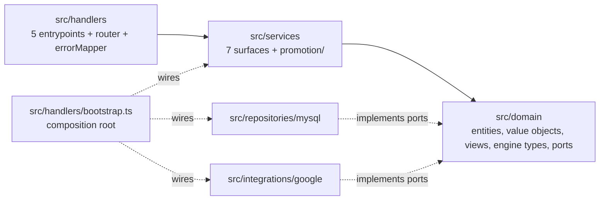

# PR Walkthrough — the `slatwall-ts` Lambda port

## 1. Purpose and how to use this walkthrough

This pull request ports a bounded **catalog + promotions/pricing** slice of **Slatwall 3.1.39** (the
release in the repository-root `version.txt`) from its CFML/Hibachi host to strict-mode TypeScript
for the AWS Lambda `nodejs20.x` runtime. The port lives in one new subtree, `slatwall-ts/`, reads and
writes the existing `Sw*` MySQL tables unchanged, and leaves the legacy CFML tree untouched. It is
written for the engineer reviewing the PR: it says what the change delivers, how the change set is
organised, what order to read it in, where the behaviour-preservation evidence lives, how to
reproduce every gate, and what is still open. It is a guided tour, not a second copy of the detail:
[`slatwall-ts/README.md`](../../slatwall-ts/README.md) is the operator and contributor reference, and
[`Project Guide.md`](Project%20Guide.md) is the delivery status report. Every count, path, symbol
and locator below was measured from the tree at the head of this branch; command outputs are
recorded results, and section 6.1 names where each one was recorded. Where a measured figure differs
from the Agent Action Plan (AAP), the measured figure is stated and the AAP figure is noted.

## 2. The PR at a glance

| Item                         | Value                                                                                                            |
| ---------------------------- | ---------------------------------------------------------------------------------------------------------------- |
| Base                         | `origin/master` @ `073b02c28` (`git merge-base HEAD origin/master` = `073b02c2898b6f80cbc2ae00d5b16c7bbaa65b84`) |
| Head before this walkthrough | `8be4d3e2d` — 46 commits, 175 files changed, 235,648 insertions, 0 deletions                                     |
| Added by this walkthrough    | one file (this one), added in `b9af9c740` (commit 47; 176 files in total); later commits change only this file   |
| Change type                  | additions only: every entry of `git diff --name-status` is `A`; none is `M`, `D` or `R`                          |
| Tracked files in the subtree | 174 (`git -C slatwall-ts ls-files \| wc -l`)                                                                     |
| Legacy tree after the change | 418 `.cfc` and 562 `.cfm` files outside `slatwall-ts/`, none modified                                            |

### Files by area (before this walkthrough)

| Area                                      |   Files | Lines added | Contents                                                                                                                               |
| ----------------------------------------- | ------: | ----------: | -------------------------------------------------------------------------------------------------------------------------------------- |
| `slatwall-ts/` root artifacts             |      13 |       8,170 | manifests, lockfile (3,339 lines), compiler/lint/format/test/bundle config, `.env.example`, `.gitignore`, `README.md`, `NOTICE-GPL.md` |
| `slatwall-ts/src/domain/`                 |      40 |      19,492 | 18 entities, 3 value objects, 3 order views, 3 engine type contracts, 13 ports                                                         |
| `slatwall-ts/src/services/`               |      16 |      11,137 | 7 service surfaces and the 9-module promotion decomposition                                                                            |
| `slatwall-ts/src/repositories/`           |      13 |      15,012 | pool, dialect, 6 MySQL repositories, 5 extracted SQL builders                                                                          |
| `slatwall-ts/src/handlers/`               |       8 |      14,302 | composition root, router, error mapper, 5 capability entrypoints                                                                       |
| `slatwall-ts/src/integrations/`           |       5 |       2,262 | integration contract and the 4-module Google feed adapter                                                                              |
| `slatwall-ts/src/lib/`                    |       7 |       4,561 | configuration, logger, 5 CFML semantic-parity helpers                                                                                  |
| `slatwall-ts/tests/unit/`                 |      58 |     118,422 | isolated unit suites                                                                                                                   |
| `slatwall-ts/tests/integration/`          |       7 |      23,572 | SQL shape and parameter-binding suites (no live server)                                                                                |
| `slatwall-ts/tests/fixtures/`, `setup.ts` |       6 |      10,001 | 5 fixture factories and the shared setup module                                                                                        |
| `slatwall-ts/tests/traceability/`         |       1 |       8,112 | `legacyTestMap.ts`, the executable traceability register (173 tests)                                                                   |
| `blitzy/documentation/Project Guide.md`   |       1 |         605 | delivery status report                                                                                                                 |
| **Total**                                 | **175** | **235,648** |                                                                                                                                        |

Outside `slatwall-ts/` the PR adds exactly two files, both documentation:
`blitzy/documentation/Project Guide.md` and this walkthrough.

### What did NOT change

- **No existing file is modified, renamed or deleted** — not a `.cfc`, `.cfm`, `.json`, the root
  `readme.md`, the root `.gitignore`, nor anything under `org/Hibachi/`.
- **No schema change.** No migration, DDL, new table or column change exists in the change set; the
  subtree ships no schema definition and must be pointed at an existing `Sw*` database.
- **No infrastructure or pipeline.** No Terraform, CDK, SAM, `serverless.yml`, CloudFormation,
  Dockerfile or CI workflow is added. "Deployable" means `npm run package` succeeds.

### Commit timeline

The 46 commits before this walkthrough, grouped by phase in the order they landed (numbers are
positions in `git log --reverse 073b02c28..HEAD`):

| #     | Dates (2026)  | Phase                             | What landed                                                                                                                                                 |
| ----- | ------------- | --------------------------------- | ----------------------------------------------------------------------------------------------------------------------------------------------------------- |
| 1–5   | 07-31         | Setup                             | Node 20.20.2 pin, manifests, strict TypeScript/ESLint/Prettier, Vitest, esbuild packaging, environment contract, licence notice                             |
| 6–7   | 07-31         | Foundations                       | configuration, structured logging, build/test/lint gates; domain ports, CFML parity helpers, MySQL dialect resolver                                         |
| 8–10  | 07-31         | Domain                            | catalog/promotion entities, money value objects, HTTP routing, MySQL access; pricing and promotion entities and their suites                                |
| 11    | 07-31         | Foundations hardening             | log redaction and failure-tolerant log emission                                                                                                             |
| 12–20 | 07-31 – 08-01 | Services, promotion, repositories | option and rounding-rule services, extracted SQL, remaining entities, feed renderer and service, all six repositories, the nine promotion modules, fixtures |
| 21–23 | 08-03         | Hardening and promotion facade    | persistence/security/currency hardening, the `PromotionService` facade, QA fixes in price-group/rounding                                                    |
| 24–28 | 08-04         | Composition root                  | `bootstrap.ts`, promotion characterization suites, review and QA fixes on the composition surface                                                           |
| 29–35 | 08-05         | Handlers and packaging            | the five capability entrypoints, their suites, the archive stage, review/QA fixes, README and traceability completion                                       |
| 36–45 | 08-06 – 08-07 | Review and QA hardening           | configuration, authorization and persistence fidelity; code and security review rounds; SKU-code conflict safety (409)                                      |
| 46    | 08-07         | Project Guide                     | `blitzy/documentation/Project Guide.md`                                                                                                                     |

## 3. Architecture map

The subtree is ports-and-adapters (hexagonal). Dependencies point inward to the domain; the adapters
implement the domain's ports; one module wires the two halves together.



| Concern                     | Where it is enforced                                                                                                                                                                                                                                                                                                                                                                         |
| --------------------------- | -------------------------------------------------------------------------------------------------------------------------------------------------------------------------------------------------------------------------------------------------------------------------------------------------------------------------------------------------------------------------------------------- |
| Composition root            | [`src/handlers/bootstrap.ts`](../../slatwall-ts/src/handlers/bootstrap.ts) — `bootstrapCompositionRoot` builds the wiring once per container; `createRequestGraph` builds request-scoped services per invocation. Replaces the DI/1 convention scan.                                                                                                                                         |
| Dependency rule             | [`eslint.config.mjs`](../../slatwall-ts/eslint.config.mjs) — `OUTWARD_LAYERS = ['repositories', 'handlers', 'integrations']` and `OUTWARD_PACKAGE_PATTERNS` (`mysql2`, `dotenv`, `aws-lambda`, `@types/aws-lambda`, `@aws-sdk/**`) are forbidden to `src/domain/**/*.ts` through `no-restricted-imports` at severity `error`. `tsconfig.json` declares no `paths`/`baseUrl` to slip past it. |
| No barrels                  | the same file's `BARREL_PATTERNS` (`**/index.{ts,js,mts,mjs,cts,cjs}`) is applied to every `.ts` file; the tree contains zero `index.*` files.                                                                                                                                                                                                                                               |
| Anti-corruption order views | [`src/domain/views/`](../../slatwall-ts/src/domain/views/) — `orderView.ts`, `orderItemView.ts`, `orderFulfillmentView.ts` are read-only inputs. The out-of-scope order aggregate drives the engines without being ported or mutated; the engines return intents.                                                                                                                            |

The six transformation rules, each tied to the files that carry it:

| Rule | Legacy construct                                                | Target construct and files                                                                                                                                                                                                                                                                                                                                                                                                                                                                                                                                                                                                                        |
| ---- | --------------------------------------------------------------- | ------------------------------------------------------------------------------------------------------------------------------------------------------------------------------------------------------------------------------------------------------------------------------------------------------------------------------------------------------------------------------------------------------------------------------------------------------------------------------------------------------------------------------------------------------------------------------------------------------------------------------------------------- |
| T1   | DI/1 convention scan of `property name="xService";`             | constructor parameters typed to ports, wired once in `src/handlers/bootstrap.ts`                                                                                                                                                                                                                                                                                                                                                                                                                                                                                                                                                                  |
| T2   | `getService("…")` locator calls inside entities                 | ports injected into `src/domain/entities/sku.ts` and `product.ts`; README "The T2 count, scoped" lists the ten legacy call sites                                                                                                                                                                                                                                                                                                                                                                                                                                                                                                                  |
| T3   | Hibernate ORM, `ORMExecuteQuery`, `<cfquery>`, lazy collections | `src/repositories/mysql/*.ts` over `mysql2` prepared statements; complex statements in `src/repositories/mysql/sql/*.sql.ts`; associations materialized at hydration                                                                                                                                                                                                                                                                                                                                                                                                                                                                              |
| T4   | `precisionEvaluate` and CFML numeric duality                    | [`src/domain/valueObjects/money.ts`](../../slatwall-ts/src/domain/valueObjects/money.ts) (`Money` over `decimal.js`) as the general money-arithmetic surface, with `src/lib/cfml/precision.ts` and `numberFormat.ts`. One named exception: `RoundingRuleService.roundValue` in `src/services/roundingRuleService.ts` computes its candidates and deltas directly with the `precision.ts` helpers `add`, `subtract`, `absolute`, `isGreaterThan` and `isLessThan` (arbitrary precision, never floats) and returns a `DecimalString`, which `roundValueByRoundingRule` and `roundValueByRoundingRuleID` convert back with `Money.fromDecimalString` |
| T5   | FW/1 subsystem routing and the `.cfm` feed view                 | `ROUTE_TABLE` in [`src/handlers/router.ts`](../../slatwall-ts/src/handlers/router.ts) and the pure `renderGoogleProductFeed` in `src/integrations/google/rssFeedRenderer.ts`                                                                                                                                                                                                                                                                                                                                                                                                                                                                      |
| T6   | ambient `getHibachiScope()` / `getSlatwallScope()`              | explicit context parameters, e.g. `PriceGroupService.calculateSkuPriceBasedOnCurrentAccount(sku, context)` and the `FeedCriteria` (`feedHost`, `now`) passed to `generateProductFeed`                                                                                                                                                                                                                                                                                                                                                                                                                                                             |

Module-scope mutable state is limited to five bindings, none holding request data:
`memoizedPool` and `memoizedExecutor` (`src/repositories/mysql/connection.ts`),
`memoizedCompositionRoot` (`src/handlers/bootstrap.ts`), `memoizedConfiguration`
(`src/lib/config.ts`) and `adoptedThreshold` (`src/lib/logger.ts`). Every legacy component-level
cache became request-scoped.

## 4. Guided reading order

Read bottom-up: tooling, then the helpers everything imports, then the domain, services, adapters,
the entrypoints that wire them, and finally the tests. Paths below are relative to `slatwall-ts/`
unless they start with a legacy directory (`model/`, `integrationServices/`, `config/`, `meta/`).

### 4.1 Tooling and root manifests

- **Files:** `package.json`, `package-lock.json`, `.nvmrc`, `tsconfig.json`, `tsconfig.build.json`,
  `eslint.config.mjs`, `.prettierrc.json`, `vitest.config.ts`, `esbuild.config.mjs`, `.env.example`,
  `.gitignore`, `README.md`, `NOTICE-GPL.md` — 13 files.
- **Legacy source:** none for the manifests; the CFML tree has no package manifest.
  `.env.example` follows `config/configApplication.cfm` (datasource name `Slatwall`) and
  `config/configORM.cfm` (dialect probe); `NOTICE-GPL.md` carries forward the attribution and the
  License section of `readme.md`.
- **Look for:**
  - 13 direct dependencies, all exact pins: runtime `decimal.js` 10.6.0, `mysql2` 3.23.1, `zod` 4.4.3;
    development `typescript` 5.9.3, `@types/node` 20.19.43, `@types/aws-lambda` 8.10.162, `vitest`
    4.1.10, `@vitest/coverage-v8` 4.1.10, `esbuild` 0.28.1, `eslint` 10.8.0, `typescript-eslint`
    8.65.0, `prettier` 3.9.6, `dotenv` 17.4.2.
  - Node pin `20.20.2` in `.nvmrc`; `engines` `node ">=20.19.0 <21"`, `npm ">=10.8.2"`.
  - `tsconfig.json`: `target` ES2022, `module`/`moduleResolution` NodeNext, `strict`,
    `noUncheckedIndexedAccess`, `exactOptionalPropertyTypes`, `noImplicitOverride`, `noUnusedLocals`,
    `skipLibCheck: false`.
  - `esbuild.config.mjs`: `platform: 'node'`, `target: 'node20'`, `format: 'cjs'`, `.cjs` output,
    `sourcesContent: true`, `minify: false`, `legalComments: 'inline'`; the `--zip` stage writes one
    archive per entrypoint with `NOTICE-GPL.md` at its root, using `node:zlib`.
  - `vitest.config.ts`: coverage floors lines 80, statements 80, functions 80, branches 70, whole-tree
    (`perFile: false`).
  - `.env.example`: 19 variables — 18 deployable plus the harness-only `TEST_LIVE_DATABASE` — and no
    credential.
- **Pinned by:** `tests/traceability/legacyTestMap.ts` — `A16` (against
  `FROZEN_NODE_VERSION = '20.20.2'`: `.nvmrc` equals it exactly; `engines.node` keeps `>=20.` and
  `<21` and admits it; the esbuild `buildOptions` hold `target: 'node20'` and `format: 'cjs'`;
  `@types/node` stays on major 20 and `typescript` on 5; every direct dependency is an exact
  `x.y.z`; the build script carries no security-review dispositions and `README.md` no dated
  verification stamps. It never checks the Node version `README.md` states and never reads
  `package-lock.json`), `A17` (package shape), `A29` (the 4,096-byte Lambda environment budget),
  `A22` (README accuracy). No A-block fixes the coverage floors: `vitest.config.ts`
  `coverage.thresholds` sets them and `CI=true npm run test:coverage` enforces them;
  `npm run verify` does not run coverage.

### 4.2 `src/lib/` — CFML parity helpers, configuration, logger

| File                           | Representative exports                                                        | Legacy semantics it reproduces                                                                                                   |
| ------------------------------ | ----------------------------------------------------------------------------- | -------------------------------------------------------------------------------------------------------------------------------- |
| `src/lib/cfml/truthiness.ts`   | `isNullish`, `cfLen`, `cfTruthy`, `cfBoolean`                                 | `isNull()` / `len()` truthiness, e.g. the eligibility gate `if(len(setting('skuEligibleCurrencies')))` in `model/entity/Sku.cfc` |
| `src/lib/cfml/list.ts`         | `listLen`, `listGetAt`, `listAppend`, `listToArray`, `listFindNoCase`         | CFML comma lists; comma-list parameters and returns are kept for signature parity                                                |
| `src/lib/cfml/struct.ts`       | `structKeyExists`, `structFindKey`, `cfFoldKey`, `structKeyList`, `structGet` | case-insensitive struct keys                                                                                                     |
| `src/lib/cfml/numberFormat.ts` | `numberFormat`, `cfNumberToString`, `cfNumericEquals`, `toDecimalString`      | `numberFormat(v,"0.00")` and CFML trailing-zero stringification, which `roundValue` depends on                                   |
| `src/lib/cfml/precision.ts`    | `add`, `subtract`, `multiply`, `divide`, `absolute`, `fromInteger`            | `precisionEvaluate` over decimals                                                                                                |
| `src/lib/config.ts`            | `appConfig`, `parseHostAuthority`                                             | `config/configApplication.cfm` and `config/configORM.cfm`; the only runtime reader of `process.env` under `src/`                 |
| `src/lib/logger.ts`            | `logger`                                                                      | net-new: structured JSON to stdout, fail-closed redaction, no imports                                                            |

- **Look for:** configuration reports every problem at once and never echoes a value;
  `DB_TLS_MODE=disabled` is refused when `NODE_ENV` is `production`, even on loopback (unset means
  `development`), and in every environment unless `DB_HOST` is a loopback spelling — a `127.0.0.0/8`
  literal, `::1`, `0:0:0:0:0:0:0:1` or `localhost`, case-insensitively — while a name that merely
  resolves to loopback is refused; `logger.ts` reads no environment variable (the threshold is
  handed over by the composition root).
- **Pinned by:** `tests/unit/lib/cfml/{truthiness,list,struct,numberFormat,precision}.test.ts`,
  `tests/unit/lib/config.test.ts`, `tests/unit/lib/logger.test.ts`.

### 4.3 `src/domain/` — value objects, entities, views, engine types, ports

**Value objects** (`src/domain/valueObjects/`): `money.ts` (`Money`, the general arithmetic surface
for money; the one exception, `RoundingRuleService.roundValue`, computes directly with the
`src/lib/cfml/precision.ts` helpers, as the T4 row in section 3 records), `currencyCode.ts`
(branded three-character code; validation is length-only, so `123`, `---` and `$$$` are accepted),
`materializedIdPath.ts` (comma-delimited ID path walking for `productTypeIDPath`, `priceGroupIDPath`
and `categoryIDPath`). Pinned by
`tests/unit/domain/valueObjects/{money,currencyCode,materializedIdPath}.test.ts`.

**Entities** (`src/domain/entities/`, 18 classes, one per legacy entity, each pinned by
`tests/unit/domain/entities/<name>.test.ts`):

| Target                                                                                       | Legacy source                                                                                      | What to look for                                                                                                                                                                                                                                                                                                                                                                              |
| -------------------------------------------------------------------------------------------- | -------------------------------------------------------------------------------------------------- | --------------------------------------------------------------------------------------------------------------------------------------------------------------------------------------------------------------------------------------------------------------------------------------------------------------------------------------------------------------------------------------------- |
| `sku.ts` (`Sku`; cascade computed by `Sku.hydrate` → `materializeCurrencyDetails`)           | `model/entity/Sku.cfc` (its `getCurrencyDetails` computes the cascade, L367-L433)                  | gate is in `resolveCurrencyCascadeContext`; `getCurrencyDetails()` is only the synchronous memo accessor; `get*PriceByCurrencyCode` return `Money \| undefined`; `getPriceByPromotion(): never`                                                                                                                                                                                               |
| `product.ts` (`Product`)                                                                     | `model/entity/Product.cfc`                                                                         | `getSkuBySelectedOptions` / `getSkusBySelectedOptions`; `getProductURL`; `getBrandName` memo divergence                                                                                                                                                                                                                                                                                       |
| `skuCurrency.ts`, `productType.ts`, `brand.ts`, `category.ts`, `option.ts`, `optionGroup.ts` | `SkuCurrency.cfc`, `ProductType.cfc`, `Brand.cfc`, `Category.cfc`, `Option.cfc`, `OptionGroup.cfc` | `productTypeIDPath`; `Category`'s inert CMS data: the `cmsCategoryID` column (index `RI_CMSCATEGORYID`) and the `site` many-to-one, which survives only as the opaque `siteID` foreign key (`getSiteID()`, no `Site` class); option-group sort order                                                                                                                                          |
| `promotion.ts`, `promotionCode.ts`, `promotionPeriod.ts`                                     | `Promotion.cfc`, `PromotionCode.cfc`, `PromotionPeriod.cfc`                                        | current/deletable flags; `PromotionPeriod.isCurrent(now?: Date)` under an explicit UTC policy                                                                                                                                                                                                                                                                                                 |
| `promotionQualifier.ts`, `promotionReward.ts`                                                | `PromotionQualifier.cfc`, `PromotionReward.cfc`                                                    | the include/exclude collections; `amount` as `Money`; the legacy `hb_permission` typo `promotionPeriod.promtionRewards` (`PromotionReward.cfc:L57`), annotated by a `LEGACY-NOTE` and corrected to `promotionPeriod.promotionRewards` in `PromotionReward.entityMetadata`, which the entity suite asserts                                                                                     |
| `promotionApplied.ts`, `promotionAccount.ts`                                                 | `PromotionApplied.cfc`, `PromotionAccount.cfc`                                                     | order foreign keys as opaque string IDs; no service, legacy or ported, references `PromotionAccount`                                                                                                                                                                                                                                                                                          |
| `priceGroup.ts`, `priceGroupRate.ts`, `roundingRule.ts`                                      | `PriceGroup.cfc`, `PriceGroupRate.cfc`, `RoundingRule.cfc`                                         | `getPriceGroupIDPath`; `preInsert()`/`preUpdate()` exposed as explicit path-maintenance methods, but the repository insert composes the path itself from the parent chain and the minted ID (`composeInsertedPriceGroupIDPath` in `mysqlPriceGroupRepository.ts`) without calling `preInsert()`, while the update calls `preUpdate()` before writing; `RoundingRule.roundValue(value: Money)` |

**Order views** (`src/domain/views/orderView.ts`, `orderItemView.ts`, `orderFulfillmentView.ts`) and
**engine types** (`src/domain/promotionEngine/qualificationTypes.ts`, `rewardUsageTypes.ts`,
`qualifiedDiscountTypes.ts`) are type-only shapes derived from the `order.*` accessors and local structs
the engines use in `model/service/PromotionService.cfc` and `PriceGroupService.cfc`. Being type-only,
they are exempt from coverage by construction.

**Ports** (`src/domain/ports/`, 13 interfaces, type-only): `productRepository`, `skuRepository`,
`optionRepository`, `productTypeRepository`, `promotionRepository`, `priceGroupRepository` (one per
legacy DAO under `model/dao/`), `settingsProvider` (four keys: `skuCurrency`, `skuEligibleCurrencies`,
`globalURLKeyProduct`, `globalURLKeyProductType`), `currencyConverter`, `addressZoneEvaluator`,
`urlTitleGenerator`, `imageStore` and `subscriptionTermProvider` (stub ports for out-of-scope
branches), and `productFeedPort` (`generateProductFeed(criteria: FeedCriteria): Promise<string>`).
Look for: no port imports anything outward, and `priceGroupRepository` documents its read-only
reach-through to the subscription tables.

### 4.4 `src/services/` — seven surfaces and the promotion decomposition

| Target                   | Legacy source                           | What to look for                                                                                                                                                | Suite                                             |
| ------------------------ | --------------------------------------- | --------------------------------------------------------------------------------------------------------------------------------------------------------------- | ------------------------------------------------- |
| `productService.ts`      | `model/service/ProductService.cfc`      | `getProductSkusBySelectedOptions`; `findProducts` (was `getProductSmartList`); `productUpdateSkusSchema` (zod, from `model/validation/Product_UpdateSkus.json`) | `tests/unit/services/productService.test.ts`      |
| `skuService.ts`          | `model/service/SkuService.cfc`          | `createSkus` cartesian product; `getSortedProductSkus`; `findSkus` (was `getSkuSmartList`)                                                                      | `tests/unit/services/skuService.test.ts`          |
| `brandService.ts`        | `model/service/BrandService.cfc`        | `saveBrand` with the URL-title port                                                                                                                             | `tests/unit/services/brandService.test.ts`        |
| `optionService.ts`       | `model/service/OptionService.cfc`       | three methods; comma-list parameter kept                                                                                                                        | `tests/unit/services/optionService.test.ts`       |
| `priceGroupService.ts`   | `model/service/PriceGroupService.cfc`   | the five-level rate chain; the parent-recursion and rounding-rule asymmetries; `updateOrderAmountsWithPriceGroups` returns `PriceGroupAppliedIntent[]`          | `tests/unit/services/priceGroupService.test.ts`   |
| `roundingRuleService.ts` | `model/service/RoundingRuleService.cfc` | `roundValue` reproduces the decimal-string algorithm and returns a branded decimal string                                                                       | `tests/unit/services/roundingRuleService.test.ts` |
| `promotionService.ts`    | `model/service/PromotionService.cfc`    | the facade over the nine modules below; `updateOrderAmountsWithPromotions` returns `PromotionAppliedIntent[]`; the `issue #1766` no-op                          | `tests/unit/services/promotionService.test.ts`    |

The nine promotion modules decompose the legacy `updateOrderAmountsWithPromotions`
(`model/service/PromotionService.cfc:L58`) and its supporting helpers. Five of those helpers were
`private` in the legacy and are public on the `PromotionService` facade so they can be tested
directly: `getPromotionPeriodQualificationDetails` (L549), `getQualifierQualificationDetails` (L629),
`getPromotionPeriodQualifiedFulfillmentIDList` (L752), `getPromotionPeriodOrderItemQualificationCount`
(L783) and `getDiscountAmount` (L987). The two membership methods, `getOrderItemInQualifier` (L852)
and `getOrderItemInReward` (L921), were already `public`. Each module has a characterization suite
of the same name under `tests/unit/services/promotion/`:

| Module (`src/services/promotion/`) | Exported unit                           | Legacy logic                                                                                                                                                                                                                                                                                                                                              |
| ---------------------------------- | --------------------------------------- | --------------------------------------------------------------------------------------------------------------------------------------------------------------------------------------------------------------------------------------------------------------------------------------------------------------------------------------------------------- |
| `salePriceSeeding.ts`              | `SalePriceSeeder`                       | seeding sale-price rewards into the usage ledger                                                                                                                                                                                                                                                                                                          |
| `promotionPeriodQualification.ts`  | `PromotionPeriodQualificationEvaluator` | `getPromotionPeriodQualificationDetails` (L549), `getPromotionPeriodQualifiedFulfillmentIDList` (L752), `getPromotionPeriodOrderItemQualificationCount` (L783)                                                                                                                                                                                            |
| `qualifierQualification.ts`        | `QualifierQualificationEvaluator`       | `getQualifierQualificationDetails` (L629)                                                                                                                                                                                                                                                                                                                 |
| `orderItemMembership.ts`           | `OrderItemMembership`                   | `getOrderItemInQualifier` (L852) and `getOrderItemInReward` (L921)                                                                                                                                                                                                                                                                                        |
| `discountAmount.ts`                | `DiscountAmountCalculator`              | `getDiscountAmount` (L987)                                                                                                                                                                                                                                                                                                                                |
| `rewardUsageLedger.ts`             | `RewardUsageLedger`                     | the mutable `promotionRewardUsageDetails` ledger and its **ascending** per-use insertion sort (L301-L329); the opposing **descending** best-discount insertion (L266-L294) is not in this module but in the facade, `services/promotionService.ts` (`insertQualifiedDiscountDescending`), and is pinned by `tests/unit/services/promotionService.test.ts` |
| `overUseStripping.ts`              | `stripOverUsedRewardDiscounts`          | the over-use correction loop starting at L468                                                                                                                                                                                                                                                                                                             |
| `promotionApplication.ts`          | `applyBestOrderItemDiscounts`           | applying only the best discount per order item                                                                                                                                                                                                                                                                                                            |
| `twoPassRewardIterator.ts`         | `TwoPassRewardIterator`                 | the loop-counter reset that runs order-level rewards as a second pass (`orderRewards = true`, L460)                                                                                                                                                                                                                                                       |

### 4.5 `src/repositories/mysql/` — MySQL adapters and extracted SQL

| File                                                                                                                                                                             | Legacy source                                                                                                            |
| -------------------------------------------------------------------------------------------------------------------------------------------------------------------------------- | ------------------------------------------------------------------------------------------------------------------------ |
| `connection.ts` (one module-scope pool, prepared-statement executor)                                                                                                             | `config/configApplication.cfm`                                                                                           |
| `dialect.ts` (`materializedIdPathLikePatternFragment`, `singleRowLimitFragments`, `optionGroupOdometerPowerFragment`)                                                            | `config/configORM.cfm`; the three dialect-branching SQL sites                                                            |
| `mysqlProductRepository.ts`, `mysqlSkuRepository.ts`, `mysqlOptionRepository.ts`, `mysqlProductTypeRepository.ts`, `mysqlPromotionRepository.ts`, `mysqlPriceGroupRepository.ts` | `model/dao/ProductDAO.cfc`, `SkuDAO.cfc`, `OptionDAO.cfc`, `ProductTypeDAO.cfc`, `PromotionDAO.cfc`, `PriceGroupDAO.cfc` |
| `sql/skusBySelectedOptions.sql.ts` (`buildSkusBySelectedOptionsStatement`)                                                                                                       | `SkuDAO.getSkusBySelectedOptions` (`model/dao/SkuDAO.cfc:L107`)                                                          |
| `sql/sortedProductSkus.sql.ts`, `sql/salePricePromotionRewards.sql.ts`, `sql/promotionUseCounts.sql.ts`, `sql/accountSubscriptionPriceGroups.sql.ts`                             | `SkuDAO.cfc`, `PromotionDAO.cfc`, `PriceGroupDAO.cfc`                                                                    |

- **Look for:** every statement is a prepared statement; the in-engine query-of-queries in
  `PromotionDAO` becomes CTEs in `salePricePromotionRewards.sql.ts`; AND-of-EXISTS option matching in
  `skusBySelectedOptions.sql.ts` (one `EXISTS` per selected option); `getActivePromotionRewards`
  applies no `ORDER BY`, exactly as `model/dao/PromotionDAO.cfc` does not, so reward order at a tie
  stays unspecified; SKU-code uniqueness is guarded in application code for inserts only, and
  updates rely on the schema's existing constraint. The legacy schema already declares `skuCode`
  unique (`model/entity/Sku.cfc:L54`, `unique="true"`); this subtree authors no DDL, so it neither
  creates nor asserts that index. In `mysqlSkuRepository.ts`, `persistSku` calls
  `assertSkuCodeUnclaimed` only when `sku.isNew()`. Inside the insert's transaction, that guard
  first locks the parent row with `select productID from SwProduct where productID = ? for update`,
  but only when a parent key is known (the override the caller hands down, else the materialized
  product's ID, and non-empty): a SKU with no nameable parent is still checked but not serialized,
  and a SKU with no code (bound as NULL) is not checked. It then re-reads with
  `select skuID from SwSku where skuCode = ? for update` and refuses a taken code with
  `WriteConflictError` (`SKU_CODE_ALREADY_PERSISTED`), which the error mapper answers as `409`. An
  update issues neither statement: moving a persisted row onto a taken code is refused only by the
  pre-existing unique index, whose duplicate-key error `asWriteConflict` in `connection.ts`
  classifies as the same `409`; without that index, such an update is not refused.
- **Pinned by:** eight suites, using three mechanisms. The six
  `tests/integration/repositories/mysql{Product,Sku,Option,ProductType,Promotion,PriceGroup}Repository.test.ts`
  suites drive each repository against a local `RecordingExecutor` (an in-memory
  `PreparedStatementExecutor`) and assert the statement text and bound parameters it captured.
  `tests/integration/repositories/skusBySelectedOptions.test.ts` calls the pure builder
  `buildSkusBySelectedOptionsStatement` directly and asserts its `sql` and `params`, plus its
  refusal above `MAX_PLACEHOLDER_COUNT`. `tests/unit/repositories/connection.test.ts` mocks
  `mysql2/promise`'s `createPool` with a fake pool and connection and asserts pool and executor
  behaviour rather than repository SQL, including transaction begin/commit/rollback/release
  ordering, joined rather than nested transactions, parameter guards, `asWriteConflict`
  classification at the `executeMutation` funnel, and the multi-row `VALUES` batching helpers.
  `dialect.ts` and the four other SQL builders are exercised through the repository suites. None of
  these suites needs a live server.

### 4.6 `src/handlers/` — router, error mapper, composition root, entrypoints

| File                             | Exported unit                                                                              | Route (`ROUTE_TABLE`)                                              | Admission                                                                                                            |
| -------------------------------- | ------------------------------------------------------------------------------------------ | ------------------------------------------------------------------ | -------------------------------------------------------------------------------------------------------------------- |
| `catalogQueryHandler.ts`         | `handler`, `createCatalogQueryHandler`                                                     | `GET,POST /catalog/products` → `queryCatalog`                      | `accountID` (else 401) and `adminAccountFlag` (else 403)                                                             |
| `skuResolutionHandler.ts`        | `handler`, `createSkuResolutionHandler`                                                    | `GET /catalog/skus` → `resolveSkus`                                | `accountID` (else 401)                                                                                               |
| `promotionApplicationHandler.ts` | `handler`, `createPromotionApplicationHandler`                                             | `POST /promotions/application` → `applyPromotions`                 | `accountID` (else 401) and `serviceScope` naming `promotionApplication` (else 403)                                   |
| `priceResolutionHandler.ts`      | `handler`, `createPriceResolutionHandler`                                                  | `POST /prices/resolution` → `resolvePrices`                        | `accountID`, except the one operation in `ANONYMOUS_PERMITTED_OPERATIONS` (`calculateSkuPriceBasedOnCurrentAccount`) |
| `productFeedHandler.ts`          | `handler`, `createProductFeedHandler`                                                      | `GET /feeds/google/products` → `generateProductFeed`               | no principal; the request `Host` must be in `FEED_ALLOWED_HOSTS`                                                     |
| `router.ts`                      | `ROUTE_TABLE`, `resolveRoute`, `resolveRouteForCapability`, `routeRequestFromEvent`        | reference port of `getSubsystemDirPrefix` (`Application.cfc:L129`) | none — dispatch only                                                                                                 |
| `errorMapper.ts`                 | `resolveRequestPrincipal`, `principalHasServiceScope`, response builders                   | —                                                                  | reads claims only from `event.requestContext.authorizer`                                                             |
| `bootstrap.ts`                   | `bootstrapCompositionRoot`, `resetCompositionRoot`, `EuropeanCentralBankCurrencyConverter` | —                                                                  | —                                                                                                                    |

The Exported unit column names each file's principal runtime exports, not its full export list. The
`router.ts` row is complete apart from the module's five exported types (`RoutedCapability`,
`RouteAction`, `RouteDescriptor`, `RouteRequest`, `RouteResolution`).

- **Look for:**
  - The router matches method and path only, carries one fixed action per route (the `→` names
    above) and reads no operation selector; where a route has one, its handler binds it:
    - `GET,POST /catalog/products`: a required, single `operation` query-string parameter (missing
      or repeated → 400) naming one of 14 operations spelled as the ported service methods — five
      `GET` reads (`findProducts`, `getFormattedOptionGroups`, `getUnusedProductOptions`,
      `getUnusedProductOptionGroups`, `getOptionsForSelect`) and nine `POST` mutations whose payload
      is the JSON body (`CATALOG_OPERATION_TRANSPORT`); an operation sent on the other method
      answers 400. `findProducts` is the AAP 0.4.2 documented rename of `getProductSmartList`.
    - `GET /catalog/skus`: a required `operation` query-string parameter (400 when missing or
      repeated) naming the legacy `getProductSkusBySelectedOptions` or `getSkuBySkuCode` verbatim.
    - `POST /prices/resolution`: a required `operation` member of the JSON body (a zod
      discriminated union) naming one of 12 operations under their legacy method names — eight
      `PriceGroupService` rate, price and best-price-group methods, the three `Sku`
      `get*PriceByCurrencyCode` accessors and `convertCurrency`.
    - `POST /promotions/application`: a required `operation` member of the JSON body, either
      `getSalePriceDetailsForProductSkus` (the legacy `PromotionService` method) or
      `applyPromotions`, a handler operation with no legacy method of that name, which runs
      `updateOrderAmountsWithPriceGroupsThenPromotions`.
    - `GET /feeds/google/products`: no selector; the route's fixed action `generateProductFeed`
      runs, the handler reads the `Host` header but neither a query string nor a body, and the feed
      criteria come from the request scope.
  - `updateOrderAmountsWithPriceGroupsThenPromotions` in `bootstrap.ts` runs the price-group pass
    before the promotion pass.
  - The currency converter takes its rates from `ECB_REFERENCE_RATES` and opens no socket.
  - Unknown routes, and routes owned by another capability (every handler calls
    `resolveRouteForCapability`), answer 404; no refusal echoes caller input.
- **Pinned by:** `tests/unit/handlers/{bootstrap,bootstrapStatements,router,errorMapper,catalogQueryHandler,skuResolutionHandler,promotionApplicationHandler,priceResolutionHandler,productFeedHandler}.test.ts`.

### 4.7 `src/integrations/` — the Google product feed

| File                             | Exported unit             | Legacy source                                                                                           |
| -------------------------------- | ------------------------- | ------------------------------------------------------------------------------------------------------- |
| `integrationInterface.ts`        | types only                | `integrationServices/IntegrationInterface.cfc` (type vocabulary `shipping \| payment \| fw1 \| custom`) |
| `google/integration.ts`          | `GoogleIntegration`       | `integrationServices/google/Integration.cfc` and `integrationServices/BaseIntegration.cfc`              |
| `google/googleFeedRepository.ts` | `GoogleFeedRepository`    | `integrationServices/google/model/dao/FeedDAO.cfc` and the filters of `controllers/feed.cfc`            |
| `google/rssFeedRenderer.ts`      | `renderGoogleProductFeed` | `integrationServices/google/views/feed/product.cfm`                                                     |
| `google/googleFeedService.ts`    | `GoogleFeedService`       | net-new orchestration; implements `generateProductFeed`                                                 |

- **Look for:** `GoogleIntegration` publishes eight members (`init`, `getIntegrationTypes` →
  `'fw1'`, `getDisplayName` → `"Google"`, `getSettings`, `getIntegratedSettings`, `getSettingOptions`
  → `undefined`, `getEventHandlers`, `getAdminNavbarHTML`); the feed contract lives on
  `ProductFeedPort`, not on the integration interface; `FEED_ORIGIN_SCHEME_PREFIX = 'http://'` and the
  empty `<g:google_product_category>` element are preserved; no Google API call is made and no
  Google API credential exists or is read. The route does read the separately configured MySQL
  credential (`DB_USER`/`DB_PASSWORD`, resolved by `src/lib/config.ts` when the composition root
  initializes), because `GoogleFeedRepository` reads `SwSku` and `SwProduct` through the shared
  executor.
- **Pinned by:** `tests/unit/integrations/google/{integration,googleFeedRepository,googleFeedService,rssFeedRenderer}.test.ts`.

### 4.8 `tests/` — suites, fixtures, traceability

- **Layout on disk:** 58 unit suites, 7 integration suites, 5 fixture factories
  (`tests/fixtures/{product,sku,promotion,priceGroup,orderView}Fixtures.ts`), `tests/setup.ts` (pins
  `TZ` to UTC and validates `TEST_LIVE_DATABASE`) and the register `tests/traceability/legacyTestMap.ts`
  — 66 test files and 6,719 tests.
- **Legacy-extended versus net-new:** exactly two suites extend legacy coverage —
  `tests/unit/domain/entities/brand.test.ts` (`defaults_are_correct`, from
  `meta/tests/unit/entity/BrandTest.cfc`) and `tests/unit/domain/entities/product.test.ts`
  (`productUrlIsCorrectlyFormatted` with the `nike-air-jorden` fixture, from
  `meta/tests/unit/entity/ProductTest.cfc`). `meta/tests/functional/admin/entity/ProductTest.cfc` is an
  empty stub counted as a gap. Everything else is net-new and labelled so (`A7`, `A8`, `A10`).
- **The register:** `legacyTestMap.ts` runs 173 tests in `describe` blocks labelled `A0` to `A30`
  (there is no `A26`). It partitions the 89 source modules into 64 covered, 25 exempt and 0 pending
  (`A2`), freezes the AAP 0.3.1 census at 165 files and itemises the 9 recorded additions (`A18`),
  cross-checks its explicit defect register and divergence budget against the bracketed markers on
  disk (`A13`, `A13b`, `A25`), and holds interface-parity budgets by declaration text (`A12`).
- **Inventories versus scans:** the registers are hand-written lists in `legacyTestMap.ts` —
  `deliberateDivergences` (3, L2187-L2212), `requiredDefectCitations` (7, L2852-L2916),
  `defectCitationExemptions` (4, L2923-L2963), `A13b`'s `AUTHORIZED_CITATIONS` (5) and
  `AUTHORIZED_OWNERS` (4) (L4301-L4315), and `AAP_NUMBERED_DEFECTS` (30), `AAP_SECONDARY_DEFECTS`
  (8) and the open-ended `SUPPLEMENTAL_TARGET_DISCOVERIES` (4, asserted `>= 4`) (L5730-L5840).
  What they read from disk is the markers and the suites that cite them, so none of these blocks
  can discover a defect nobody annotated:
  - `A13` scans `src/` for `LEGACY-DEFECT [` (floors: 100 markers, 80 citations, 30 carrying
    modules); every citation needs a line locator and a collected suite citing the same legacy
    line, unless it is one of the 4 exemptions; each of the 7 curated citations must still be
    annotated in its owning module, named by an `it(...)` case in its owning suite, and present
    among the on-disk citations.
  - `A13b` requires every `DELIBERATE DIVERGENCE [` citation and carrying module to be inside the
    fixed 5-citation, 4-owner budget, each of the 3 declared divergences to be annotated, and the
    marker to keep one spelling.
  - `A25` requires each of the 38 base entries to have a `LEGACY-DEFECT`, `DELIBERATE DIVERGENCE`
    or `LEGACY-NOTE` bracketed citation in `src/` naming a line inside its span (a companion span
    is checked on its own; the whole-file `product.cfm` entry needs only its path), except the
    three span-less misspellings, which are met through `verbatimIdentifiers`; supplemental
    entries may be annotated in `src/` or `tests/`.
  - The `describe` titles say "derived from the source tree" (`A13`, `A13b`) and "proven
    individually" (`A25`): what is derived from disk is the marker scan, and what is proven per
    entry is an in-range citation, not an output.

## 5. Behaviour-preservation checklist

Each row names where the behaviour lives (`file` : `symbol`, paths under `slatwall-ts/src/`) and the
suite that pins it (paths under `slatwall-ts/tests/`). Legacy locators were re-read in the CFML source.

### 5.1 The three must-preserve areas

| Behaviour                                                                                                                                                                                                                                                                                                     | Lives in                                                                                                                                                                                                                                                                                                                                                                                                                                                                                                                                                                                                                                                           | Legacy                                                                                                                         | Pinned by                                                                                                                                                                                                                                                                                                                                                                                                                                                                                                                                                                                                                                                                                                                                                                      |
| ------------------------------------------------------------------------------------------------------------------------------------------------------------------------------------------------------------------------------------------------------------------------------------------------------------- | ------------------------------------------------------------------------------------------------------------------------------------------------------------------------------------------------------------------------------------------------------------------------------------------------------------------------------------------------------------------------------------------------------------------------------------------------------------------------------------------------------------------------------------------------------------------------------------------------------------------------------------------------------------------ | ------------------------------------------------------------------------------------------------------------------------------ | ------------------------------------------------------------------------------------------------------------------------------------------------------------------------------------------------------------------------------------------------------------------------------------------------------------------------------------------------------------------------------------------------------------------------------------------------------------------------------------------------------------------------------------------------------------------------------------------------------------------------------------------------------------------------------------------------------------------------------------------------------------------------------ |
| Promotion discount math and use-limit enforcement                                                                                                                                                                                                                                                             | `services/promotionService.ts` : `PromotionService.updateOrderAmountsWithPromotions`, over `services/promotion/*`                                                                                                                                                                                                                                                                                                                                                                                                                                                                                                                                                  | `model/service/PromotionService.cfc:L58`                                                                                       | `unit/services/promotionService.test.ts` and the nine `unit/services/promotion/*.test.ts` suites                                                                                                                                                                                                                                                                                                                                                                                                                                                                                                                                                                                                                                                                               |
| Discount amount per amount type. Reference: 19.99 × 3 = 59.97, and 12.5% of it is 7.49625. `getDiscountAmount` returns the **discount**, quantized to `7.50` by `numberFormat(discountAmount, "0.00")`; the **net** the customer pays, 59.97 − 7.50, presents as `"52.47"` and is not what the method returns | `services/promotion/discountAmount.ts` : `DiscountAmountCalculator.getDiscountAmount`                                                                                                                                                                                                                                                                                                                                                                                                                                                                                                                                                                              | `PromotionService.cfc:L987`, `:L1017` (the `numberFormat` return)                                                              | `unit/services/promotion/discountAmount.test.ts` ("the migration's reference calculation": the discount `7.50`, then the net `52.47`, asserted separately); `unit/domain/valueObjects/money.test.ts` ("the verified reference calculation": 59.97, 7.49625 and the unquantized net 52.47375)                                                                                                                                                                                                                                                                                                                                                                                                                                                                                   |
| Over-use stripping indexed by the leaked `reward` variable                                                                                                                                                                                                                                                    | `services/promotion/overUseStripping.ts` : `stripOverUsedRewardDiscounts`                                                                                                                                                                                                                                                                                                                                                                                                                                                                                                                                                                                          | `PromotionService.cfc:L468` (loop), `:L472` (leaked index)                                                                     | `unit/services/promotion/overUseStripping.test.ts`                                                                                                                                                                                                                                                                                                                                                                                                                                                                                                                                                                                                                                                                                                                             |
| Two-pass reward iteration, including no second pass on an empty reward list                                                                                                                                                                                                                                   | `services/promotion/twoPassRewardIterator.ts` : `TwoPassRewardIterator`                                                                                                                                                                                                                                                                                                                                                                                                                                                                                                                                                                                            | `PromotionService.cfc:L460` (`orderRewards = true`)                                                                            | `unit/services/promotion/twoPassRewardIterator.test.ts`                                                                                                                                                                                                                                                                                                                                                                                                                                                                                                                                                                                                                                                                                                                        |
| Opposing insertion sort 1 of 2: each order item's qualified discounts are insert-sorted **descending** by discount, and only the first (largest) is applied                                                                                                                                                   | `services/promotionService.ts` : `PromotionService.insertQualifiedDiscountDescending` (private; the facade owns this sort, not the ledger); the first entry is read by `services/promotion/promotionApplication.ts` : `applyBestOrderItemDiscounts`                                                                                                                                                                                                                                                                                                                                                                                                                | `PromotionService.cfc:L266-L294` (sort), `:L524-L537` (index `[1]` applied)                                                    | `unit/services/promotionService.test.ts` ("★★ emits ONLY the best discount per order item, discarding every other candidate"; "★★ a STRICTLY LARGER reward discount DISPLACES the sale-price seed")                                                                                                                                                                                                                                                                                                                                                                                                                                                                                                                                                                            |
| Opposing insertion sort 2 of 2: each reward's `orderItemsUsage` in the usage ledger is insert-sorted **ascending** by `discountPerUseValue`, so the cheapest per-use discounts are stripped first                                                                                                             | `services/promotion/rewardUsageLedger.ts` : `RewardUsageLedger.recordOrderItemUsage` (through its private `insertUsageInAscendingOrder`)                                                                                                                                                                                                                                                                                                                                                                                                                                                                                                                           | `PromotionService.cfc:L299` (`discountPerUseValue`), `:L301-L329` (sort)                                                       | `unit/services/promotion/rewardUsageLedger.test.ts` ("the ascending insertion sort - the ordering half of vector 4")                                                                                                                                                                                                                                                                                                                                                                                                                                                                                                                                                                                                                                                           |
| Five-level price-group rate cascade, with the parent recursion calling the product variant                                                                                                                                                                                                                    | `services/priceGroupService.ts` : `PriceGroupService.getRateForSkuBasedOnPriceGroup`                                                                                                                                                                                                                                                                                                                                                                                                                                                                                                                                                                               | `model/service/PriceGroupService.cfc:L140`, `:L174`                                                                            | `unit/services/priceGroupService.test.ts` ("the five-level cascade" describes, including "DEFECT 7")                                                                                                                                                                                                                                                                                                                                                                                                                                                                                                                                                                                                                                                                           |
| Four-step currency cascade behind the `skuEligibleCurrencies` gate, computed at hydration so the currency accessors stay synchronous                                                                                                                                                                          | `domain/entities/sku.ts` : `Sku.resolveCurrencyCascadeContext` (Step 0, the gate) and `Sku.hydrate` → private `materializeCurrencyDetails` (Steps 1-3, seeding the memo), both called by `repositories/mysql/mysqlSkuRepository.ts`; `Sku.getCurrencyDetails` is only the synchronous accessor that returns the memo                                                                                                                                                                                                                                                                                                                                               | `model/entity/Sku.cfc:L367-L433` (there `getCurrencyDetails` itself computes the cascade)                                      | `unit/domain/entities/sku.test.ts` ("Sku.getCurrencyDetails — the four-step cascade", "Sku currency cascade — Step 3 and the memo" and "Sku.hydrate / Sku.resolveCurrencyCascadeContext — the hydration boundary"; each hydrates before reading the memo)                                                                                                                                                                                                                                                                                                                                                                                                                                                                                                                      |
| `USD` is a setting default, not an entity literal                                                                                                                                                                                                                                                             | `domain/ports/settingsProvider.ts`; `handlers/bootstrap.ts` : `BootstrapSettingsProvider`                                                                                                                                                                                                                                                                                                                                                                                                                                                                                                                                                                          | `model/service/SettingService.cfc:L221`                                                                                        | `unit/handlers/bootstrap.test.ts`, `unit/domain/entities/sku.test.ts`                                                                                                                                                                                                                                                                                                                                                                                                                                                                                                                                                                                                                                                                                                          |
| Option-to-SKU resolution by AND-of-EXISTS matching                                                                                                                                                                                                                                                            | the predicate: `repositories/mysql/sql/skusBySelectedOptions.sql.ts` : `buildSkusBySelectedOptionsStatement`, issued by `repositories/mysql/mysqlSkuRepository.ts` : `MysqlSkuRepository.getSkusBySelectedOptions`; pure delegation to that repository method: `services/productService.ts` : `ProductService.getProductSkusBySelectedOptions` and `domain/entities/product.ts` : `Product.getSkusBySelectedOptions`; `Product.getSkuBySelectedOptions` uses that result only for a non-empty selection (one match returns it, none or several throw); on an empty selection it skips the repository and returns the product's sole SKU from `getSkus()` or throws | `model/service/ProductService.cfc:L104` → `model/dao/SkuDAO.cfc:L107-L128`; `model/entity/Product.cfc:L349-L364`, `:L366-L368` | Predicate pins: `integration/repositories/skusBySelectedOptions.test.ts` (one ANDed `EXISTS` per option, never `OR`, bound in list order) and `integration/repositories/mysqlSkuRepository.test.ts` ("getSkusBySelectedOptions emits one ANDed EXISTS per selected option"). Delegation pins only, not independent AND-of-EXISTS checks: `unit/services/productService.test.ts` ("getProductSkusBySelectedOptions - must-preserve area (iii)": forwards the comma list to a repository double) and `unit/domain/entities/product.test.ts` (B7.4/B7.5: forwards positionally and returns the port result, "matching semantics are not re-implemented here"; its "C2 MUST-PRESERVE: getSkuBySelectedOptions - all five outcomes" cases pin the outcome rules, not the predicate) |

### 5.2 Cross-cutting guarantees

| Guarantee                                                                                                                                                                                                                                                                                                                                                                                                                                                                       | Lives in                                                                                                                                                                                                                                                                                                                                                                                                                                                                                                                                                                                                                                                                                                                                                                                                                                                                                                                                                                                                                                                                                                                                                                                                                                                                                   | Pinned by                                                                                                                                                                                                                                                                                                                                                                                                                                                                                                                                                                                                                                                                                                                                                                                                                                                                                                                                                                                            |
| ------------------------------------------------------------------------------------------------------------------------------------------------------------------------------------------------------------------------------------------------------------------------------------------------------------------------------------------------------------------------------------------------------------------------------------------------------------------------------- | ------------------------------------------------------------------------------------------------------------------------------------------------------------------------------------------------------------------------------------------------------------------------------------------------------------------------------------------------------------------------------------------------------------------------------------------------------------------------------------------------------------------------------------------------------------------------------------------------------------------------------------------------------------------------------------------------------------------------------------------------------------------------------------------------------------------------------------------------------------------------------------------------------------------------------------------------------------------------------------------------------------------------------------------------------------------------------------------------------------------------------------------------------------------------------------------------------------------------------------------------------------------------------------------ | ---------------------------------------------------------------------------------------------------------------------------------------------------------------------------------------------------------------------------------------------------------------------------------------------------------------------------------------------------------------------------------------------------------------------------------------------------------------------------------------------------------------------------------------------------------------------------------------------------------------------------------------------------------------------------------------------------------------------------------------------------------------------------------------------------------------------------------------------------------------------------------------------------------------------------------------------------------------------------------------------------- |
| **Price-group pass before promotion pass.** The promotion pass reads what the price-group pass writes (guard at `PromotionService.cfc:L241`)                                                                                                                                                                                                                                                                                                                                    | `handlers/bootstrap.ts` : `updateOrderAmountsWithPriceGroupsThenPromotions`                                                                                                                                                                                                                                                                                                                                                                                                                                                                                                                                                                                                                                                                                                                                                                                                                                                                                                                                                                                                                                                                                                                                                                                                                | `unit/services/promotionService.test.ts` ("★★★ the cross-service ordering constraint", including "REVERSING the two passes produces a DIFFERENT discount"); `unit/handlers/bootstrap.test.ts` ("runs the price-group pass strictly BEFORE the promotion pass")                                                                                                                                                                                                                                                                                                                                                                                                                                                                                                                                                                                                                                                                                                                                       |
| **`undefined`, never zero.** A missing currency, list or renewal price returns `undefined`                                                                                                                                                                                                                                                                                                                                                                                      | `domain/entities/sku.ts` : `Sku.getPriceByCurrencyCode`, `getListPriceByCurrencyCode`, `getRenewalPriceByCurrencyCode` (`Money \| undefined`)                                                                                                                                                                                                                                                                                                                                                                                                                                                                                                                                                                                                                                                                                                                                                                                                                                                                                                                                                                                                                                                                                                                                              | `unit/domain/entities/sku.test.ts` ("Sku currency accessors — undefined is never zero"); legacy `model/entity/Sku.cfc:L269-L285`                                                                                                                                                                                                                                                                                                                                                                                                                                                                                                                                                                                                                                                                                                                                                                                                                                                                     |
| **Defects reproduced, not repaired.** Reproduced defects are annotated in place with a bracketed legacy citation, mostly `LEGACY-DEFECT [<path>:<locator>]` on a `//` line, on a `*` JSDoc line or inside a thrown-error string. Not every register entry carries that marker: reproduced defect 25 carries `LEGACY-NOTE` instead, as does defect 15, which is recorded rather than reproduced (the port returns the honest `Promise<number>`)                                  | 103 bracketed `LEGACY-DEFECT [...]` marker lines in 44 files under `src/`, citing 82 distinct legacy locators: 74 on `//` lines, 27 on `*` JSDoc lines (e.g. `services/roundingRuleService.ts:533`), 2 in thrown-error strings (`services/priceGroupService.ts:296`, `:317`). The bare token appears on 110 lines in 46 files; the other 7 lines are prose mentions, and `domain/entities/promotionCode.ts` and `repositories/mysql/mysqlProductTypeRepository.ts` mention it without carrying a marker. Defect 25 (`model/entity/Product.cfc:L614-L622`): `domain/entities/product.ts` : `Product.getSalePriceExpirationDateTime(): never` (L2062-L2078) always throws, documented by its JSDoc "Defect 25 - preserved as a throw" and by a thrown message citing `Product.cfc` L614, L617 and L618 in bare brackets; its register entry is met by `LEGACY-NOTE [model/entity/Product.cfc:L614-L622]` on `Sku.getSalePriceExpirationDateTime` (`domain/entities/sku.ts:1861`). The other entries met without a `LEGACY-DEFECT` marker: defect 15 and secondary `orderItemQulifiedDiscounts` by `LEGACY-NOTE`; divergent defects 17, 18 and 19 by `DELIBERATE DIVERGENCE`; the misspellings `promtionRewards`, `singlularname` and `subsciptionUsageBenefit` through `verbatimIdentifiers` | `traceability/legacyTestMap.ts` `A13` (a scan of the on-disk `LEGACY-DEFECT [` markers, cross-checked against 7 curated citations, 4 exemptions and the legacy lines the suites cite) and `A25` (a hand-written inventory of 30 numbered, 8 secondary and 4 supplemental entries, each checked individually for an annotation, never for an output: the 38 span-bearing entries need a citation naming a line inside the span, with the duplicated `getStartDateTime` item's second site checked on its own; the whole-file entry, defect 4 (`product.cfm`), needs a citation of its path; the three identifier-only misspellings need a `verbatimIdentifiers` row). Behavioural evidence is in the characterization suites, those in 5.1 among them, and in defect-named cases, e.g. `unit/domain/entities/product.test.ts` ("DEFECT 25 / G1 (preserved): getSalePriceExpirationDateTime cannot return", L999-L1104) and `unit/domain/entities/sku.test.ts` ("Sku.getPriceByPromotion — defect 16") |
| **Exactly three deliberate divergences**: (1) the un-`var`'d `discountAmount` becomes function-local; (2) the `amountOff` branch uses `Money` rather than float multiplication; (3) the entity memo defects are repaired                                                                                                                                                                                                                                                        | `DELIBERATE DIVERGENCE [...]` markers on 6 lines (3 on `//` lines, 3 on `*` JSDoc lines) at 5 distinct citations: `PromotionService.cfc:L1007` (`services/promotion/discountAmount.ts`, `services/promotionService.ts`), `PromotionService.cfc:L998` (`services/promotionService.ts`), `Sku.cfc:L500-L510` and `Sku.cfc:L512-L522` (`domain/entities/sku.ts`), `Product.cfc:L524-L532` (`domain/entities/product.ts`)                                                                                                                                                                                                                                                                                                                                                                                                                                                                                                                                                                                                                                                                                                                                                                                                                                                                      | `traceability/legacyTestMap.ts` `A13b` (a fixed budget of 5 authorized citations, 4 authorized owner modules and 3 declared divergences, cross-checked against the `DELIBERATE DIVERGENCE [...]` markers on disk)                                                                                                                                                                                                                                                                                                                                                                                                                                                                                                                                                                                                                                                                                                                                                                                    |
| **Three signature reshapings, no fourth** (three reasons, five reshaped symbols): (1) the anti-corruption inversion, where `updateOrderAmountsWithPromotions` returns `PromotionAppliedIntent[]` and `updateOrderAmountsWithPriceGroups` returns `PriceGroupAppliedIntent[]`, both `void` in the legacy; (2) `getProductSmartList`/`getSkuSmartList` become `findProducts`/`findSkus`; (3) `product(rc)` becomes `generateProductFeed(criteria: FeedCriteria): Promise<string>` | `services/promotionService.ts`, `services/priceGroupService.ts`, `services/productService.ts`, `services/skuService.ts`, `domain/ports/productFeedPort.ts`, `integrations/google/googleFeedService.ts`                                                                                                                                                                                                                                                                                                                                                                                                                                                                                                                                                                                                                                                                                                                                                                                                                                                                                                                                                                                                                                                                                     | `traceability/legacyTestMap.ts` `A12` (five `signatureReshapings` rows, checked by declaration text and counted as two pairs and a single)                                                                                                                                                                                                                                                                                                                                                                                                                                                                                                                                                                                                                                                                                                                                                                                                                                                           |
| **Five visibility widenings, no sixth**: the legacy-private `getDiscountAmount`, `getPromotionPeriodQualificationDetails`, `getQualifierQualificationDetails`, `getPromotionPeriodQualifiedFulfillmentIDList` and `getPromotionPeriodOrderItemQualificationCount` are public                                                                                                                                                                                                    | `services/promotionService.ts` : `PromotionService` (delegating to the promotion modules)                                                                                                                                                                                                                                                                                                                                                                                                                                                                                                                                                                                                                                                                                                                                                                                                                                                                                                                                                                                                                                                                                                                                                                                                  | `traceability/legacyTestMap.ts` `A12`; `unit/services/promotionService.test.ts`                                                                                                                                                                                                                                                                                                                                                                                                                                                                                                                                                                                                                                                                                                                                                                                                                                                                                                                      |
| **One entity-layer widening**: `isCurrent(now?: Date)`, optional so the legacy zero-argument call still works                                                                                                                                                                                                                                                                                                                                                                   | `domain/entities/promotionPeriod.ts` : `PromotionPeriod.isCurrent`                                                                                                                                                                                                                                                                                                                                                                                                                                                                                                                                                                                                                                                                                                                                                                                                                                                                                                                                                                                                                                                                                                                                                                                                                         | `traceability/legacyTestMap.ts` `A12`; `unit/domain/entities/promotionPeriod.test.ts`                                                                                                                                                                                                                                                                                                                                                                                                                                                                                                                                                                                                                                                                                                                                                                                                                                                                                                                |
| **A method that throws in the legacy throws here**: `getPriceByPromotion` calls a service method that does not exist                                                                                                                                                                                                                                                                                                                                                            | `domain/entities/sku.ts` : `Sku.getPriceByPromotion(): never`                                                                                                                                                                                                                                                                                                                                                                                                                                                                                                                                                                                                                                                                                                                                                                                                                                                                                                                                                                                                                                                                                                                                                                                                                              | `unit/domain/entities/sku.test.ts` ("Sku.getPriceByPromotion — defect 16"); legacy `model/entity/Sku.cfc:L258`                                                                                                                                                                                                                                                                                                                                                                                                                                                                                                                                                                                                                                                                                                                                                                                                                                                                                       |
| **Preserved TODO `issue #1766`**: the return/exchange branch still does nothing                                                                                                                                                                                                                                                                                                                                                                                                 | `services/promotionService.ts` (`// TODO [issue #1766]` at L690)                                                                                                                                                                                                                                                                                                                                                                                                                                                                                                                                                                                                                                                                                                                                                                                                                                                                                                                                                                                                                                                                                                                                                                                                                           | `unit/services/promotionService.test.ts` ("★★ issue_1766 - the preserved return/exchange no-op"); `traceability/legacyTestMap.ts` `A11`; legacy `PromotionService.cfc:L543`                                                                                                                                                                                                                                                                                                                                                                                                                                                                                                                                                                                                                                                                                                                                                                                                                          |
| **Empty `g:google_product_category`** is still emitted empty                                                                                                                                                                                                                                                                                                                                                                                                                    | `integrations/google/rssFeedRenderer.ts` : `GOOGLE_PRODUCT_CATEGORY_ELEMENT`                                                                                                                                                                                                                                                                                                                                                                                                                                                                                                                                                                                                                                                                                                                                                                                                                                                                                                                                                                                                                                                                                                                                                                                                               | `unit/integrations/google/rssFeedRenderer.test.ts`; legacy `integrationServices/google/views/feed/product.cfm:L20`                                                                                                                                                                                                                                                                                                                                                                                                                                                                                                                                                                                                                                                                                                                                                                                                                                                                                   |

The legacy `product.cfm:L20` line is a bare empty element with no comment, so the port records it as a
preserved gap rather than a preserved TODO; the other TODOs carried from source are
`model/dao/ProductDAO.cfc:L64`, `model/dao/SkuDAO.cfc:L177`, `model/service/CurrencyService.cfc:L81`
and `model/entity/ProductType.cfc:L93`, each as `// TODO [<legacy locator>]` in the module that owns it.

## 6. How to verify locally

### 6.1 Gates

Node 20.20.2 and npm 10.8.2 must be active (`.nvmrc`). Run from `slatwall-ts/`. Never run
`npm run format`, `npm run lint:fix` or `eslint --fix` while reviewing: they rewrite files.

```bash
cd slatwall-ts
node -v && npm -v
CI=true npm ci --no-audit --no-fund
npm run typecheck
npm run lint
npm run format:check
CI=true npm test
CI=true npm run test:coverage
npm run package
for f in dist/*.cjs; do node -e "console.log('$f ->', typeof require('./$f').handler)"; done
CI=true npm audit --omit=dev
```

The static counts elsewhere in this walkthrough are read from the tree. Command outputs are not: they
depend on the host, the registry and the day, so each row below says where its result was recorded
instead of presenting it as a measurement of your checkout.

- **Project Guide _n_** names the section of `Project Guide.md` (committed at `8be4d3e2d` on
  2026-08-07) that states the delivery run's result: measured in sections 3 and 9.4 and in the audit
  statements of 5.2 and 6; expected in 9.1, 9.3 and 9.6.
- **2026-09-28** marks a re-run on that date against the same `slatwall-ts/` tree, which printed the
  same result. This walkthrough changes no file under `slatwall-ts/`
  (`git diff --name-status 8be4d3e2d HEAD` lists only this file).
- A **configuration file** marks a result that follows from that file rather than from a run.

Your own run is authoritative: where it differs from a row, the fresh result stands.

| Command                               | Expected result                                                                                                                                                                                                                        | Recorded in                                                                                                                                                           |
| ------------------------------------- | -------------------------------------------------------------------------------------------------------------------------------------------------------------------------------------------------------------------------------------- | --------------------------------------------------------------------------------------------------------------------------------------------------------------------- |
| `node -v && npm -v`                   | `v20.20.2`, `10.8.2`                                                                                                                                                                                                                   | `.nvmrc`; Project Guide 9.1; 2026-09-28                                                                                                                               |
| `CI=true npm ci --no-audit --no-fund` | `added 174 packages`, exit 0                                                                                                                                                                                                           | Project Guide 9.3; 2026-09-28                                                                                                                                         |
| `npm run typecheck`                   | `tsc --noEmit`, exit 0                                                                                                                                                                                                                 | Project Guide 9.4; 2026-09-28                                                                                                                                         |
| `npm run lint`                        | `eslint .`, exit 0                                                                                                                                                                                                                     | Project Guide 9.4; 2026-09-28                                                                                                                                         |
| `npm run format:check`                | `All matched files use Prettier code style!`                                                                                                                                                                                           | Project Guide 9.4; 2026-09-28                                                                                                                                         |
| `CI=true npm test`                    | `Test Files 66 passed (66)`, `Tests 6719 passed (6719)`                                                                                                                                                                                | Project Guide 3 and 9.4; 2026-09-28                                                                                                                                   |
| `CI=true npm run test:coverage`       | `All files` 94.03 % statements, 86.18 % branches, 98.11 % functions, 94.02 % lines, against floors of 80 / 70 / 80 / 80                                                                                                                | figures: Project Guide 3 and 9.4; 2026-09-28; floors: `vitest.config.ts`                                                                                              |
| `npm run package`                     | `[esbuild] Bundled 5 Lambda artifact(s) as CommonJS into dist/`; `dist/` holds `{catalogQuery,priceResolution,productFeed,promotionApplication,skuResolution}Handler.{cjs,cjs.map,zip}`; each archive is `[<name>.cjs, NOTICE-GPL.md]` | message: `esbuild.config.mjs`; file set: Project Guide 9.4; archive contents: Project Guide 9.6; 2026-09-28                                                           |
| the `for f in dist/*.cjs` loop        | five lines, each ending `-> function`                                                                                                                                                                                                  | Project Guide 9.6, for the five entrypoints `esbuild.config.mjs` declares; 2026-09-28                                                                                 |
| `CI=true npm audit --omit=dev`        | `found 0 vulnerabilities`                                                                                                                                                                                                              | Project Guide 5.2 (divergence 7, "full and production-only trees") and 6, as of 2026-08-07; 2026-09-28. Advisories change, so only a run on the day you review counts |

`CI=true npm run verify` chains typecheck → lint → format:check → test in one command. The package
step also prints one line per artifact of the form
`Annotations recoverable from <name>.cjs.map: LEGACY-DEFECT xN, DELIBERATE DIVERGENCE x6`; N differs
per artifact because each bundle holds only the modules its entrypoint reaches.

### 6.2 Marker census and the additions-only check

```bash
# from slatwall-ts/
grep -rc 'LEGACY-DEFECT' src | awk -F: '{s+=$2} END {print s}'      # 110 lines mention the token
grep -rn 'LEGACY-DEFECT \[' src | wc -l                             # 103 carry a bracketed marker
grep -roh 'LEGACY-DEFECT \[[^]]*\]' src | sort -u | wc -l             # 82
grep -roh 'DELIBERATE DIVERGENCE \[[^]]*\]' src | sort -u | wc -l     # 5

# from the repository root
git diff --name-status origin/master...HEAD | cut -f1 | sort | uniq -c   # 176 A
git diff --name-only origin/master...HEAD | grep -v '^slatwall-ts/'      # the two documentation files
```

The last command prints `blitzy/documentation/PR Walkthrough.md` and
`blitzy/documentation/Project Guide.md`.

### 6.3 Optional: the runtime tier

The suites above need no database. Invoking the packaged handlers does: they need a MySQL 8 server
holding the existing `Sw*` schema. The subtree ships **no** schema definition, by design, so the
steps below load a dump of an existing Slatwall database into a throwaway local server. The
environment contract is the README's. Project Guide 9.5 covers the same database and environment
setup, but its route table is stale: it lists `POST /catalog/products` and `POST /catalog/skus`,
where `ROUTE_TABLE` in `src/handlers/router.ts` declares `GET,POST /catalog/products` and
`GET /catalog/skus` (section 8.3). Its example also puts passwords in command text and runs the
service as the image's `MYSQL_USER`. Take HTTP methods from `ROUTE_TABLE` or from this section, and
credentials as handled here. Replace every `<…>` placeholder before running.

No password appears in any command below, and none should be typed into one: a password in
`mysql -p…` or `docker run -e MYSQL_*PASSWORD=…` is visible to `ps` while the command runs, and in
the `docker run` case remains readable through `docker inspect` for the container's lifetime; any
password typed into a command line, an `export` literal included, stays in shell history. Step 0
instead writes random passwords and MySQL client option files into a `0700` directory of `0600`
files **outside the repository**, where `git add -A` cannot stage them. The container reads root's
password from that directory through `MYSQL_ROOT_PASSWORD_FILE` and a read-only mount, and every
client call names an option file with `--defaults-extra-file`, which MySQL accepts only as the first
option. Run every step in one shell session, because later steps use the variables and the function
earlier ones define.

```bash
# 0. Secrets outside the checkout: a 0700 directory of 0600 files; a rerun keeps existing passwords
CONTAINER=<container>
SECRETS_DIR="$HOME/.slatwall-local"
(
  umask 077 && mkdir -p "$SECRETS_DIR" && chmod 700 "$SECRETS_DIR" || exit 1
  for pair in root:root app:slatwall_app; do   # <file stem>:<MySQL account>
    stem="${pair%%:*}"
    [ -s "$SECRETS_DIR/$stem.pw" ] || openssl rand -hex 24 > "$SECRETS_DIR/$stem.pw" || exit 1
    printf '[client]\nuser=%s\npassword=%s\n' "${pair#*:}" "$(cat "$SECRETS_DIR/$stem.pw")" \
      > "$SECRETS_DIR/$stem.cnf" || exit 1
  done
)

# 1. A throwaway MySQL 8.4 server published on the loopback interface only; root's password is read
#    from the mounted file, so neither argv nor `docker inspect` carries it
docker run -d --name "$CONTAINER" -p 127.0.0.1:<db-port>:3306 \
  -v "$SECRETS_DIR:/run/secrets:ro" -e MYSQL_ROOT_PASSWORD_FILE=/run/secrets/root.pw \
  -e MYSQL_DATABASE=Slatwall mysql:8.4

# 2. Readiness: an authenticated TCP probe, at most 60 attempts 2 s apart; nonzero when it gives up
wait_for_mysql() {
  local attempt
  for attempt in $(seq 1 60); do
    if docker exec "$CONTAINER" mysql --defaults-extra-file=/run/secrets/root.cnf \
         --protocol=TCP -h127.0.0.1 --connect-timeout=2 -N -e 'SELECT 1' > /dev/null 2>&1; then
      echo "MySQL ready after $attempt attempt(s)"
      return 0
    fi
    sleep 2
  done
  echo "MySQL is not ready after 60 attempts; the container's last log lines follow" >&2
  docker logs --tail 20 "$CONTAINER" >&2
  return 1
}

# 3. Import the schema and data of an existing Slatwall database, as root, only once ready
wait_for_mysql && docker exec -i "$CONTAINER" mysql --defaults-extra-file=/run/secrets/root.cnf \
  Slatwall < <your-Sw-schema-and-data.sql>

# 4. A distinct runtime account holding only the four DML verbs, created by root; the SQL, password
#    included, travels on stdin (printf is a shell builtin), never on a command line
wait_for_mysql && {
  printf "CREATE USER 'slatwall_app'@'%%' IDENTIFIED BY '%s';\n" "$(cat "$SECRETS_DIR/app.pw")"
  echo "GRANT SELECT, INSERT, UPDATE, DELETE ON \`Slatwall\`.* TO 'slatwall_app'@'%';"
} | docker exec -i "$CONTAINER" mysql --defaults-extra-file=/run/secrets/root.cnf
# ... and verify it: its grants, a refused DDL statement, and the Sw* tables it can read
docker exec "$CONTAINER" mysql --defaults-extra-file=/run/secrets/root.cnf -N \
  -e "SHOW GRANTS FOR 'slatwall_app'@'%';"
docker exec "$CONTAINER" mysql --defaults-extra-file=/run/secrets/app.cnf Slatwall \
  -e 'CREATE TABLE ddl_probe (id INT);'
docker exec "$CONTAINER" mysql --defaults-extra-file=/run/secrets/app.cnf -N -e \
  "SELECT COUNT(*) FROM information_schema.tables
     WHERE table_schema='Slatwall' AND table_name LIKE 'Sw%';"

# 5. The runtime contract (from slatwall-ts/, after npm run package), as the runtime account; the
#    password is read from its file, so shell history records only the substitution
export DB_HOST=127.0.0.1 DB_PORT=<db-port> DB_NAME=Slatwall DB_USER=slatwall_app \
       DB_PASSWORD="$(cat "$SECRETS_DIR/app.pw")" DB_TLS_MODE=disabled DB_DIALECT=MySQL \
       NODE_ENV=development LOG_LEVEL=info FEED_ALLOWED_HOSTS=shop.example.com
```

Step 2 exists because a running container is not a ready server. `docker run -d` returns while the
entrypoint is still initialising a fresh data directory, first through a temporary server that
accepts no TCP connection and then by restarting into the final one. The probe authenticates as root
over TCP inside the container, so it succeeds only against the final server; `mysqladmin ping` is
no substitute, because it reports success even when authentication is refused. When the probe gives
up it prints the container's last log lines and returns nonzero, and each step chained behind it
with `&&` does not run.

Step 4 keeps the two credentials apart: root imports the dump and is never handed to the service,
and the handlers run as `slatwall_app`, which holds what a deployment's account needs,
`SELECT, INSERT, UPDATE, DELETE` on the schema and nothing more (README, "The grant the database
account needs"). The image's `MYSQL_USER` is deliberately not used, because its entrypoint grants
that account `ALL` on `MYSQL_DATABASE`, DDL included. The account is `'slatwall_app'@'%'` because
the handlers reach the container through Docker's published-port proxy, so the server sees a bridge
address rather than loopback; the port itself is published on `127.0.0.1` only. `SHOW GRANTS` prints
exactly `` GRANT USAGE ON *.* TO `slatwall_app`@`%` `` and
`` GRANT SELECT, INSERT, UPDATE, DELETE ON `Slatwall`.* TO `slatwall_app`@`%` ``; the probe exits 1,
printing `ERROR 1142 (42000) at line 1:` followed by
`CREATE command denied to user 'slatwall_app'@'localhost' for table 'ddl_probe'`; the count is the
number of `Sw*` tables in your dump, 182 for a schema generated from this repository's
`model/entity/*.cfc`.

`DB_TLS_MODE=disabled` is admitted only when both rules hold. `NODE_ENV` must not be `production`:
production refuses plaintext even on loopback, and an unset `NODE_ENV` means `development`. And
`DB_HOST` must be a loopback spelling, matched case-insensitively after trimming: any `127.0.0.0/8`
IPv4 literal, `::1` bare or bracketed, `0:0:0:0:0:0:0:1`, or the name `localhost`. The test is
syntactic, so a name that merely resolves to loopback, such as `localhost.localdomain` or
`db.localhost`, is refused. Anywhere else use `verify-identity` for a named host (with `DB_TLS_CA`
when the authority is not a public root), or `verify-ca`, which requires `DB_TLS_CA`.

Step 6 invokes a bundle in-process with a synthesized API Gateway (REST, v1) proxy event. The
authorizer claims go in `requestContext.authorizer`, which is the only place the handlers read them.
The first argument is the status the call must answer, so every call is a pass/fail check.

```bash
# 6. invoke <expected-status> <dist/bundle.cjs> <METHOD> <path>
#           ['<json: query for GET, body otherwise>'] ['<claims json>'] [Host]
#    exits 0 once the expected status is printed, 2 on any other status, and 1 when the arguments
#    are unusable, the bundle fails to load, or the handler rejects or answers no response
invoke() {
  node -e '
    const [expected, bundle, method, path, payload, claims, host] = process.argv.slice(1);
    const fail = (code, ...detail) => {
      console.error("FAIL", ...detail);
      process.exit(code);
    };
    if (!/^[1-5][0-9]{2}$/.test(expected || "") || !bundle || !method || !path) {
      fail(1, "usage: invoke <expected-status> <bundle> <METHOD> <path> [payload] [claims] [Host]");
    }
    const authorizer = JSON.parse(claims || "{}");
    const isGet = method === "GET";
    const event = {
      resource: path, path, httpMethod: method,
      headers: { Host: host || "shop.example.com", "Content-Type": "application/json" },
      multiValueHeaders: null, pathParameters: null, stageVariables: null, isBase64Encoded: false,
      queryStringParameters: isGet && payload ? JSON.parse(payload) : null,
      multiValueQueryStringParameters: null,
      body: !isGet && payload ? payload : null,
      requestContext: {
        requestId: "local-1", httpMethod: method, path, resourcePath: path, stage: "local",
        identity: { sourceIp: "127.0.0.1" },
        ...(Object.keys(authorizer).length ? { authorizer } : {}),
      },
    };
    const context = { awsRequestId: "local-1", getRemainingTimeInMillis: () => 30000 };
    Promise.resolve()
      .then(() => require(require("node:path").resolve(bundle)).handler(event, context))
      .then(
        (r) => {
          if (!r || typeof r.statusCode !== "number") fail(1, bundle, "answered no response:", r);
          console.log("STATUS", r.statusCode, String(r.body ?? "").slice(0, 100));
          if (String(r.statusCode) !== expected) fail(2, "expected STATUS", expected);
          process.exit(0);
        },
        (error) => fail(1, bundle, "failed to load or rejected:", error),
      );
  ' "$@"
}

invoke 200 dist/productFeedHandler.cjs GET /feeds/google/products
invoke 400 dist/productFeedHandler.cjs GET /feeds/google/products '' '' not-allowed.example
invoke 200 dist/skuResolutionHandler.cjs GET /catalog/skus \
  '{"operation":"getSkuBySkuCode","skuCode":"<sku-code>"}' '{"accountID":"<account-id>"}'
invoke 401 dist/skuResolutionHandler.cjs GET /catalog/skus \
  '{"operation":"getSkuBySkuCode","skuCode":"<sku-code>"}'
invoke 200 dist/catalogQueryHandler.cjs GET /catalog/products \
  '{"operation":"findProducts","keyword":"<keyword>","pageRecordsShow":"10"}' \
  '{"accountID":"<account-id>","adminAccountFlag":"true"}'
invoke 403 dist/catalogQueryHandler.cjs GET /catalog/products \
  '{"operation":"findProducts","keyword":"<keyword>"}' '{"accountID":"<account-id>"}'
```

Expected, after any JSON log lines, is one `STATUS <code>` line with the first 100 characters of
the body, and exit 0 for each call: `STATUS 200` for the first, whose RSS 2.0 document starts
`<?xml version="1.0"?>`; `STATUS 400` for a `Host` outside `FEED_ALLOWED_HOSTS`; `STATUS 200` for an
identified SKU lookup and `STATUS 401` without claims; `STATUS 200` for an administrative catalog
query and `STATUS 403` without `adminAccountFlag`. Any other status still prints its `STATUS` line,
then `FAIL expected STATUS <code>` on stderr, and exits 2; a bundle that fails to load, a rejected
handler promise or a missing response prints `FAIL` and the cause on stderr and exits 1, so no
failure reads as a pass. The explicit `process.exit` is still required: the bundles export only
`handler`, and the module-scope connection pool keeps the process alive after the response.

The exported `DB_PASSWORD` reaches every command the shell starts, and a process's environment is
readable to the same OS user and to root. When finished, run `unset DB_PASSWORD`, then
`docker rm -f -v "$CONTAINER"` and `rm -r "$SECRETS_DIR"`. The `-v` matters: the `mysql:8.4` image
declares `VOLUME /var/lib/mysql`, so the step 1 container keeps its data directory, which holds the
imported database and the grant tables with root's and `slatwall_app`'s password hashes, in an
anonymous volume that `docker rm` without `-v` leaves on disk. No step deletes the dump file
supplied at step 3; that is yours to do.

## 7. Deliberate departures and documented judgment calls

Each item below is delivered as described, for the stated reason, and is recorded where named.

| #   | Delivered                                                                                                                                                                                                                                                                                                                                                                                                                                                                                                                                                                                                                                                                                                                                                                                                                                                                                                                                                                                                                                                                                                                                                                                                                                                                                                                                                                                                                                                                                                                                              | Rationale                                                                                                                                                                                                                                                                                                                 | Recorded in                                                                                                                                                                                                                                                                                                                                                                                             |
| --- | ------------------------------------------------------------------------------------------------------------------------------------------------------------------------------------------------------------------------------------------------------------------------------------------------------------------------------------------------------------------------------------------------------------------------------------------------------------------------------------------------------------------------------------------------------------------------------------------------------------------------------------------------------------------------------------------------------------------------------------------------------------------------------------------------------------------------------------------------------------------------------------------------------------------------------------------------------------------------------------------------------------------------------------------------------------------------------------------------------------------------------------------------------------------------------------------------------------------------------------------------------------------------------------------------------------------------------------------------------------------------------------------------------------------------------------------------------------------------------------------------------------------------------------------------------ | ------------------------------------------------------------------------------------------------------------------------------------------------------------------------------------------------------------------------------------------------------------------------------------------------------------------------- | ------------------------------------------------------------------------------------------------------------------------------------------------------------------------------------------------------------------------------------------------------------------------------------------------------------------------------------------------------------------------------------------------------- |
| 1   | `getProductSmartList` (`model/service/ProductService.cfc:L342`) and `getSkuSmartList` (`model/service/SkuService.cfc:L309`) become `ProductService.findProducts(criteria)` and `SkuService.findSkus(criteria)`. Retained: `findProducts` takes `keyword` (required), an optional comma-list `productTypeIDs` (exact `productTypeID in (...)`, no sub-type path walk) and a `pageRecordsStart`/`pageRecordsShow` window (`currentURL` is carried, not interpreted), and matches `productName like` only, the `ProductDAO.searchProductsByProductType` query (`model/dao/ProductDAO.cfc:L419-L424`); `findSkus` takes `keyword` (required) and an optional `productTypeID` list, matches `skuCode like` only (`model/dao/SkuDAO.cfc:L130-L135`) and has no paging. Dropped: the `data`-driven dynamic filter, range and order surface; each smart list's three joins and four of its five keyword properties (only `productName` or `skuCode` is still matched); and every caller-added filter, join or selection. That includes the two in-scope entity callers, `ProductType.getProductsSmartList` (a `productTypeIDPath LIKE` sub-type filter, `model/entity/ProductType.cfc:L261-L267`) and `Product.getDefaultProductImageFiles` (a product-ID filter with a distinct `imageFile` select, `model/entity/Product.cfc:L497-L505`), which are omitted rather than ported and pinned absent by `tests/unit/domain/entities/productType.test.ts` and `product.test.ts`. The Google feed controller's smart-list use becomes the fixed statement of row 3 | a faithful smart list would reimplement the Hibachi query builder, reimporting the framework coupling the port removes, and could not be typed under the strict profile. AAP 0.6.2 and Project Guide 5.2 #4 describe the filters callers apply as preserved; the delivered queries are narrower than that, as listed here | AAP 0.4.2 / 0.6.2; README "Interface parity is the acceptance contract"; Project Guide 5.2 #4; register `A12`                                                                                                                                                                                                                                                                                           |
| 2   | `updateOrderAmountsWithPromotions(order: OrderView)` returns `Promise<PromotionAppliedIntent[]>` and `updateOrderAmountsWithPriceGroups` returns `Promise<PriceGroupAppliedIntent[]>`; the legacy methods return `void` and mutate the order                                                                                                                                                                                                                                                                                                                                                                                                                                                                                                                                                                                                                                                                                                                                                                                                                                                                                                                                                                                                                                                                                                                                                                                                                                                                                                           | the order aggregate is out of scope, so the engines take a read-only view and return intents for the caller to apply                                                                                                                                                                                                      | AAP 0.4.2; `src/services/promotionService.ts`; `src/services/priceGroupService.ts`; `A12`                                                                                                                                                                                                                                                                                                               |
| 3   | the feed controller's `product(rc)` (`integrationServices/google/controllers/feed.cfc:L58`) becomes `generateProductFeed(criteria: FeedCriteria): Promise<string>`; `FeedCriteria` carries only `feedHost` and `now`, and the four legacy filters are compiled into the statement                                                                                                                                                                                                                                                                                                                                                                                                                                                                                                                                                                                                                                                                                                                                                                                                                                                                                                                                                                                                                                                                                                                                                                                                                                                                      | T5: the feed is a pure function returning a string; T6: the ambient `CGI.HTTP_HOST` and `now()` become explicit arguments                                                                                                                                                                                                 | `src/domain/ports/productFeedPort.ts`; README "Interface parity…"; `A12`                                                                                                                                                                                                                                                                                                                                |
| 4   | the Lambda bundles are CommonJS (`format: 'cjs'`, `target: 'node20'`) while the source stays `NodeNext` with `"type": "module"`                                                                                                                                                                                                                                                                                                                                                                                                                                                                                                                                                                                                                                                                                                                                                                                                                                                                                                                                                                                                                                                                                                                                                                                                                                                                                                                                                                                                                        | an ESM bundle builds and then fails at first load with `Error: Dynamic require of "node:buffer" is not supported`, from the `mysql2` dependency chain                                                                                                                                                                     | AAP 0.5.2; README "Why the Lambda bundle is CommonJS"; `esbuild.config.mjs`                                                                                                                                                                                                                                                                                                                             |
| 5   | the subtree tracks 174 files: the frozen AAP 0.3.1 census of 165 plus 9 `recordedScopeAdditions` — the root `.gitignore` and 8 suites (`integration/repositories/skusBySelectedOptions.test.ts`, `unit/handlers/{bootstrap,bootstrapStatements,errorMapper,router}.test.ts`, `unit/lib/{config,logger}.test.ts`, `unit/repositories/connection.test.ts`)                                                                                                                                                                                                                                                                                                                                                                                                                                                                                                                                                                                                                                                                                                                                                                                                                                                                                                                                                                                                                                                                                                                                                                                               | the `.gitignore` keeps `node_modules/`, `dist/`, `build/`, `coverage/` and a real `.env` out of the index; the 8 suites cover modules the plan left exempt                                                                                                                                                                | `tests/traceability/legacyTestMap.ts` (`recordedScopeAdditions`, `ROOT_SCOPE_EXCEPTIONS`, `A18`)                                                                                                                                                                                                                                                                                                        |
| 6   | 13 direct dependencies (3 runtime, 10 development), each an exact pin                                                                                                                                                                                                                                                                                                                                                                                                                                                                                                                                                                                                                                                                                                                                                                                                                                                                                                                                                                                                                                                                                                                                                                                                                                                                                                                                                                                                                                                                                  | AAP 0.5.1 says "fourteen" but its table lists thirteen; the table is the inventory and Node is described separately                                                                                                                                                                                                       | README "Development dependencies"; `NOTICE-GPL.md` "Third-party dependencies"; Project Guide 5.2                                                                                                                                                                                                                                                                                                        |
| 7   | ten pinned `roundValue` rows                                                                                                                                                                                                                                                                                                                                                                                                                                                                                                                                                                                                                                                                                                                                                                                                                                                                                                                                                                                                                                                                                                                                                                                                                                                                                                                                                                                                                                                                                                                           | AAP 0.6.4 says "nine verified results" and tabulates ten; the tenth (`12.3456` with the default `0.00` expression → `10.00`) is the case an omitted argument hits                                                                                                                                                         | `tests/unit/services/roundingRuleService.test.ts` ("roundValue - the ten pinned outputs"); README                                                                                                                                                                                                                                                                                                       |
| 8   | 15 legacy validation files present for in-scope artifacts, 6 absent (`Category`, `PromotionQualifier`, `PromotionApplied`, `PromotionAccount`, `Product_AddOption`, `Product_AddOptionGroup`) and none invented. Presence is not enforcement. Enforced: the conditional `Product_UpdateSkus` rule set, as a zod schema in `processProduct_updateSkus` (`src/services/productService.ts`), plus the save-context checks inside `saveProduct` (its two `unique` qualifiers are not asserted in memory), `saveProductType`, `saveBrand`, `savePriceGroupRate` and `saveRoundingRule`, and the delete checks inside `deleteProduct` and `deletePriceGroup`. Not every rule set is ported: an artifact with no target write path keeps its rules unenforced, e.g. `SkuCurrency.json`'s non-negative prices (the entity accepts `-20`, `tests/unit/domain/entities/skuCurrency.test.ts`) and `OptionGroup.json`'s save and delete rules (`OptionService` is read-only); `Option`, `Promotion`, `PromotionCode`, `PromotionPeriod` and `PromotionReward` likewise have no target save path                                                                                                                                                                                                                                                                                                                                                                                                                                                                    | AAP 0.2.1 lists 12 present; `SkuCurrency.json`, `OptionGroup.json` and `RoundingRule.json` belong to the three entities added by implicit necessity; a rule set is enforced only where the port has the write path it guards                                                                                              | README "Declarative validation — fifteen present, six absent, none invented", which counts files, not enforcement; `src/services/productService.ts` (`productUpdateSkusSchema`)                                                                                                                                                                                                                         |
| 9   | the defect register holds 30 numbered and 8 secondary entries, plus 4 supplemental discoveries; the divergence markers sit at 5 citations for 3 authorized subjects                                                                                                                                                                                                                                                                                                                                                                                                                                                                                                                                                                                                                                                                                                                                                                                                                                                                                                                                                                                                                                                                                                                                                                                                                                                                                                                                                                                    | AAP 0.6.7 publishes 20 numbered and 8 secondary; the rest were found reading the in-scope source; the memo-defect subject spans three legacy sites                                                                                                                                                                        | README "Defects are reproduced, not repaired"; `A13b`, `A25`                                                                                                                                                                                                                                                                                                                                            |
| 10  | `GoogleIntegration.getIntegrationTypes()` returns `'fw1'`                                                                                                                                                                                                                                                                                                                                                                                                                                                                                                                                                                                                                                                                                                                                                                                                                                                                                                                                                                                                                                                                                                                                                                                                                                                                                                                                                                                                                                                                                              | the legacy component registers as `"fw1"` (`integrationServices/google/Integration.cfc:L55-L57`) and the value is part of the frozen contract; AAP 0.8.5's resolution named `custom`                                                                                                                                      | the JUDGMENT CALL at `src/integrations/google/integration.ts`; README "Scope boundaries"                                                                                                                                                                                                                                                                                                                |
| 11  | `GoogleIntegration` publishes eight members, with the feed contract on a separate `ProductFeedPort`                                                                                                                                                                                                                                                                                                                                                                                                                                                                                                                                                                                                                                                                                                                                                                                                                                                                                                                                                                                                                                                                                                                                                                                                                                                                                                                                                                                                                                                    | the five interface methods (the legacy component implements four and inherits `getEventHandlers`), the non-interface `getAdminNavbarHTML` default, and two Google-specific extras; the AAP counts the surface as six and nine in different places                                                                         | README "Scope boundaries — what is deliberately absent"                                                                                                                                                                                                                                                                                                                                                 |
| 12  | `PromotionPeriod.isCurrent(now?: Date)` takes an **optional** instant; AAP 0.4.2 maps it as `isCurrent(now: Date)`                                                                                                                                                                                                                                                                                                                                                                                                                                                                                                                                                                                                                                                                                                                                                                                                                                                                                                                                                                                                                                                                                                                                                                                                                                                                                                                                                                                                                                     | omitting it reads the entity's injected clock, so the legacy zero-argument call stays valid and T6 holds                                                                                                                                                                                                                  | README "Interface parity…"; `A12`                                                                                                                                                                                                                                                                                                                                                                       |
| 13  | five capability entrypoints, one bundle and one archive each                                                                                                                                                                                                                                                                                                                                                                                                                                                                                                                                                                                                                                                                                                                                                                                                                                                                                                                                                                                                                                                                                                                                                                                                                                                                                                                                                                                                                                                                                           | AAP 0.1.1 resolves handler granularity as one module per bounded capability sharing a common bootstrap; AAP 0.8.5 describes a single routed entrypoint in one artifact                                                                                                                                                    | `esbuild.config.mjs`; README 'What "deployable" means here'                                                                                                                                                                                                                                                                                                                                             |
| 14  | three dialect-branching SQL sites parameterized in `dialect.ts`; AAP 0.4.3 names two                                                                                                                                                                                                                                                                                                                                                                                                                                                                                                                                                                                                                                                                                                                                                                                                                                                                                                                                                                                                                                                                                                                                                                                                                                                                                                                                                                                                                                                                   | the third, the option-group positional weight at `model/dao/SkuDAO.cfc:L194-L198`, was found in the source                                                                                                                                                                                                                | README "Environment-variable contract"; `src/repositories/mysql/dialect.ts`                                                                                                                                                                                                                                                                                                                             |
| 15  | SKU-code uniqueness is checked in application code on the insert path only: a parent-row lock when a parent key is known, then a `for update` re-read of the code, refusing a taken code as `409`. The update path relies on the existing unique constraint (`model/entity/Sku.cfc:L54`), whose duplicate-key error also answers `409`. No index is created                                                                                                                                                                                                                                                                                                                                                                                                                                                                                                                                                                                                                                                                                                                                                                                                                                                                                                                                                                                                                                                                                                                                                                                            | schema continuity (AAP 0.8.1) forbids authoring DDL, so the port neither creates nor asserts the index; the insert guard serializes concurrent code minting under a known parent without it; an idempotency-key store would be new persistent state                                                                       | Project Guide 5.2 #5 and #6 (#5's "correctness no longer depends on an object the deployment may not create" holds for inserts only); `src/repositories/mysql/mysqlSkuRepository.ts`; `tests/integration/repositories/mysqlSkuRepository.test.ts` ("saveSku - the sku code is serialized and re-checked against the database", including "is an INSERT-path guard: an update issues neither statement") |
| 16  | the `CurrencyConverter` port is implemented by `EuropeanCentralBankCurrencyConverter` inside `src/handlers/bootstrap.ts`, reading `ECB_REFERENCE_RATES`; a missing quote passes the amount through unconverted                                                                                                                                                                                                                                                                                                                                                                                                                                                                                                                                                                                                                                                                                                                                                                                                                                                                                                                                                                                                                                                                                                                                                                                                                                                                                                                                         | the legacy `CurrencyService` converts through EUR on European Central Bank rates and returns the amount unchanged on a miss (`model/service/CurrencyService.cfc:L100-L101`); no HTTP client is in the pinned set                                                                                                          | README "Scope boundaries"                                                                                                                                                                                                                                                                                                                                                                               |
| 17  | the empty `g:google_product_category` element is treated as a preserved gap, not a TODO                                                                                                                                                                                                                                                                                                                                                                                                                                                                                                                                                                                                                                                                                                                                                                                                                                                                                                                                                                                                                                                                                                                                                                                                                                                                                                                                                                                                                                                                | AAP 0.6.7 describes it as carrying a legacy TODO; the legacy line (`product.cfm:L20`) carries none                                                                                                                                                                                                                        | `src/integrations/google/rssFeedRenderer.ts`; README "Preserved TODOs stay TODOs"                                                                                                                                                                                                                                                                                                                       |

## 8. Known open items and out of scope

### 8.1 Open items (Project Guide 1.4, 1.5, 5.2 and 6)

- **Runtime line.** The artifacts target Lambda `nodejs20.x`, which README records as deprecated by
  AWS on 2026-04-30. The pin is frozen by the plan; moving it means changing the six pin artifacts
  (`.nvmrc`, `engines.node`, `package-lock.json`, `@types/node`, `target: 'node20'`,
  `FROZEN_NODE_VERSION`), `FROZEN_MAJOR` beside the last, and the two `A22` assertions that hold
  `engines.node` to `">=20.19.0 <21"` and `.nvmrc` to a `20.` prefix; updating `README.md`, where 23
  lines state the pin or name the runtime, among them its Toolchain table, prose and setup
  commands, its "Runtime lifecycle" section, its dependency sections and its packaging section; and
  re-proving the bundle format. README's "Six artifacts state the pin" list and the Project Guide
  count only the six, and `A16` never reads `package-lock.json` and never checks the Node version
  README states (section 4.1). `NOTICE-GPL.md` (L9 and its `@types/node` row), the `package.json`
  `description` and comments in `eslint.config.mjs`, `esbuild.config.mjs`, `.env.example`,
  `src/lib/config.ts` and three test files state the pin or name the runtime too. From the
  repository root,
  `git grep -nE '20\.(x|19|20)|[Nn]ode(\.js)? 20|node(js)?20' -- slatwall-ts ':!slatwall-ts/package-lock.json'`
  prints all 43 such lines outside the lockfile, across 11 files; it cannot match `FROZEN_MAJOR` or
  the `.nvmrc` assertion. Needs an owner decision.
- **Feed route capacity.** `GET /feeds/google/products` recomputes and buffers the whole eligible
  catalog on every allow-listed request, with no cache, validator, rate limit or concurrency guard.
  The controls belong at the edge or need a plan amendment.
- **Cleartext feed origins.** All five absolute-URL sites emit `http://`, as the legacy template does
  (`product.cfm:L14`, `L15`, `L22`, `L23`, `L24`). Changing the literal `FEED_ORIGIN_SCHEME_PREFIX` in
  `rssFeedRenderer.ts` would be a fourth divergence and needs approval.
- **Deployment prerequisites.** Lambda functions, API Gateway routes and an authorizer that supplies
  the `accountID` / `adminAccountFlag` / `serviceScope` claims, IAM, a network path and DML grants to
  an existing `Slatwall` schema, a managed secret store for the database credential, and a first
  Google Merchant Center submission. None exists in this repository by design.
- **Parity is characterization, not measurement.** No legacy CFML engine was run; no output of the
  two implementations has been diffed, and the default suite runs no statement against a live MySQL
  server.

### 8.2 Out of scope (AAP 0.2.2)

The order, checkout, cart, payment, shipping and fulfilment pipeline (including
`model/service/OrderService.cfc`); account, subscription, vendor and tax modules (except the
read-only subscription price-group query behind `priceGroupRepository`); every integration other
than Google, including `integrationServices/fullcircle/` and `integrationServices/mura/`; the
presentation subsystems `admin/`, `frontend/`, `public/`, `assets/`, `templates/`, `tags/`,
`custom/`; `org/Hibachi/**`; infrastructure as code and CI/CD; the legacy 60-, 45- and 30-second
lock timeouts (noted, not implemented); and any invented SLA or throughput figure.

### 8.3 Statements in existing documents and comments that the tree no longer matches

These pre-date this walkthrough and are left unedited; the accurate fact is stated here.

| Where                                                                                                                | States                                                                                        | Accurate fact                                                                                                                                           |
| -------------------------------------------------------------------------------------------------------------------- | --------------------------------------------------------------------------------------------- | ------------------------------------------------------------------------------------------------------------------------------------------------------- |
| Project Guide 1.3, 5.1 (row 11) and 8                                                                                | "all 174 changed files are additions" (1.3 and 5.1 add "under `slatwall-ts/`")                | 174 of the additions are under `slatwall-ts/`; the Project Guide itself was the 175th, and this walkthrough is the 176th. All are additions             |
| Project Guide 7                                                                                                      | "Files added 174", "Lines added 235,043"                                                      | 175 files and 235,648 lines before this walkthrough; the difference is the Project Guide's own 605 lines                                                |
| Project Guide 9.6                                                                                                    | `git diff --name-only origin/master...HEAD \| grep -v '^slatwall-ts/' \| wc -l` → "expect: 0" | prints `2`: the Project Guide and this walkthrough                                                                                                      |
| Project Guide 4 and 9.5                                                                                              | catalog query and SKU resolution on `POST /catalog/products` and `POST /catalog/skus`         | `ROUTE_TABLE` declares `GET,POST /catalog/products` (reads on `GET`, mutations on `POST`) and `GET /catalog/skus`                                       |
| README "The isolation invariant" and "Before opening a pull request"                                                 | `git status --porcelain` shows only paths under `slatwall-ts/`                                | true of work inside the subtree; at the PR level the only other additions are the two files under `blitzy/documentation/`                               |
| Project Guide 9.5 (step three), 9.7 and E (`DB_TLS_MODE`)                                                            | `disabled` needs a "literal loopback" `DB_HOST`                                               | the name `localhost` is accepted too, besides the `127.0.0.0/8`, `::1` and `0:0:0:0:0:0:0:1` literals (sections 4.2 and 6.3)                            |
| README "The six transformation rules", row T4                                                                        | "The `Money` value object as the sole arithmetic surface"                                     | `Money` is the general surface; `RoundingRuleService.roundValue` computes with the `precision.ts` helpers directly (section 3, T4)                      |
| README "The router"                                                                                                  | "the operation travels as a query parameter", `?operation=<portedMethodName>`                 | only the catalog and SKU routes read `operation` from the query string; price and promotion read it from the JSON body; the feed has none (section 4.6) |
| Header comments of `src/domain/entities/promotionQualifier.ts` and `src/integrations/google/googleFeedRepository.ts` | `Money` is "the sole" / "the one" arithmetic surface                                          | as README T4 above: `roundValue` is the one exception                                                                                                   |
| Comments above `preInsert()`/`preUpdate()` in `src/domain/entities/priceGroup.ts`                                    | the repository invokes both hooks on save, and should call `preInsert()` on insert            | the insert composes the path with `composeInsertedPriceGroupIDPath` and never calls `preInsert()`; only the update calls `preUpdate()` (section 4.3)    |

## 9. Reviewer checklist

Every box is required. A box that points at a section covers every row of it, not a sample. The
runtime tier in section 6.3 is optional and has no box.

**Gates (sections 6.1 and 6.2).** Compare each result with the row recorded in section 6.1; where
yours differs, yours stands.

- [ ] `node -v` and `npm -v` print `v20.20.2` and `10.8.2`.
- [ ] `CI=true npm ci --no-audit --no-fund` installs from the lockfile and exits 0.
- [ ] `CI=true npm run verify` (typecheck → lint → format:check → test) and
      `CI=true npm run test:coverage` pass, with coverage at or above the 80 / 70 / 80 / 80 floors in
      `vitest.config.ts`.
- [ ] `npm run package` emits five `.cjs` bundles, five source maps and five archives, and the
      `for f in dist/*.cjs` loop prints `-> function` for all five bundles.
- [ ] `CI=true npm audit --omit=dev` reports no vulnerability in the runtime dependencies on the day
      you review.
- [ ] The four census commands in section 6.2 print 110 (lines under `src/` that mention
      `LEGACY-DEFECT`), 103 (lines carrying a bracketed `LEGACY-DEFECT [...]` marker), 82 (distinct
      `LEGACY-DEFECT` citations) and 5 (distinct `DELIBERATE DIVERGENCE` citations).
- [ ] `git diff --name-status origin/master...HEAD` shows only `A` entries: 174 under `slatwall-ts/`,
      two under `blitzy/documentation/`.

**Behaviour preservation (section 5, every row).**

- [ ] Every row of the section 5.1 table: the behaviour lives in the symbol the row names and the
      suites the row names pin it. Together the rows cover the three must-preserve areas: promotion
      discount math with use-limit enforcement, the price-group and currency resolution cascade, and
      option-to-SKU resolution.
- [ ] Section 5.2, ordering: the price-group pass runs before the promotion pass, and reversing the
      two changes the discount.
- [ ] Section 5.2, missing prices: a missing currency, list or renewal price returns `undefined`,
      never `0`.
- [ ] Section 5.2, the complete defect register, not a sample: every `A13` and `A25` register entry
      is citation-checked: its legacy locator exists and the cited CFML says what the marker says.
- [ ] Section 5.2, divergences and parity budgets: exactly three divergence subjects at the 5
      divergence citations that `A13b` budgets, three signature reshapings and five visibility
      widenings (`A12`).
- [ ] Section 5.2, the entity-layer widening: `PromotionPeriod.isCurrent(now?: Date)` is the only
      one, and its argument is optional, so the legacy zero-argument call still works.
- [ ] Section 5.2, the throwing method: `Sku.getPriceByPromotion(promotion)` still throws, as the
      legacy method does; its return type is `never`.
- [ ] Section 5.2, preserved gaps: `issue #1766` still does nothing; `g:google_product_category` is
      still emitted empty.
- [ ] The four further TODOs carried from source are each present as `// TODO [<legacy locator>]` in
      the module that owns them: `model/dao/ProductDAO.cfc:L64`, `model/dao/SkuDAO.cfc:L177`,
      `model/service/CurrencyService.cfc:L81` and `model/entity/ProductType.cfc:L93`.

**Boundaries and hygiene.**

- [ ] `src/domain/**` imports nothing from repositories, handlers, integrations or outward packages
      (`eslint.config.mjs`), and no `index.*` barrel exists.
- [ ] Every statement is a prepared statement; no DDL, migration or IaC is in the change set.
- [ ] No credential in `.env.example` or any tracked file; `src/lib/config.ts` is the only runtime
      reader of `process.env` under `src/`.
- [ ] `NOTICE-GPL.md` carries the GPL v3.0 attribution and states that the `/integrationServices/`
      special exception does not extend to `slatwall-ts/`.
- [ ] The open items in section 8.1 have owners before any deployment.

## 10. Related documents

- [`slatwall-ts/README.md`](../../slatwall-ts/README.md) — toolchain, commands, environment contract,
  architecture, behaviour preservation, testing, scope boundaries.
- [`slatwall-ts/NOTICE-GPL.md`](../../slatwall-ts/NOTICE-GPL.md) — licensing. The subtree is a work
  derived from Slatwall and is licensed GPL v3.0 or later (`GPL-3.0-or-later` in `package.json`); the
  upstream special exception names only `/integrationServices/` and does not extend to
  `slatwall-ts/`.
- [`Project Guide.md`](Project%20Guide.md) — completion status, test results, divergences, risks, and
  the development guide.
- [`slatwall-ts/tests/traceability/legacyTestMap.ts`](../../slatwall-ts/tests/traceability/legacyTestMap.ts)
  — the executable traceability register: module census, legacy lineage, defect register, divergence
  budget and interface-parity budgets.
- [`slatwall-ts/.env.example`](../../slatwall-ts/.env.example) — the annotated environment contract.
