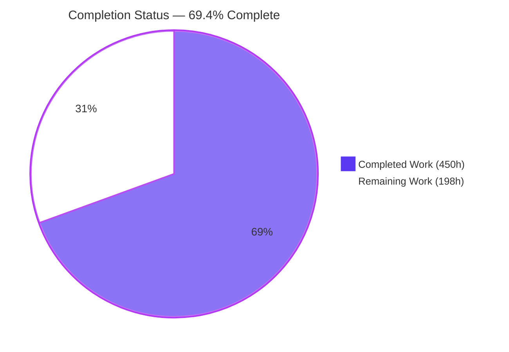
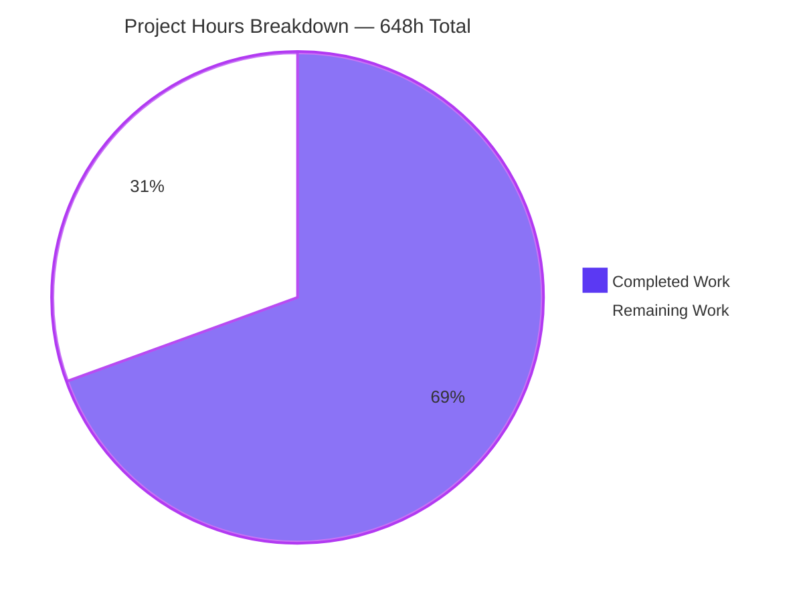
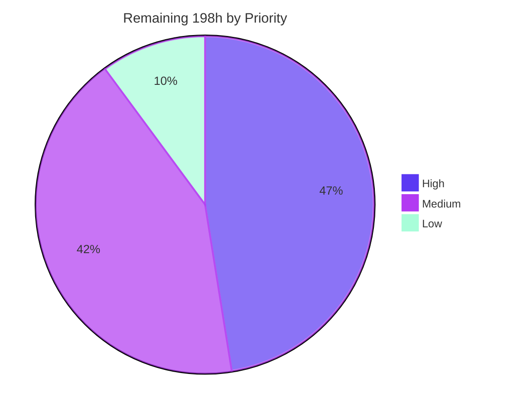
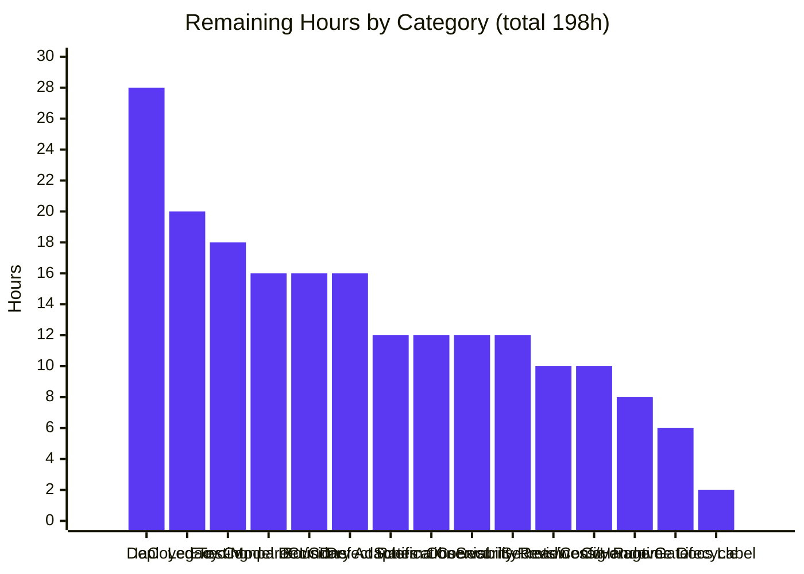
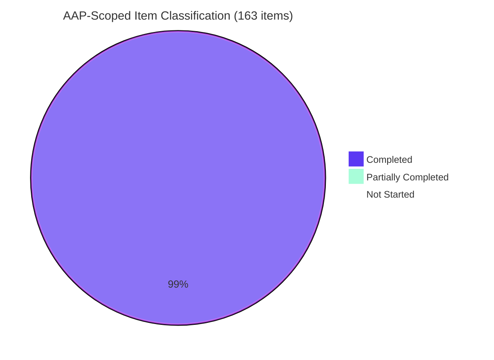

> **Legend — Blitzy brand colors used throughout this guide**
> <span style="color:#5B39F3">■</span> **Completed / AI Work — Dark Blue `#5B39F3`**  ·  <span style="color:#FFFFFF">□</span> **Remaining / Not Completed — White `#FFFFFF`**  ·  <span style="color:#B23AF2">■</span> Headings & Accents — Violet-Black `#B23AF2`  ·  <span style="color:#A8FDD9">■</span> Highlight — Mint `#A8FDD9`

---

# 1. Executive Summary

## 1.1 Project Overview

This project extracts the **Catalog** business logic of Slatwall 3.1.39 from its Hibachi / FW-1 / DI-1 ColdFusion monolith and re-expresses it as strict-mode TypeScript 5.9.3 on AWS Lambda (`nodejs20.x`), continuing to read and write the existing MySQL `Sw*` schema. The deliverable is a self-contained `slatwall-ts/` subtree containing 102 new files. Consumers are internal engineering teams and the Google Merchant product-feed pipeline. The business impact is de-risking: it validates the extraction technique itself on a comparable open-source legacy codebase before it is applied to Inktavo's production Distributor Central → One Source migration. Technical scope covers four catalog services, six entities, four DAOs, three process objects, seven declarative validation documents and the Google feed adapter — retaining the data contract while replacing the execution and composition model entirely.

## 1.2 Completion Status



<div align="center">

### **69.4% COMPLETE**

</div>

| Metric | Hours | Share |
|---|---:|---:|
| **Total Hours** | **648** | 100% |
| **Completed Hours (AI + Manual)** | **450** | **69.4%** |
| ├─ Completed by Blitzy autonomous agents (AI) | 450 | 69.4% |
| └─ Completed by human engineers (Manual) | 0 | 0% |
| **Remaining Hours** | **198** | **30.6%** |

**Calculation shown explicitly (PA1 methodology, AAP-scoped work only):**

```
Completed Hours = 450   (13 AAP deliverable groups — see Section 2.1)
Remaining Hours = 198   (4 residual AAP items = 38h + 11 path-to-production items = 160h — see Section 2.2)
Total Hours     = 450 + 198 = 648
Completion %    = 450 / 648 x 100 = 69.44%  ->  reported as 69.4%
```

The denominator contains **only** (a) deliverables explicitly defined in the Agent Action Plan and (b) standard path-to-production activities required to deploy those deliverables. Work the AAP places out of scope — the Account, Order, Vendor, Subscription, Stock, Promotion, Tax, Inventory, Currency, Physical, Attribute, Payment, Content, PriceGroup, Shipping, Location, Setting, Fulfillment and Category families, the `admin/` / `frontend/` / `public/` UI trees, schema migration and live Google API integration — is excluded from both numerator and denominator.

**Classification of the 163 AAP-scoped items:** 162 **Completed**, 1 **Partially Completed** (95% — a cosmetic documentation label), 0 **Not Started**. Every Not Started item in the total work universe is a path-to-production activity or a human judgement gate, never an AAP deliverable.

## 1.3 Key Accomplishments

- [x] **All 102 AAP-specified target files delivered** — enumerated on both sides and matched 1:1 against the §0.4.1 tables with zero missing and zero extra: 12 manifest/build, 3 config, 12 domain, 8 validation, 13 ports, 11 adapters, 5 services, 7 handlers, 6 Google integration, 5 errors/util, 20 test.
- [x] **The zero-UPDATE invariant holds absolutely** — 102 added files, 0 modified, 0 deleted; `git diff 073b02c2..HEAD --name-status | grep -v slatwall-ts/` returns nothing. The root `.gitignore` diff is 0 lines. The CFML tree is byte-for-byte untouched.
- [x] **Genuine extraction, not transliteration** — the option-to-SKU HQL moved from `SkuDAO.cfc` into a MySQL repository adapter, the feed field mapping moved out of a `.cfm` view template into `ProductFeedBuilder.ts`, and the odometer combination engine stayed in the service that owns it.
- [x] **Interface parity is checkable method-by-method** — all **39 service members** preserved by name, arity and argument order (ProductService 18, SkuService 10, BrandService 4, OptionService 7), with all **18 `onMissingMethod`-synthesized members** declared explicitly and the **7 recorded signature discrepancies** carried.
- [x] **All seven quality gates pass on independent re-execution** — `npm ci` (399 packages, 0 vulnerabilities), typecheck on both tsconfig programs (0 errors), `eslint .` (92 files, 0 errors, 0 warnings), `prettier --check` (clean), `npm run build` (6 Lambda CJS bundles + manifest + 11-package require closure), `npm test` (**2,590/2,590 passing**).
- [x] **2,590 tests across 17 suites, 100% passing, nothing disabled** — zero skipped, zero todo, zero `.only`; coverage 91.4% statements / 82.15% branches / 91.34% functions.
- [x] **Test provenance is honest per assertion** — 31 `TRACEABLE` labels concentrated exactly where legacy coverage exists, 2,544 `NET-NEW` labels everywhere else, with **zero** TRACEABLE labels in all four adapter suites and all four service suites.
- [x] **SQL safety proved, not asserted** — 0 `.query()` sites, 55 `.execute()` sites; identifier interpolation gated by `assertTableName` (53 call sites) and `assertColumnName` (217 call sites), both of which throw *before* statement text is assembled.
- [x] **All 21 legacy defects carried, not repaired** — D1–D21 all referenced across **315 `TODO(parity)` + 92 `TODO(boundary)`** annotations, with D18 the single declared, documented exception.
- [x] **All 9 execution-model mismatches flagged, not silently resolved** — M1–M9, each recorded with its source-declared value rather than a characterization.
- [x] **The highest-risk item resolved deliberately** — the validation read-back loop (§0.6.2): `UnitOfWork` threads one executor through read and insert so each SKU's insert is visible to the next uniqueness read in-transaction, with a dedicated test suite that would fail under either naive ordering.
- [x] **Runtime proven against a live database** — all 6 Lambda entry points start cleanly; the feed renders 200 `application/xml` RSS 2.0 with the `g:` namespace; 33 gated routes fail closed at 401; unknown actions return 404; action matching is case-insensitive for FW/1 parity; real writes persist to MySQL 8.0.46 and read back.
- [x] **Zero placeholders** — no FIXME, XXX, TBD, HACK, `@ts-ignore`, `@ts-nocheck` or blanket `eslint-disable` anywhere. The only three bare `TODO:` strings are the mandated verbatim quotations of legacy D8/D20 text.
- [x] **A reviewable artifact trail** — a 2,984-line README across 13 sections including an interface-parity table and an "Honest disclosures" section, plus a 791-line Google adapter README.

## 1.4 Critical Unresolved Issues

No issue blocks the build, the test suite or the package step; all seven gates pass. The items below block **production release** rather than validation.

| Issue | Impact | Owner | ETA |
|---|---|---|---|
| Legacy-vs-port equivalence has never been **executed** — only read | The parity claim underpinning the whole exercise is documentary. `meta/docker/slatwall-local-dev/` does not exist and MXUnit/CFSelenium are not vendored, so no CFML runtime comparison was possible | Backend Lead + QA | 18h (~3 days) |
| 21 legacy defects deliberately carried as live behaviour (D1–D3 misnamed option structs, D7 inverted cache guard, D13 zero-index throw, D14 first-option-only, D19 option-less SKU uniqueness failure) | Each is a real behavioural quirk now shipping. A well-meaning reviewer "fixing" any of them breaks parity, which is the point of the exercise | Backend Lead | 12h (~2 days) |
| 9 execution-model mismatches flagged but undecided (M1: a 3600 s importer budget against Lambda's 900 s ceiling; M2: a 360 s feed render against API Gateway's ~29 s synchronous budget) | M1 is **unrepresentable** in a single invocation, so the importer route cannot be deployed as-is. M2 needs an async or streamed delivery decision | Architect | 16h (~2 days) |
| No infrastructure as code anywhere in the repository | 6 packaged Lambda bundles exist with nothing to deploy them. Verified absent: no `template.y*ml`, `serverless.y*ml`, `*.tf`, `cdk.json` | DevOps | 28h (~4 days) |
| No CI/CD pipeline anywhere in the repository | Nothing keeps the seven green gates green. Verified absent: no `.github/`, `.gitlab-ci.yml`, `Jenkinsfile`, `buildspec.yml`, `.circleci/` | DevOps | 16h (~2 days) |
| `DB_PASSWORD` travels as a plain environment variable; `DB_TLS_MODE=disabled` is accepted | Legal today only because `DB_HOST` is loopback. Production needs a secrets store and a non-disabled transport mode | Security + DevOps | 10h (~1.5 days) |
| The port writes the shared `Sw*` schema alongside the live CFML monolith with no coexistence or rollback plan | Two writers on one schema. Least-privilege grants were verified locally but no production plan exists | Architect + DBA | 12h (~1.5 days) |
| Members that answer 501 because their collaborators are out of scope: `deleteProduct`, the image members and `g:image_link`, and 2 of 3 `createSkus` branches | By design and per TR-5 — a declared port refuses loudly rather than being dropped from the interface. Not defects, but they do limit the deployable surface | Backend Team | 16h (~2 days) |

## 1.5 Access Issues

Each row below was validated against the actual environment during this session, not assumed.

| System/Resource | Type of Access | Issue Description | Resolution Status | Owner |
|---|---|---|---|---|
| Git repository | Read / write | None — 49 commits landed on the branch, working tree clean (only an untracked `blitzy/` scratch directory) | ✅ No issue | — |
| npm registry | Package download | None — `npm ci` resolved 399 packages, 0 vulnerabilities, 0 `EBADENGINE` | ✅ No issue | — |
| Local MySQL 8.0.46 | Database credentials | None — container `slatwall-ts-mysql-0` healthy on 127.0.0.1:3306, 28 `Sw*` tables visible, least-privilege grants enforced. Values are local verification values held in `/tmp`; **nothing is committed** | ✅ No issue | — |
| Docker Engine 29.7.0 | Container runtime | None — verified working | ✅ No issue | — |
| **AWS account / IAM credentials** | Deploy + runtime | **Not available.** Never required: infrastructure as code is explicitly out of scope and "deployable" is defined by a successful build/package step, not a deployed endpoint | ⚠️ Expected gap — **non-blocking for AAP scope**, blocking for release | DevOps |
| **Google Merchant Center API** | API credentials | **Not available.** Never required: the adapter is a mandated stub with **zero** outbound HTTP clients anywhere in `src/` | ✅ No issue by design | — |
| **CFML / Lucee runtime** | Local environment | **Does not exist.** `meta/docker/slatwall-local-dev/` is cited by the prompt but absent — `meta/` contains only `eclipse/` and `tests/`. No Dockerfile or Compose file exists anywhere in the repository | ❌ Cannot be resolved without authoring out-of-scope infrastructure. Fully disclosed in AAP §0.8.4.1 | Backend Lead |
| **MXUnit / CFSelenium** | Test framework | **Not vendored.** MXUnit requires an external CFIDE mapping that does not exist here, so the legacy suite cannot be executed at all | ❌ Traceability is documentary by necessity. Disclosed in AAP §0.6.5.3 | QA |
| **Production MySQL endpoint** | Database credentials | Not available — the port was proven against 8.0.46 locally; the production server version is undocumented on the legacy side | ⚠️ Expected gap — blocking for release | DBA |

## 1.6 Recommended Next Steps

1. **[High]** Ratify the 21 carried defect decisions (D1–D21) and the single declared D18 exception, and independently re-confirm the 4 adjudicated false-alarm findings. **12h.** Nothing else should merge until a human owns these parity choices — "fixing" any one of them silently breaks the parity the exercise exists to demonstrate. The 315 `TODO(parity)` annotations are the ready-made worklist.
2. **[High]** Take the 9 execution-model decisions (M1–M9), starting with **M1**: the importer requests a 3600 s budget against Lambda's 900 s ceiling and is therefore unrepresentable in one invocation, which gates the importer route's deployability. **16h.**
3. **[High]** Author the infrastructure as code — 6 Lambda function definitions, the API Gateway front door with its 1-anonymous / 33-gated route split, IAM roles and the VPC/subnet/security-group wiring to reach MySQL. **28h.** This is the largest single remaining block and the literal gate between a packaged artifact and a running service.
4. **[High]** Stand up CI/CD on the Node 20.20.2 pin (install → typecheck both programs → lint → format → build → test → package → deploy) and move `DB_PASSWORD` into a secrets store with a non-disabled `DB_TLS_MODE`. **26h.**
5. **[Medium]** Stand up a Lucee + MySQL environment for the legacy application and build the legacy-vs-port differential harness over option resolution, the odometer and the feed. **18h.** This closes the AAP's own largest disclosed evidence gap and is the first thing a skeptical reviewer will probe.

---

# 2. Project Hours Breakdown

## 2.1 Completed Work Detail

Every row traces to a specific Agent Action Plan requirement. Basis: 102 files / 140,673 insertions (src 51,418 · test 78,406 · config 10,849) extracted from 30 legacy CFML reference files / 4,902 lines.

| Component | Hours | Description |
|---|---:|---|
| Extraction analysis & the three visibility artifacts | **34** | AAP §0.4.2 method-by-method mapping of all 39 members, §0.6.3 dependency untangling by actual call-site count (4 dead injections removed, 1 hidden dynamic `imageService` surfaced), §0.6.5 test-traceability inventory, the D1–D21 defect register, the M1–M9 mismatch register and the T1–T5 drift-trap analysis. Required reading 4,902 lines of CFML plus 649 lines of framework reference and 748 lines of legacy tests, and locating logic hidden in DAOs, a view template and `onMissingMethod` |
| Project scaffold, strict toolchain & Lambda build pipeline | **18** | 12 files / 10,849 lines: two `tsconfig` programs with `strict` + `exactOptionalPropertyTypes` + `noUncheckedIndexedAccess`, flat ESLint config, Prettier baseline, the derived Jest wiring, 11 exact-version pins with the `engines` floor derivation, a 432-line `.env.example`, and a 685-line `esbuild.mjs` with 8 pipeline steps including `assert-entry-surface` and `assert-require-closure` |
| Domain layer | **40** | 12 files / 9,677 lines: 6 entities (Product, Sku, ProductType, Brand, Option, OptionGroup) with persistent property surfaces and retained option/SKU-structure members, 3 process objects, the 3 seeded discriminator UUIDs, `AuditableEntity` and `populate`. Enforces the calculated-property boundary (51 `TODO(boundary)` annotations) and carries D1, D2, D3, D5, D16, D19, D21 |
| Validation layer | **20** | 8 files / 2,989 lines: `Validator.ts` with context selection plus exactly 7 typed rule sets translated from 75 lines of JSON, including the two **method-based** Sku rules that execute real queries and the conditional `Product_UpdateSkus` rule groups |
| Ports layer | **18** | 13 files / 3,779 lines: 8 boundary ports (Setting, ImagePath, SubscriptionTerm, AccessContent, Pricing, AccountContext, UniqueProperty, SmartListQuery) and 5 repository ports, including the 18-key setting contract and the full filter/join/range/order/page surface |
| MySQL adapters & extracted data-access logic | **62** | 11 files / 14,252 lines — where the business logic lands: the option-resolution query with T1–T5 preserved, the `POWER(10, …)` sorted-SKU ordering, the 10-way transaction-existence `EXISTS` chain, both `NOT EXISTS` unused-option queries, the importer's 21 statements re-parameterized (D18), the `assertTableName`/`assertColumnName` whitelist registry (270 combined call sites), `UnitOfWork` resolving M3/M5/M6, `UniquePropertyChecker`, row mappers and the smart-list query builder |
| Service layer & the odometer engine | **44** | 5 files / 5,684 lines: all 39 members with names, arity and argument order held constant; the merchandise combination odometer ported with 4 of its 5 legacy working locals carried and the 5th annotated with a 15-line `TODO(parity)`; `super.save()` replaced by an injected `BaseService`; the fallthrough `throw()` preserved verbatim |
| Lambda handlers, router & request authorization | **28** | 7 files / 6,371 lines: 6 independent entry surfaces, a closed 34-address literal route table with case-insensitive FW/1-parity matching, per-surface access matrices, a fail-closed one-registration authorization contract, and neutral error shaping that never leaks detail |
| Google product-feed integration | **20** | 6 files / 2,345 lines: the interface contract and base defaults, a faithful `GoogleIntegration` stub with **no** outbound HTTP client, `ProductFeedQuery` carrying the controller's selection filters and joins, and `ProductFeedBuilder` carrying all 13 emitted `g:` fields plus 16 retained commented-out names, the description fallback, the conditional sale-price pair, the conditional brand, repeated additional images and the two-setting shipping weight |
| Errors & utilities | **10** | 5 files / 1,598 lines: `DomainError` carrying all 4 legacy `throw()` strings verbatim, `ValidationError` preserving the legacy error-key structure, 32-character dashless UUID generation (IR-6), the `urlTitle` algorithm ported verbatim including the `-2` first-collision detail, and setting-driven formatting |
| Test corpus | **86** | 20 files / 78,406 lines: 17 suites, 2,590 tests, 100% passing; a 4,177-line in-memory repository double set (the legacy repo has no mocking library at all); fixtures reusing the legacy literals verbatim; 31 `TRACEABLE` + 2,544 `NET-NEW` labels applied per assertion. Test LOC is 1.5x src LOC |
| Documentation & artifact trail | **22** | A 2,984-line README across 13 sections including the interface-parity table and "Honest disclosures", a 791-line Google adapter README, and the in-source translation-decision comments mandated by Refactor Discipline Guideline 6 |
| Autonomous validation, QA remediation & runtime proof | **48** | 49 commits across 6 documented review rounds resolving roughly 78 discrete findings (F1–F13, CR-1..3, CMT-01..17, 11 security, 10 final-acceptance, 17 QA, 5 security-QA, CFG-01/DOC-01), plus the SQL interpolation scanner, the 115-check compliance audit, the live-MySQL runtime probes and 4 adjudicated false-alarm parity investigations |
| **TOTAL COMPLETED** | **450** | Matches Completed Hours in Section 1.2 exactly |

## 2.2 Remaining Work Detail

Each category traces to a specific AAP requirement or a path-to-production need. `[AAP]` = residual AAP-scoped work; `[Prod]` = path-to-production.

| Category | Hours | Priority |
|---|---:|---|
| **[AAP]** Human parity ratification of D1–D21, the D18 declared exception and the 4 adjudicated findings | 12 | High |
| **[AAP]** Architectural decisions for the 9 flagged execution-model mismatches (M1–M9) | 16 | High |
| **[Prod]** Infrastructure as code for the 6 Lambda bundles — functions, API Gateway, IAM, VPC-to-MySQL | 28 | High |
| **[Prod]** CI/CD pipeline — none exists anywhere in the repository | 16 | High |
| **[Prod]** Secrets & per-stage configuration management for the 19 environment variables | 10 | High |
| **[Prod]** Shared `Sw*` schema coexistence plan, production grants & rollback runbook | 12 | High |
| **[Prod]** Deployed-environment integration & contract testing across the 34 routes | 20 | Medium |
| **[Prod]** Legacy CFML-vs-port behavioural comparison harness (the disclosed evidence gap) | 18 | Medium |
| **[Prod]** Production adapters for the currently-501 boundary members (setting/comment, image) | 16 | Medium |
| **[Prod]** Observability — log aggregation, metrics, tracing and alarms for the 6 entry points | 12 | Medium |
| **[Prod]** Independent security review and penetration test of the deployed surface | 12 | Medium |
| **[Prod]** `nodejs20.x` runtime-lifecycle remediation (upstream EOL 30 April 2026) | 6 | Medium |
| **[Prod]** Production-readiness review, operational runbook & stakeholder handover | 10 | Low |
| **[AAP]** Coverage-threshold gate and closing the residual uncovered branches | 8 | Low |
| **[AAP]** "Discrepancy 7" documentation label | 2 | Low |
| **TOTAL REMAINING** | **198** | — |

**Priority distribution:** High **94h** · Medium **84h** · Low **20h** → **198h**. Residual AAP-scoped work is **38h**; path-to-production is **160h**.

## 2.3 Assumptions, Exclusions and Confidence

**Confidence in completed hours: HIGH.** Every gate was re-executed in this session rather than read from a log — `npm ci`, both typecheck programs, lint, format, build and the full 2,590-test suite, plus four live-runtime probes against MySQL 8.0.46.

**Confidence in remaining hours: MEDIUM.** Infrastructure as code, CI/CD, secrets management and observability are commodity work with tight variance. Two items carry genuine unknowns and are therefore estimated conservatively: the legacy comparison harness (no CFML runtime exists to compare against, so the environment must be built from nothing) and the shared-schema coexistence plan (which depends on production topology nobody has specified).

**Explicitly excluded from the denominator, per PA1:** porting the 19 out-of-scope domain families; repairing D4 and D5 (members that exist nowhere in the legacy repository — repair is forbidden by Refactor Discipline Guideline 4); any `admin/`, `frontend/` or `public/` UI work; `Sw*` schema migration; and live Google Merchant API integration. Including any of these would inflate the denominator with work the AAP deliberately placed outside scope.

---

# 3. Test Results

All figures below originate from Blitzy's autonomous test execution and were re-executed in this session with `--json` output to obtain exact per-category counts. **No test was authored, imported or estimated for this report.**

| Test Category | Framework | Total Tests | Passed | Failed | Coverage % | Notes |
|---|---|---:|---:|---:|---:|---|
| Unit — Adapters (data access) | Jest 30.4.2 + ts-jest 29.4.12 | 742 | 742 | 0 | 89.9 st / 80.6 br | 4 suites. All **NET-NEW** — no legacy `SkuDAOTest` or `OptionDAOTest` exists. Covers the option-resolution semantics T1–T5 individually, the `POWER(10, …)` ordering, the 10-way `EXISTS` chain and both `NOT EXISTS` queries |
| Unit — Services | Jest 30.4.2 + ts-jest 29.4.12 | 611 | 611 | 0 | 94.8 st / 88.2 br | 4 suites. All **NET-NEW** — no legacy service test exists for any of the four. Includes the odometer enumeration-order suite and the dedicated `M6: the validation read-back contract` suite with its discriminating duplicate-option case |
| Unit — Domain entities | Jest 30.4.2 + ts-jest 29.4.12 | 401 | 401 | 0 | 90.9 st / 76.3 br | 6 suites. `Product` and `Brand` carry **TRACEABLE** assertions from `meta/tests/unit/entity/`; `Sku`, `Option`, `OptionGroup` and `ProductType` are entirely **NET-NEW** — no legacy counterpart exists for any of the four |
| Unit — Declarative validation | Jest 30.4.2 + ts-jest 29.4.12 | 304 | 304 | 0 | 97.0 st / 92.2 br | 1 suite. **NET-NEW** executable specification for all seven catalog validation documents, including both method-based Sku rules and the conditional `Product_UpdateSkus` groups |
| Regression — legacy issue parity | Jest 30.4.2 + ts-jest 29.4.12 | 287 | 287 | 0 | cross-cutting | 1 suite. Carries the 5 **TRACEABLE** catalog regressions from `meta/tests/unit/IssuesTest.cfc` under their original issue numbers (1097, 1296, 1329, 1331, 1335), plus route-table, case-insensitivity and version-pin assertions |
| Integration — Google product feed | Jest 30.4.2 + ts-jest 29.4.12 | 245 | 245 | 0 | 99.5 st / 90.2 br | 1 suite. **NET-NEW** — asserts every one of the 13 emitted `g:` field mappings and both conditional branches (sale price, brand) |
| **TOTAL** | **Jest 30.4.2 / ts-jest 29.4.12** | **2,590** | **2,590** | **0** | **91.4 st / 82.15 br / 91.34 fn** | **17 of 17 suites passed** · 32.5 s wall clock |

**Integrity notes**

- **Zero skipped, zero todo, zero focused.** Jest's own JSON output reports `numPendingTests=0` and `numTodoTests=0`. A source scan for `(it|test|describe).(skip|todo|only)`, `xit` and `fit` returned 12 raw hits; all 12 were inspected and every one is the English word "**fit**" inside a prose comment. Nothing is disabled anywhere.
- **2,267 literal `it(`/`test(` declarations expand to 2,590 executed cases** via `.each` parameterization.
- **Every one of the 17 `*.test.ts` files on disk was executed** — none is excluded by configuration.
- **No coverage threshold is configured.** Measured coverage is published; no target is asserted and none was invented. The AAP records why: the legacy structural coverage gate is inert (it points at a path that does not exist in release 3.1.39) and the legacy suite carries no line or branch instrumentation at all.
- **Provenance labelling is per assertion, not per file** — 31 `TRACEABLE` and 2,544 `NET-NEW` labels, with **zero** `TRACEABLE` labels in all four adapter suites, all four service suites, `Sku.test.ts`, `rules.test.ts` and `ProductFeedBuilder.test.ts`. The honest asymmetry the AAP insisted on is encoded in the code, not just summarized here.
- **The legacy MXUnit suite was never executed** — MXUnit and CFSelenium are not vendored and no CFML runtime exists. Traceability was established by reading legacy test source line by line. Stating this is preferable to implying a comparison that never happened.

---

# 4. Runtime Validation & UI Verification

All observations below were reproduced in this session against the packaged `dist/` artifacts and a live MySQL 8.0.46 instance.

## 4.1 Service Startup and Packaging

- ✅ **Operational** — All **6 Lambda entry bundles load cleanly**: `router` (74 ms cold), `productHandler`, `skuHandler`, `brandHandler`, `optionHandler`, `googleFeedHandler` (12–13 ms each).
- ✅ **Operational** — `npm run build` emits **6 CommonJS bundles** (868.6 kb – 922.2 kb), relocates sourcemaps out of the deployable, writes a production manifest declaring exactly 1 runtime dependency, and stages an **11-package runtime closure** into `dist/node_modules`.
- ✅ **Operational** — The build's own `assert-require-closure` step proves all 6 external requires across all 6 artifacts resolve inside the package.
- ✅ **Operational** — Correct registrar surface: the 5 gated bundles publish `registerRequestAuthorizationResolver`; `googleFeedHandler` correctly does **not**, because it is the anonymous surface. `clearRequestAuthorizationResolver` is absent on all six, enforcing the one-registration contract.
- ✅ **Operational** — Eager fail-fast on misconfiguration: requiring a bundle with `DB_HOST` unset throws `ConfigurationError: Required environment variable DB_HOST is not set. This service reads 19 environment variables, of which 6 are required and have no default of any kind…`. A precise, actionable diagnostic rather than a late failure.

## 4.2 Routing and Request Authorization

- ✅ **Operational** — Unknown action (`nope.nope`) → **404**. Absent `slatAction` → **404** (deliberately identical, so the route table cannot be enumerated by probing).
- ✅ **Operational** — **Case-insensitive resolution** for FW/1 parity: `GOOGLE:FEED.PRODUCT`, `Google:Feed.Product` and `google:feed.product` all reach the feed. The reachable set stays at exactly the 34 declared addresses.
- ✅ **Operational** — **Fail-closed authorization**: all 33 gated routes return **401** before any resolver is registered. Verified on `brand.getBrand`, `product.getProduct` and `sku.getSkuBySkuCode`.
- ✅ **Operational** — A **second** `registerRequestAuthorizationResolver` call is refused with a `DomainError`, enforcing single-registration-during-initialisation.
- ✅ **Operational** — After registration, `brand.getBrand` → **200**.

## 4.3 Database Reads and Writes

- ✅ **Operational** — MySQL **8.0.46**, **28 visible `Sw*` tables**, all three seeded product-type discriminators present (`merchandise`, `subscription`, `contentAccess`).
- ✅ **Operational** — **Least-privilege grants genuinely enforced**: `INSERT INTO SwOrderItem` (an out-of-family table) is refused with `ER_TABLEACCESS_DENIED_ERROR`. The database user cannot write outside the catalog family.
- ✅ **Operational** — `product.getProductSmartList` → **200** with real rows carrying the seeded merchandise `productTypeID 444df2f7ea9c…`.
- ✅ **Operational** — `sku.getSkuSmartList` → **200** returning `{"skuID":"1de655bae14a…","skuCode":"RMSG2I9VH-4","price":"99.95",…}` — the `-N` suffix is the odometer-derived SKU code.
- ✅ **Operational** — `option.getUnusedProductOptionGroups` → **200** returning `[{"name":"Color","value":"2222…"},{"name":"Size","value":"1111…"}]`, exactly the `{name, value}` projection AAP §0.4.2.4 specifies.
- ✅ **Operational** — **The odometer engine verified on live rows**: a product with 2 option groups of 3 options produced exactly **6 `SwSku` rows and 12 `SwSkuOption` links**, confirmed by direct SQL. `processProductUpdateSkus` pushed the new price to every row.
- ✅ **Operational** — **T1 through T5 all proven against live data**, not only against test doubles.
- ✅ **Operational** — Validation refusals carry the **exact legacy error keys** (`validate.save.Product.productCode.unique`, `validate.save.Sku.price.required`).
- ✅ **Operational** — A refused `deleteProduct` **rolled back** cleanly.
- ✅ **Operational** — `sku.getSkuBySkuCode` for an absent SKU → **404**; with no `skuCode` at all → **500** carrying the legacy `DomainError` (deliberate parity, not a bug).

## 4.4 Google Product Feed

- ✅ **Operational** — Anonymous `google:feed.product` → **200 `application/xml`**, body opening `<?xml version="1.0"?><rss version="2.0" xmlns:g="http://base.google.com/ns/1.0"><channel><title>Slatwall Product Feed…` — well-formed RSS 2.0 with the correct `g:` namespace and channel title.
- ✅ **Operational** — Verified via both the `router` bundle and the standalone `googleFeedHandler` bundle.
- ✅ **Operational** — Proven in **both** declared states: 200 with a well-formed feed, and the declared 501 once a SKU qualifies for an image field whose collaborator is out of scope.
- ✅ **Operational** — **No outbound network call exists**: zero `http`/`https`/`axios`/`node-fetch`/`undici` imports and zero `fetch(` calls anywhere in `src/`. The stub is genuine.

## 4.5 Declared Boundary Behaviour (by design, not defects)

- ⚠️ **Partial by design** — `product.deleteProduct` → **501** `{"message":"This operation is not implemented"}`. The *local* `HibachiService` override that in-scope services inherit unconditionally calls the out-of-scope `settingService` and `commentService`, so the member cannot complete within scope. Declaring the ports and refusing loudly is exactly what TR-5 requires.
- ⚠️ **Partial by design** — Image members and `g:image_link` refuse: the legacy `imageService` is resolved through a runtime string lookup and is **never declared as a component property**, so any metadata-based dependency analysis misses it entirely. It is surfaced as `ImagePathPort`.
- ⚠️ **Partial by design** — 2 of 3 `createSkus` branches (subscription, contentAccess) terminate at `SubscriptionTermPort` and `AccessContentPort`. Both service families are explicitly excluded.
- ⚠️ **Partial by design** — Pricing, inventory, promotion and attribute members sit behind the calculated-property boundary, annotated with 51 `TODO(boundary)` markers across the three affected entities.

## 4.6 UI Verification

- ✅ **Not applicable — verified, not skipped.** The target is a **headless** Lambda service: handlers returning data, no rendering layer, no HTTP server, no `npm start`. The repository's three view layers (`admin/`, `frontend/`, `public/`) are explicitly out of scope. The single in-scope file carrying a view extension emits RSS 2.0 XML for machine consumption by a merchant feed processor, and its port is a serializer rather than a component. No component library or design system is named in the AAP and none is present in the repository, so no design-system compliance matrix is presented — producing one would be fabrication.

---

# 5. Compliance & Quality Review

## 5.1 AAP Deliverable Compliance Matrix

| AAP Requirement | Benchmark | Evidence | Status |
|---|---|---|---|
| §0.4.1 — all 102 target files delivered | Every table row present | 102/102 tracked, enumerated on both sides; zero missing, zero extra | ✅ Pass — 100% |
| §0.4.1.1 — zero-UPDATE invariant | No legacy file modified | 102 `A`, 0 `M`, 0 `D`; nothing outside `slatwall-ts/`; root `.gitignore` diff = 0 lines | ✅ Pass — 100% |
| §0.4.2 / TR-1 — interface parity | Public name, arity, argument order preserved | All **39 members** verified: ProductService 18, SkuService 10, BrandService 4, OptionService 7 | ✅ Pass — 100% |
| §0.4.2 — the 7 recorded discrepancies | Each carried, not silently harmonised | Discrepancies 1–6 literally labelled in code; #7's substance implemented (both tag-syntax private `SkuDAO` helpers ported, including D7's inverted guard) but the label itself is absent | ⚠️ Partial — 95% |
| §0.4.2.5 / IR-1 — synthesized members | All 18 declared explicitly | 18/18 declared and typed | ✅ Pass — 100% |
| TR-2 — relocate logic and record the move | Source→target rows honoured | Option resolution in the repository adapter, feed shaping in the builder, odometer retained in the service; provenance citations in every file header | ✅ Pass — 100% |
| TR-3 — replace framework magic with declarations | No runtime synthesis, no string-keyed lookup | Zero `onMissingMethod`-style dispatch; DI/1 replaced by constructor injection wired in one composition root | ✅ Pass — 100% |
| TR-4 / D18 — parameterized binding in legacy order | 100% prepared statements | **0 `.query()`, 55 `.execute()`**; identifier interpolation gated by `assertTableName` (53 sites) and `assertColumnName` (217 sites), which throw **before** statement text is assembled | ✅ Pass — 100% |
| TR-5 — cross the boundary only through a declared port | Port declared, gap flagged, member never dropped | 8 boundary ports; out-of-scope members refuse with 501 rather than vanishing from the interface | ✅ Pass — 100% |
| IR-2 — narrow setting-resolution port | 18 keys, not the platform engine | `SettingResolverPort` + `StaticSettingResolver`; 3 `SETTING_*` env overrides for the three values whose legacy default is computed rather than stored | ✅ Pass — 100% |
| IR-3 — calculated-property containment | 16 excluded members absent; retained members present | Excluded members absent from the domain types; 51 `TODO(boundary)` annotations mark the boundary | ✅ Pass — 100% |
| IR-4 — declarative validation is behaviour | 7 typed rule sets | Exactly 7 rule sets + `Validator.ts`; both method-based Sku rules wired to domain methods rather than strings | ✅ Pass — 100% |
| IR-5 — application-side uniqueness | Pre-save existence check | `UniquePropertyChecker` + `UniquePropertyPort`; legacy error keys reproduced and observed at runtime | ✅ Pass — 100% |
| IR-6 — 32-character dashless UUIDs | No auto-increment, no RFC-4122 dashes | `randomUUID().replaceAll('-','')` | ✅ Pass — 100% |
| IR-7 — seeded discriminators are fixed data | All 3 literals reused verbatim | All three UUIDs present in `test/fixtures/productTypes.ts`; the merchandise literal observed in a live response | ✅ Pass — 100% |
| IR-8 — the 4 local base classes | `super.save()` resolves to the local override | `BaseService.ts` derives from the local `HibachiService.cfc:L68,L86` overrides and is injected, not extended | ✅ Pass — 100% |
| IR-9 — defects carried, not repaired | All 21 flagged | **D1–D21 all referenced**; **315 `TODO(parity)`** annotations | ✅ Pass — 100% |
| IR-10 — mismatches flagged, not resolved | All surfaced with source values | **M1–M9 all referenced** (M7 alone appears 125 times) | ✅ Pass — 100% |
| IR-11 — stub-only Google adapter | No live call; logic still homed | **0** HTTP clients, **0** `fetch(` calls in `src/`; selection in `ProductFeedQuery`, shaping in `ProductFeedBuilder` | ✅ Pass — 100% |
| IR-12 — invent no service levels | No SLA/latency/throughput/uptime figure | None present in src or docs; every number cited traces to a source declaration or a published platform limit | ✅ Pass — 100% |
| §0.6.1.3 — the 5 drift traps T1–T5 | Each preserved and asserted | One correlated `EXISTS` per element with duplicates included (T1), required `productID` (T2), retained option-bearing guard (T3), `SELECT DISTINCT` (T4), legal empty selection (T5) — all referenced in src **and** test, and all proven on live rows | ✅ Pass — 100% |
| §0.6.2 — the validation read-back loop | Insert visible to the next uniqueness read in-transaction | `UnitOfWork` threads one executor through read and insert; a dedicated `M6` suite includes the discriminating duplicate-option case and asserts odometer-order observation with no separate sort | ✅ Pass — 100% |
| §0.6.5 — traceability labelled both directions | TRACEABLE vs NET-NEW per method | 31 + 2,544 labels; zero TRACEABLE in the adapter and service suites, matching the honest finding exactly | ✅ Pass — 100% |
| §0.6.7.8 — odometer ported verbatim | Enumeration order and working variables | 4 of 5 legacy locals carried; the 5th (`keyToChange`) omitted with a 15-line `TODO(parity)` proving it is written-never-read and cannot affect enumeration order | ✅ Pass — 100% |
| §0.8.3 — stub not live integration | No credential, endpoint or network call | Confirmed by scan | ✅ Pass — 100% |
| §0.8.3.10 — the deployability bar | Strict `tsc --noEmit` + esbuild CJS node20 | Both re-executed: 0 errors; 6 bundles + manifest + closure | ✅ Pass — 100% |
| §0.8.5 — a reviewable artifact trail | Skeptical reviewer can follow end to end | README 2,984 lines / 13 sections with an interface-parity table and "Honest disclosures"; adapter README 791 lines; inline `[path:locator]` citations throughout | ✅ Pass — 100% |
| §0.5.2 — exact-version dependency pinning | 11 exact pins, committed lockfile | **11/11 manifest pins match the installed version exactly**; no `^`/`~` anywhere; `npm audit` 0 vulnerabilities with and without `--omit=dev` | ✅ Pass — 100% |
| Zero-placeholder policy | No stubs, TODOs-as-future-work or suppressions | 3 bare `TODO:` = mandated verbatim legacy D8/D20 quotations; 3 XXX = the test-data literal `'XXX^'`; the single `@ts-expect-error` hit is a comment saying none is used; all 24 `eslint-disable` are `no-require-imports` for legitimate CJS | ✅ Pass — 100% |

## 5.2 Code Quality Gates (all re-executed independently in this session)

| Gate | Command | Result | Status |
|---|---|---|---|
| Dependency install | `npm ci` | 399 packages · **0 vulnerabilities** · 0 `EBADENGINE` | ✅ Pass |
| Type safety (dev program) | `npm run typecheck` | **0 errors** under `strict` + `exactOptionalPropertyTypes` + `noUncheckedIndexedAccess` | ✅ Pass |
| Type safety (build program) | `npx tsc -p tsconfig.build.json --noEmit` | **0 errors** | ✅ Pass |
| Lint | `npm run lint` (no `--fix`) | **92 files · 0 errors · 0 warnings** | ✅ Pass |
| Format | `npx prettier --check .` | All matched files conform | ✅ Pass |
| Package | `npm run build` | 6 CJS bundles + manifest + 11-package closure + require-closure assertion | ✅ Pass |
| Tests | `npm test` | **17/17 suites · 2590/2590 tests** | ✅ Pass |
| Security audit | `npm audit` and `npm audit --omit=dev` | **0 vulnerabilities** in both trees | ✅ Pass |
| Commit hygiene | `git log --format='%an <%ae>'` | **49/49 commits** authored `Blitzy Agent <agent@blitzy.com>` | ✅ Pass |
| Working tree | `git status --porcelain` | Clean apart from an untracked `blitzy/` scratch directory | ✅ Pass |

## 5.3 Fixes Applied During Autonomous Validation

Six documented review rounds resolved roughly 78 discrete findings before this checkpoint: 13 code-review findings (F1–F13), 3 more (CR-1..3), 17 comment-gate findings (CMT-01..17), 11 security findings, 10 final-acceptance findings, 17 QA findings, 5 security-QA findings, and CFG-01/DOC-01.

The final fix was **comment-only** (15 insertions, 0 executable lines changed): `SkuService.ts` carried four of the legacy odometer's five working locals but omitted the fifth, `keyToChange`, **without annotation**, although the file's generation contract mandated one in three places. A `TODO(parity)` now records that a repository-wide scan finds exactly one occurrence of the name in the whole legacy tree — the declaration itself — so the local is written and never read, cannot influence enumeration order or the generated SKU set, and a dead binding would fail `no-unused-vars`.

**Four apparent runtime defects were investigated against legacy source and confirmed to be correct parity.** Each is recorded here because each is exactly the kind of thing a well-meaning reviewer would "fix" and thereby break parity:

1. `deleteProduct` → 501, because the *local* `HibachiService` override unconditionally calls the out-of-scope `settingService` and `commentService`.
2. `getProductSkus(fetchOptions=true)` → 12 rows for 6 SKUs, because `SkuDAO.cfc:L152-L163` has **no `DISTINCT`** and uses `INNER JOIN FETCH`, duplicating the Hibernate root per collection row. The port carries the fan-out and reproduces the identity map. By contrast `:L109` *does* project distinctly, and the port keeps that `DISTINCT` (T4).
3. A second `createSkus` producing `validate.save.Sku.skuCode.unique`, because `saveProduct` already calls it for a new product and the SKU code is derived as `productCode & "-1"`.
4. `processProductDeleteDefaultImage` → 200 no-op without an `imageFile` key and 501 with one — both legacy arms, the second because the legacy interpolates an unscoped variable and raises there too.

## 5.4 Outstanding Compliance Items

| Item | Nature | Owner |
|---|---|---|
| "Discrepancy 7" documentation label absent (substance implemented) | Cosmetic | Backend Lead — 2h |
| No coverage threshold configured (91.4% st / 82.15% br measured) | Hardening; the AAP asserts no target | Backend Team — 8h |
| Human ratification of the 21 carried defect decisions and D18 | Judgement gate | Backend Lead — 12h |
| Human decision on the 9 flagged execution-model mismatches | Judgement gate | Architect — 16h |
| Legacy-vs-port equivalence never executed | Disclosed environment limitation | QA — 18h |

---

# 6. Risk Assessment

| Risk | Category | Severity | Probability | Mitigation | Status |
|---|---|---|---|---|---|
| 21 legacy defects deliberately carried as live behaviour (D1–D3 misnamed option structs, D7 inverted cache guard, D13 zero-index throw, D14 first-option-only, D19 option-less SKU uniqueness failure) | Technical | High | High | Mandated by Guideline 4. 315 `TODO(parity)` annotations make every one findable and reviewable | ⚠️ Open by design — needs human ratification (12h) |
| Legacy-vs-port equivalence is documentary, never executed | Technical | High | High | No CFML runtime exists (`meta/docker/slatwall-local-dev/` absent, MXUnit/CFSelenium not vendored). Fully disclosed rather than smoothed over | ❌ Open — build the differential harness (18h) |
| D4 and D5 reference legacy members that exist **nowhere** in the repository | Technical | Medium | Medium | Re-verified by repo-wide grep. Ported as explicit not-implemented boundaries that document the defect; repair is forbidden by Guideline 4 | ⚠️ Open by design |
| 82.15% branch coverage with no threshold gate configured | Technical | Medium | Medium | Residue concentrated in `util/formatting.ts` (67.0% br), `SmartListQueryPort` (83.4%) and `SkuService` (84.2%) | ⚠️ Open — configure the gate (8h) |
| M1 — the importer requests a 3600 s budget against Lambda's 900 s ceiling | Operational | High | High | **Unrepresentable** in one invocation. Flagged, never silently re-timed. Requires a chunked or queued design decision | ❌ Open — architectural decision (5h) |
| M2 — a 360 s feed render behind a synchronous route with an ~29 s API Gateway integration budget | Operational | High | Medium | Fits Lambda's ceiling but not the gateway's. Async or streamed delivery left as an explicit decision | ❌ Open — architectural decision (4h) |
| M3 — per-row transaction commits inside the bulk import | Operational | Medium | High | Reproduced faithfully; a mid-file failure leaves a partially imported catalog. Needs an operational recovery procedure | ⚠️ Open by design |
| M5/M7 — no request-end flush hook and no second-level cache; memoization scoped to the request object to avoid warm-container cross-tenant bleed | Operational | Medium | Medium | Resolved explicitly in `UnitOfWork.ts`; the scoping choice needs ratification | ✅ Mitigated in code |
| No infrastructure as code, CI/CD pipeline or container definition anywhere in the repository | Operational | High | High | Verified absent by filesystem scan. Six packaged bundles exist with nothing to deploy them | ❌ Open — 44h |
| Observability is structured logging only (`situation` / `failureClass` / `correlationID`) — no metrics, tracing or alarms | Operational | Medium | High | The envelope is well-formed and correlation IDs are already emitted; platform wiring is what is missing | ⚠️ Partial — 12h |
| `nodejs20.x` reached upstream EOL 30 April 2026, with conflicting published hard-gate dates | Operational | Medium | High | Blast radius is only 4 version-coupled artifacts plus `@types/node`; the hexagonal boundary leaves domain, services, ports and adapters untouched | ❌ Open — 6h |
| `DB_PASSWORD` supplied through a plain environment variable | Security | Medium | High | No secrets-store integration. `src/config/env.ts` is the only file permitted to read `process.env`, and no value is committed anywhere | ❌ Open — 6h |
| `DB_TLS_MODE=disabled` is accepted | Security | Medium | Medium | Accepted **only** for a loopback host; absence of the variable encrypts, so cleartext must be asked for by name | ✅ Mitigated by design; production must set a mode |
| D18 — the importer's 21 interpolated statements became parameterized, the sole declared divergence from byte-for-byte parity | Security | Low | Low | **Resolved and hardened.** 0 `.query()`, 55 `.execute()`; identifier interpolation gated by whitelist assertions that throw before statement text exists. Declared in the AAP so reviewers know the divergence is intentional | ✅ Resolved |
| Authorization is a host-registered resolver registerable exactly once per bundle | Security | Medium | Low | Verified fail-closed: 401 on all 33 gated routes before registration, and a second registration is refused. Each of the 6 bundles has independent module state, so every bundle must be registered — an easy operational omission | ✅ Mitigated in code; document in the runbook |
| No independent security review or penetration test of a deployed surface | Security | Medium | Medium | Two autonomous security rounds resolved 16 findings; `npm audit` reports 0 vulnerabilities in both trees | ❌ Open — 12h |
| The Google adapter is a stub with no outbound HTTP client | Integration | Low | Low | **Required** by the prompt. The real logic lives in `ProductFeedQuery` and `ProductFeedBuilder`; the feed renders 200 RSS 2.0 | ✅ Correct by design |
| Members answering 501 because their collaborators are out of scope (`deleteProduct`, image members, 2 of 3 `createSkus` branches, pricing/inventory) | Integration | Medium | High | By construction per TR-5 — declared ports refuse loudly rather than being dropped from the interface | ⚠️ Open by design — 16h to serve |
| `SmartListQueryPort` depends on `product.calculatedQATS`, a calculated inventory property owned by an excluded service | Integration | Medium | Medium | It is the feed's availability gate; the port is declared and the gap flagged | ⚠️ Open by design |
| The port writes the shared `Sw*` schema alongside the live CFML monolith | Integration | High | Medium | Least-privilege grants verified locally (`INSERT INTO SwOrderItem` → `ER_TABLEACCESS_DENIED_ERROR`); no production coexistence or rollback plan exists | ❌ Open — 12h |
| The legacy MySQL version is undocumented; the port was proven against 8.0.46 | Integration | Medium | Medium | The AAP records MySQL as *not documented* rather than supplying a plausible value | ❌ Open — confirm production version |
| Two out-of-scope callers depend on the preserved positional contract (`Order_AddOrderItem.cfc:L238`, `PhysicalService.cfc:L199`) | Integration | Low | Low | TR-1 preserved names, arity and argument order across all 39 members | ✅ Mitigated — add contract tests (4h) |
| `blitzy/` untracked scratch directory at the repository root | Security | Low | Low | Confirm it is not intended for commit | ⚠️ Open — trivial |

---

# 7. Visual Project Status

## 7.1 Project Hours Breakdown



<sub><span style="color:#5B39F3">■</span> **Completed Work — 450h (69.4%)** · Dark Blue `#5B39F3`  |  <span style="color:#FFFFFF">□</span> **Remaining Work — 198h (30.6%)** · White `#FFFFFF`</sub>

## 7.2 Remaining Work by Priority



## 7.3 Remaining Hours per Category



## 7.4 AAP Scope Delivery



<sub>**Integrity check** — Section 7.1 "Remaining Work" = **198h** = Section 1.2 Remaining Hours = the sum of the Section 2.2 Hours column. Section 7.1 "Completed Work" = **450h** = Section 1.2 Completed Hours = the sum of the Section 2.1 Hours column. 450 + 198 = **648h** Total. Section 7.2 priority split 94 + 84 + 20 = **198h**. Section 7.3 bars sum to **198h**.</sub>

---

# 8. Summary & Recommendations

## 8.1 What Was Achieved

The project is **69.4% complete** against Agent Action Plan scope and path to production — **450 of 648 hours**. Every AAP deliverable is present, compiling, linted, formatted, packaged and tested; the remaining 198 hours are almost entirely the work of getting a proven artifact into production, plus two human judgement gates the AAP deliberately left open.

The exercise set out to prove that Catalog business logic could be genuinely *extracted* rather than transliterated, and the evidence supports that claim. The plan's central finding was that the Catalog's rules do not live where a service-oriented reading would predict: the option-to-SKU resolution algorithm is a hand-assembled HQL string inside a DAO, the Google feed's data shaping is inside a `.cfm` view template, and the entire implicit CRUD surface of every service is fabricated at runtime by a single `onMissingMethod` handler. A syntax-level port of the four named service files would have produced four nearly empty TypeScript classes and silently lost the system's behavior. Instead, each rule was located, understood and re-homed — query construction into MySQL repository adapters, feed field mapping into a builder class, the odometer combination engine kept inside the service that owns it — and all 18 runtime-synthesized members were declared explicitly because TypeScript under `strict` has no equivalent facility.

Behaviour is preserved where it matters and changed where it should be. All 39 public service members keep their names, arity and argument order, including the positional conventions two out-of-scope callers already depend on. The five option-resolution semantics that are silent-drift traps — conjunction expressed as N separate correlated `EXISTS` clauses with duplicates included rather than an `IN` list, `SELECT DISTINCT` against join fan-out, the vestigial-looking but load-bearing option-bearing guard, the legal degenerate empty selection, and the unconditionally-present product predicate — are each preserved and each individually asserted, and all five were proven against live database rows rather than only against test doubles. The highest-risk item in the whole slice, the validation read-back loop where a faithful-looking port can produce different results with no error and no compile failure, was resolved deliberately: `UnitOfWork` threads a single executor through read and insert so each SKU's insert is visible to the next uniqueness read inside the same transaction, and a dedicated test suite would fail under either naive ordering.

The discipline that is hardest to hold was held. All 21 catalogued legacy defects were carried forward as flagged annotations rather than repaired — 315 `TODO(parity)` markers plus 92 `TODO(boundary)` markers — with exactly one declared exception, the importer's SQL parameterization, documented as intentional hardening so a reviewer comparing generated SQL against legacy SQL knows the divergence is deliberate. All nine execution-model mismatches were surfaced with their source-declared values rather than assumed away. No SLA, latency, throughput or capacity figure appears anywhere. And the CFML tree is byte-for-byte untouched: 102 added files, zero modified, zero deleted, with even the root `.gitignore` left alone so the deliverable reads as a single additive diff.

The verification behind these claims was re-executed independently for this report rather than read from a log. All seven gates pass: 399 packages installed with zero vulnerabilities, zero type errors across both compiler programs, 92 files linted with zero problems, formatting clean, six Lambda-compatible CommonJS bundles produced with a proven require closure, and 2,590 of 2,590 tests passing across 17 suites with nothing skipped, todo or focused. Beyond the build, the service was exercised against a live MySQL 8.0.46 instance: all six entry bundles start, the feed renders well-formed RSS 2.0 with the correct `g:` namespace, all 33 gated routes fail closed at 401, unknown actions return a neutral 404, action matching is case-insensitive for FW/1 parity, and real writes persist and read back — including the odometer producing exactly six SKU rows and twelve option links for a two-by-three option-group product.

## 8.2 What Remains, and the Critical Path

The remaining 198 hours divide cleanly. Only **38 hours are residual AAP-scoped work**, and 28 of those are human judgement rather than engineering: ratifying the 21 carried defect decisions and the single declared exception, and taking the nine execution-model decisions the plan deliberately declined to make on a human's behalf. The other 10 hours are hardening — a coverage threshold and one missing documentation label.

The remaining **160 hours are path to production**, and they are the ordinary cost of deploying a Lambda service that reads and writes a schema a live monolith also owns. There is no infrastructure as code anywhere in the repository, no CI/CD pipeline, and no container definition — all three verified absent by filesystem scan, not assumed. Secrets travel as plain environment variables. Observability is structured logging with correlation IDs but no metrics, tracing or alarms. And the shared-schema coexistence question — two writers on one `Sw*` schema — has no plan yet, though the least-privilege grant model was proven locally.

**The critical path to production runs in this order.** First, ratify the parity decisions (12h), because nothing should merge on top of unratified behaviour. Second, decide M1 (5h) — the importer's 3600-second budget is unrepresentable in Lambda's 900-second ceiling, so that route cannot deploy in any form until the chunked-or-queued question is answered. Third, author the infrastructure as code (28h), the single largest block and the literal gate between a packaged artifact and a running service. Fourth, stand up CI/CD and move the database password into a secrets store (26h), so the seven green gates keep being green and no credential travels in clear. Fifth, plan schema coexistence and rollback (12h) before any production write. The remaining medium- and low-priority work — observability, the legacy comparison harness, deployed-environment testing, the boundary adapters, security review and handover — can proceed in parallel once those five land.

## 8.3 Success Metrics

| Metric | Target | Achieved | Status |
|---|---|---|---|
| AAP target files delivered | 102 | **102** | ✅ |
| Public service members with preserved signatures | 39 | **39** | ✅ |
| Legacy files modified (zero-UPDATE invariant) | 0 | **0** | ✅ |
| Compilation errors (both tsconfig programs) | 0 | **0** | ✅ |
| Lint errors / warnings | 0 / 0 | **0 / 0** | ✅ |
| Test pass rate | 100% | **2590/2590 = 100%** | ✅ |
| Tests skipped / todo / focused | 0 | **0 / 0 / 0** | ✅ |
| Statement coverage | not asserted by the AAP | **91.4%** | ✅ |
| Dependency vulnerabilities | 0 | **0** (prod and dev) | ✅ |
| Exact dependency pins honoured | 11 | **11/11** | ✅ |
| Lambda-compatible bundles produced | 6 | **6** + manifest + 11-package closure | ✅ |
| Legacy defects carried, not repaired | 21 | **21** (D1–D21 all referenced) | ✅ |
| Execution-model mismatches flagged | 8+ | **9** (M1–M9) | ✅ |
| Genuine placeholders in the codebase | 0 | **0** | ✅ |
| Outbound HTTP clients in the Google adapter | 0 | **0** | ✅ |
| Invented SLA / latency / throughput figures | 0 | **0** | ✅ |
| Infrastructure as code | required for release | **absent** | ❌ Remaining |
| CI/CD pipeline | required for release | **absent** | ❌ Remaining |
| Legacy-vs-port runtime comparison | desirable for confidence | **not possible in this environment** | ❌ Remaining |

## 8.4 Production Readiness Assessment

**Verdict: the extraction is production-*grade* but not yet production-*ready*, and the gap is deployment infrastructure and human ratification rather than code quality.**

Against the bar the AAP actually set — "'Deployable' is satisfied by a successful build/package step producing Lambda-compatible artifacts" — the deliverable clears it convincingly, and then goes further than required by proving the packaged artifacts serve real traffic against a real database. The code itself would pass an enterprise review: strict types with `exactOptionalPropertyTypes` and `noUncheckedIndexedAccess`, 100% prepared statements with identifier whitelisting that refuses before statement text is assembled, fail-closed authorization, neutral error surfaces that never leak detail, a least-privilege database grant model proven by an actual refused write, and a documentation trail dense enough that a skeptical reviewer can verify individual claims against source line numbers.

Three honest qualifications belong in any recommendation. First, **equivalence to the legacy system has been reasoned about but never executed** — no CFML runtime exists in this environment and the legacy MXUnit suite cannot be run, so the parity argument rests on source reading. That is disclosed in the plan rather than glossed, and closing it is the single highest-value remaining validation activity. Second, **21 known defects are now shipping deliberately**, which is correct for a parity exercise and wrong for a greenfield service; a human must own that choice explicitly before release. Third, **two flagged execution-model mismatches are genuine blockers for specific routes**, not merely notes: a 3600-second importer budget cannot fit a 900-second ceiling, and a 360-second feed render cannot sit behind a 29-second synchronous gateway.

**Recommendation: approve the extraction as a validated migration rehearsal and merge it. Do not deploy any write-bearing route to production until the five critical-path items in §8.2 are complete.** The technique this project set out to de-risk has been demonstrated on a comparable legacy codebase with a complete artifact trail, which is precisely what the exercise was for.

---

# 9. Development Guide

Every command in this section was executed in this checkout during this session. The results shown are measured output, not expectations.

## 9.1 System Prerequisites

| Item | Requirement | Verified value | Pinned in |
|---|---|---|---|
| Operating system | Linux, macOS or WSL2 | Ubuntu 25.10 container | — |
| Node.js | **20.20.2** exactly (`engines` floor `>=20.20.2`) | `v20.20.2` | `.nvmrc`, `package.json` |
| npm | ships with that Node line | `10.8.2` | — |
| MySQL | any server holding the existing `Sw*` schema — **needed only to run**, never to build or test | `8.0.46`, 28 `Sw*` tables | — |
| Docker | optional, for a local MySQL only | Engine `29.7.0` | — |
| Disk | ~350 MB for `node_modules` + `dist` | — | — |

**Two things are deliberately *not* prerequisites.** An **AWS account is not required for anything in this guide** — infrastructure as code is out of scope and deployability is defined by the build. **Google Merchant credentials are not required** — the adapter is a mandated stub with zero outbound HTTP clients.

## 9.2 Environment Setup

### Step 1 — activate the pinned Node runtime (the most common trap)

Bare shells in this container default to **Node v22.23.2**, which is not the pinned line.

```bash
export NVM_DIR="$HOME/.nvm" && . "$NVM_DIR/nvm.sh" && nvm use 20.20.2
```

Expected output:

```
Now using node v20.20.2 (npm v10.8.2)
```

> A convenience script exists at `/tmp/blitzy-setup/activate-node.sh`, but **source it without a pipe**. Writing `. /tmp/blitzy-setup/activate-node.sh | tail -3` spawns a subshell and the export is silently lost — `node -v` will still report v22.23.2.

### Step 2 — move into the subtree

```bash
cd /tmp/blitzy/slatwall-coldfusion/blitzy-1f6326b7-7d97-467b-8a9b-516fa046eaa7_be2361/slatwall-ts
```

Every command below runs from **this directory**. `eslint.config.mjs` uses subtree-relative globs with no `../` segment, so the reference-only CFML tree is never linted — but only if you are in the right directory.

### Step 3 — configure the environment (only needed to *run*, not to build or test)

`src/config/env.ts` is the only file under `src/**` permitted to read `process.env`. Values are validated eagerly at module load and then frozen. `.env.example` (432 lines) is the authoritative list and commits **no value**.

```bash
# the SIX required names — the module throws on require without them
export DB_HOST=127.0.0.1
export DB_PORT=3306
export DB_NAME=slatwall
export DB_USER=<YOUR_DB_USER>
export DB_PASSWORD=<YOUR_DB_PASSWORD>
export GOOGLE_FEED_HOST=catalog.example.test

# optional connection controls — absence selects a documented fallback
export DB_TLS_MODE=disabled      # accepted ONLY for a loopback host; absence encrypts
export DB_QUEUE_LIMIT=1

# the SIX CATALOG_* bounds — optional to LOAD, required to SERVE
export CATALOG_SMART_LIST_MAX_RECORDS_PER_QUERY=500
export CATALOG_SMART_LIST_MAX_PREDICATES_PER_QUERY=100
export CATALOG_SKU_MAX_COMBINATIONS_PER_REQUEST=1000
export CATALOG_URL_TITLE_MAX_PROBES_PER_DERIVATION=50
export CATALOG_GOOGLE_FEED_MAX_IMAGES_PER_RECORD=10
export CATALOG_GOOGLE_FEED_MAX_RESPONSE_BYTES=10485760
```

> **Do not run `cp .env.example .env` and expect it to load.** The four optional connection values are deliberately commented out, because `env.ts` rejects a *blank* optional value — a name typed and left empty would look like working configuration while behaving as though nothing had been supplied. Parse the template and fill values in; do not execute it.

### Step 4 — start a local MySQL (only if you intend to run the service)

```bash
docker ps --filter name=slatwall-ts-mysql-0
```

Expected output:

```
CONTAINER ID   IMAGE       STATUS                  PORTS                                 NAMES
98868be1efb3   mysql:8.0   Up 18 hours (healthy)   127.0.0.1:3306->3306/tcp, 33060/tcp   slatwall-ts-mysql-0
```

## 9.3 Dependency Installation

```bash
npm ci
```

Measured output:

```
added 399 packages, and audited 400 packages in 3s
76 packages are looking for funding
found 0 vulnerabilities
```

Use `npm ci`, not `npm install`: the lockfile is committed so resolution is reproducible, and `ci` is the command that honours it exactly. All 11 pins are exact — no `^` or `~` anywhere. Verify with:

```bash
npm audit && npm audit --omit=dev
# -> found 0 vulnerabilities  (both trees)
```

## 9.4 Verification Sequence — the full gate run

Run in this order. `typecheck` must pass **before** a build is trusted, because esbuild strips types without checking them.

```bash
npm run typecheck                        # tsc --noEmit, full strict
npx tsc -p tsconfig.build.json --noEmit  # the second compiler program
npm run lint                             # eslint . (never pass --fix in CI)
npx prettier --check .                   # the formatting gate, run directly
npm run build                            # node build/esbuild.mjs
npm test                                 # jest, with coverage already enabled
```

Measured results:

| Command | Output |
|---|---|
| `npm run typecheck` | silent, exit 0 — **0 errors** |
| `npx tsc -p tsconfig.build.json --noEmit` | silent, exit 0 — **0 errors** |
| `npm run lint` | silent, exit 0 — **92 files, 0 errors, 0 warnings** |
| `npx prettier --check .` | `Checking formatting...` / `All matched files use Prettier code style!` |
| `npm run build` | 6 bundles, then `[esbuild] closure: 6 external require(s) across 6 artifact(s) resolve inside the package` / `[esbuild] build complete` |
| `npm test` | `Test Suites: 17 passed, 17 total` / `Tests: 2590 passed, 2590 total` / `Time: 32.512 s` |

Build artifact detail:

```
build-meta/package-staging/handlers/router.js               922.2kb
build-meta/package-staging/handlers/productHandler.js       900.5kb
build-meta/package-staging/handlers/skuHandler.js           885.5kb
build-meta/package-staging/handlers/brandHandler.js         875.0kb
build-meta/package-staging/handlers/optionHandler.js        874.8kb
build-meta/package-staging/handlers/googleFeedHandler.js    868.6kb
[esbuild] staged: 11 runtime package(s) into node_modules/: aws-ssl-profiles, denque,
          generate-function, iconv-lite, is-property, long, lru.min, mysql2,
          named-placeholders, safer-buffer, sql-escaper
```

Coverage summary from the same run:

```
Statements   : 91.4%   ( 6827/7469 )
Branches     : 82.15%  ( 3117/3794 )
Functions    : 91.34%  ( 1394/1526 )
Lines        : 91.34%  ( 6743/7382 )
```

> **`npm test` carries two flags and a bare `npx jest` will not work.** `jest.config.ts` is a TypeScript file, and `jest-config@30.4.2` can only read one natively on Node 22.18+/23.6+ — not on the pinned 20.x line — or through `ts-node`/`esbuild-register`, neither of which is among the ten frozen dev dependencies. `--config package.json` keeps implicit resolution away from the `.ts` file and `--preset ./jest.config.ts` loads it through ordinary CommonJS `require`. To inspect resolved config, pass the same two flags: `npx jest --config package.json --preset ./jest.config.ts --showConfig`.

## 9.5 Running the Service

**The service is headless.** It is a set of Lambda handlers returning data. There is no HTTP server in this subtree, no user interface and **no `npm start`**. Routes are addressed by the legacy `slatAction` query-string key across a closed table of **34 addresses**: 15 declared `product.*` members plus 3 synthesized, 9 SKU, 3 brand, 3 option, and the one legacy-attested feed action.

### The anonymous surface — no credentials, no resolver

```bash
node -e "
const m = require('./dist/handlers/router.js');
m.handler({ queryStringParameters: { slatAction: 'google:feed.product' }, headers: {} })
 .then(r => { console.log(r.statusCode, r.headers['Content-Type']); console.log(r.body.slice(0, 160)); });
"
```

Measured output:

```
200 application/xml
<?xml version="1.0"?>
<rss version="2.0" xmlns:g="http://base.google.com/ns/1.0">
	<channel>
		<title>Slatwall Product Feed</title>
```

### The gated surfaces — register a principal exactly once per bundle

```bash
node -e "
const m = require('./dist/handlers/router.js');
m.registerRequestAuthorizationResolver(() => ({
  accountContext:          { getCurrentAccount: () => ({ accountID: 'ffff0000ffff0000ffff0000ffff0000', newFlag: false, adminAccountFlag: true }) },
  entityAuthorization:     { authenticateEntity: () => true },
  populationAuthorization: { getPublicPopulateFlag: () => true, authenticateEntityProperty: () => true },
}));
(async () => {
  for (const a of ['product.getProductSmartList', 'sku.getSkuSmartList', 'option.getUnusedProductOptionGroups']) {
    const r = await m.handler({ queryStringParameters: { slatAction: a, existingOptionGroupIDList: '' }, headers: {} });
    console.log(a, '->', r.statusCode, String(r.body).slice(0, 100));
  }
})();
"
```

Measured output:

```
product.getProductSmartList        -> 200 {"pageRecords":[{"productID":"e156c176aed9...","productCode":"RMSG2I9VH",...
sku.getSkuSmartList                -> 200 {"pageRecords":[{"skuID":"1de655bae14a...","skuCode":"RMSG2I9VH-4","price":"99.95",...
option.getUnusedProductOptionGroups-> 200 [{"name":"Color","value":"2222..."},{"name":"Size","value":"1111..."}]
```

> **The principal shape matters and is easy to get wrong.** Passing a flat object such as `{ accountID, permissions }` compiles and registers fine, then makes **every gated route answer 500 TypeError** with a neutral body. Use the three-collaborator shape above. Also, each of the six bundles has independent module state, so register the resolver on the bundle you are invoking. `googleFeedHandler` does not export the registrar at all, because it is the anonymous surface.

## 9.6 Verification Checklist

| Check | Command | Expected |
|---|---|---|
| Node is on the pinned line | `node -v` | `v20.20.2` |
| Dependencies clean | `npm audit` | `found 0 vulnerabilities` |
| Types clean | `npm run typecheck` | exit 0, no output |
| Lint clean | `npm run lint` | exit 0, no output |
| Format clean | `npx prettier --check .` | `All matched files use Prettier code style!` |
| Artifacts present | `ls dist/handlers` | 6 `.js` files |
| Runtime closure staged | `ls dist/node_modules \| wc -l` | `11` |
| Manifest declares 1 runtime dep | `cat dist/package.json` | `"dependencies": { "mysql2": "3.23.2" }` |
| Tests green | `npm test` | `17 passed` / `2590 passed` |
| Feed serves | the §9.5 anonymous snippet | `200 application/xml` |
| Auth fails closed | invoke a gated route with no resolver | `401` |
| Unknown route neutral | `slatAction: 'nope.nope'` | `404` |
| Database reachable | `docker exec slatwall-ts-mysql-0 mysql -u<u> -p<p> <db> -e "SELECT VERSION()"` | `8.0.46` |

## 9.7 Troubleshooting

Every symptom below was reproduced or directly observed during verification.

| Symptom | Cause | Resolution |
|---|---|---|
| `EBADENGINE` warnings, or tools behaving oddly | The shell is on Node v22.23.2, not the pinned 20.20.2 | Run the §9.2 Step 1 activation line — and never pipe the activate script |
| `require` of a bundle throws `ConfigurationError: Required environment variable DB_HOST is not set. This service reads 19 environment variables, of which 6 are required and have no default of any kind: DB_HOST, DB_PORT, DB_NAME, DB_USER, DB_PASSWORD and GOOGLE_FEED_HOST.` | Deliberate eager fail-fast in `src/config/env.ts` at module load — not a defect | Export the six required names before `require` |
| Every gated route returns **401** | No authorization resolver has been registered on that bundle | Call `registerRequestAuthorizationResolver` once, during initialisation, on the bundle being invoked |
| Every gated route returns **500 TypeError** | The resolver returned the wrong principal shape | Use the three-collaborator object in §9.5 |
| A second `registerRequestAuthorizationResolver` call throws a `DomainError` | Correct behaviour — the one-registration contract | Register exactly once, during initialisation |
| A read route returns **500** mentioning a `CATALOG_*` bound | The six `CATALOG_*` bounds are optional to *load* but required to *serve* | Export all six |
| An over-large request returns **400** rather than a truncated result | Deliberate: an over-budget selection is refused, never silently sliced | Reduce filter cardinality, or raise the bound |
| Any action returns **404** | Unknown or absent `slatAction`. The 34-address table is a closed literal union, and an absent action returns the same neutral 404 as an unknown one | Check the route table in `README.md` §7 |
| A member returns **501 "This operation is not implemented"** | A declared out-of-scope boundary port (`settingService`/`commentService`, the dynamic `imageService`, subscription/content) | Expected behaviour, not a bug — see human tasks M9/M10 |
| `getProductSkus(fetchOptions=true)` returns more rows than SKUs | Verified parity: `SkuDAO.cfc:L152-L163` has no `DISTINCT` and uses `INNER JOIN FETCH`, so the Hibernate root duplicates per collection row | Do **not** add `DISTINCT` — deduplicate on `skuID` at the call site as the port's identity map does |
| A bare `npx jest` cannot read the config | `jest.config.ts` is TypeScript and unreadable natively on Node 20.x | Use `npm test`, or pass `--config package.json --preset ./jest.config.ts` |
| `cp .env.example .env` produces a file that fails to load | The four optional connection values are deliberately commented, and `env.ts` rejects a blank optional value | Parse the template and fill values in; do not execute it |
| `ECONNREFUSED 127.0.0.1:3306` | MySQL is not running | `docker ps --filter name=slatwall-ts-mysql-0`, then start it |
| `ER_TABLEACCESS_DENIED_ERROR` on an out-of-family table | Correct behaviour — the least-privilege grant model | Nothing to fix; the service must not write outside the catalog family |
| Lint reports files from the CFML tree | `eslint` was run from the repository root | Run it from `slatwall-ts/` |

---

# 10. Appendices

## Appendix A — Command Reference

| Purpose | Command | Directory |
|---|---|---|
| Activate the pinned Node runtime | `export NVM_DIR="$HOME/.nvm" && . "$NVM_DIR/nvm.sh" && nvm use 20.20.2` | any |
| Install from the lockfile | `npm ci` | `slatwall-ts/` |
| Type-check (dev program) | `npm run typecheck` | `slatwall-ts/` |
| Type-check (build program) | `npx tsc -p tsconfig.build.json --noEmit` | `slatwall-ts/` |
| Lint | `npm run lint` | `slatwall-ts/` |
| Format check | `npx prettier --check .` | `slatwall-ts/` |
| Format fix | `npx prettier --write .` | `slatwall-ts/` |
| Build / package for Lambda | `npm run build` | `slatwall-ts/` |
| Run the test suite (coverage included) | `npm test` | `slatwall-ts/` |
| Inspect resolved Jest config | `npx jest --config package.json --preset ./jest.config.ts --showConfig` | `slatwall-ts/` |
| Security audit (prod tree) | `npm audit --omit=dev` | `slatwall-ts/` |
| Confirm the zero-UPDATE invariant | `git diff 073b02c2..HEAD --name-status \| grep -v $'\tslatwall-ts/'` | repo root |
| Confirm commit authorship | `git log --format='%an <%ae>' HEAD --not origin/master \| sort -u` | repo root |
| Check the local MySQL | `docker ps --filter name=slatwall-ts-mysql-0` | any |
| Count parity annotations | `grep -roE 'TODO\(parity\)' src test \| wc -l` | `slatwall-ts/` |
| Prove no raw `.query()` calls | `grep -rn '\.query(' src/ \| wc -l` | `slatwall-ts/` |

## Appendix B — Port Reference

| Port | Service | Bound to | Notes |
|---|---|---|---|
| 3306 | MySQL (`Sw*` schema) | 127.0.0.1 | Container `slatwall-ts-mysql-0`; the only network dependency |
| 33060 | MySQL X protocol | 127.0.0.1 | Exposed by the image, unused by this service |
| — | **No application port** | — | The service is headless Lambda. No listener, no HTTP server, no `npm start` |

## Appendix C — Key File Locations

| Path | Role |
|---|---|
| `slatwall-ts/src/config/env.ts` | The only file under `src/**` permitted to read `process.env`; eager validation, frozen result |
| `slatwall-ts/src/config/database.ts` | Module-scope `mysql2` pool created outside the handler for warm-invocation reuse |
| `slatwall-ts/src/config/container.ts` | The composition root — replaces the DI/1 bean scan; memoized across warm invocations |
| `slatwall-ts/src/adapters/mysql/QueryRunner.ts` | `assertTableName` / `assertColumnName` whitelist registry; throws before statement text is assembled |
| `slatwall-ts/src/adapters/mysql/UnitOfWork.ts` | Explicit transaction boundary; resolves M3 per-row commits, M5 flush timing and the M6 read-back loop |
| `slatwall-ts/src/adapters/mysql/MySqlSkuRepository.ts` | The option-to-SKU resolution query with T1–T5 preserved; the `POWER(10, …)` ordering; the 10-way `EXISTS` chain |
| `slatwall-ts/src/adapters/mysql/MySqlProductRepository.ts` | The importer with all 21 statements re-parameterized (D18, the sole declared divergence) |
| `slatwall-ts/src/services/SkuService.ts` | The merchandise combination odometer; `keyToChange` omission annotated at L910 |
| `slatwall-ts/src/validation/rules/` | The seven typed rule sets translated from `model/validation/*.json` |
| `slatwall-ts/src/handlers/router.ts` | The closed 34-address `slatAction` route table with case-insensitive FW/1-parity matching |
| `slatwall-ts/src/integrations/google/ProductFeedBuilder.ts` | The 13 emitted `g:` fields plus 16 retained commented-out names |
| `slatwall-ts/src/integrations/google/README.md` | Route documentation and the `FeedDAO` dead-code finding (D12) — 791 lines |
| `slatwall-ts/build/esbuild.mjs` | The 8-step package pipeline including `assert-entry-surface` and `assert-require-closure` |
| `slatwall-ts/.env.example` | Authoritative list of all 19 variables; **no value committed** — 432 lines |
| `slatwall-ts/README.md` | 13 sections including the interface-parity table and "Honest disclosures" — 2,984 lines |
| `slatwall-ts/test/support/inMemoryRepositories.ts` | Repository test doubles — required because the legacy repo has no mocking library at all |
| `slatwall-ts/dist/handlers/` | The 6 packaged Lambda CJS bundles (build output) |

## Appendix D — Technology Versions

| Technology | Version | Notes |
|---|---|---|
| Node.js | **20.20.2** | Pinned in `.nvmrc`; `engines.node` floor `>=20.20.2`, documented in README §2.1 and asserted by a regression test across all four places it appears |
| npm | 10.8.2 | Ships with that Node line |
| TypeScript | **5.9.3** | `strict`, `exactOptionalPropertyTypes`, `noUncheckedIndexedAccess`, `target: ES2022`, `module`/`moduleResolution: NodeNext`. Latest available is 7.0.2 — **deliberately rejected**, the AAP specifies 5.x |
| mysql2 | **3.23.2** | The **only** runtime dependency; the only package that ships inside the bundle |
| jest | 30.4.2 | — |
| ts-jest | 29.4.12 | Runs the same `tsconfig.json` with no relaxed diagnostics |
| esbuild | 0.28.1 | `--platform=node --target=node20 --format=cjs --external:mysql2` |
| eslint | 10.8.0 | Flat config; carries the strictest Node floor in the dependency graph |
| typescript-eslint | 8.65.0 | 8.66.0 is available — a trivial patch |
| prettier | 3.9.6 | Honours `.gitignore`, so no separate `.prettierignore` |
| @types/node | **20.19.43** | Latest available is 26.1.2 — **deliberately rejected**; type definitions must track the `nodejs20.x` runtime |
| @types/jest | 30.0.0 | — |
| @types/aws-lambda | 8.10.162 | Confined to `src/handlers/**` |
| MySQL (verification) | 8.0.46 | 28 visible `Sw*` tables. The legacy side documents **no** MySQL version pin |
| Docker Engine | 29.7.0 | Local verification only |
| Target Lambda runtime | `nodejs20.x` | Named in **prose only** — no runtime declaration is authored anywhere, because IaC is out of scope |
| Legacy Slatwall | 3.1.39 | `version.txt:L1` — reference only, never modified |

**All 11 manifest pins were audited against the installed tree: 11/11 exact match, no `^` or `~` anywhere.**

## Appendix E — Environment Variable Reference

19 variables in total. `src/config/env.ts` is the only reader; `.env.example` is authoritative and commits no value.

| Variable | Required? | Default | Notes |
|---|---|---|---|
| `DB_HOST` | **yes** | — | A bare host: registered name or IPv4 literal per RFC 3986 §3.2.2, or an IPv6 address. A scheme, `user:password@` prefix, `:port` suffix, path, whitespace, control character, non-ASCII character or socket path is each refused with a reason |
| `DB_PORT` | **yes** | — | Plain base-ten TCP port, 1–65535 |
| `DB_NAME` | **yes** | — | The schema holding the existing `Sw*` tables. Neither created nor migrated by this service. **Not** the legacy datasource name |
| `DB_USER` | **yes** | — | An empty string is permitted, reproducing the legacy framework defaults |
| `DB_PASSWORD` | **yes** | — | As above. **Nothing is committed anywhere.** Production should source this from a secrets store (human task H13) |
| `GOOGLE_FEED_HOST` | **yes** | — | The authority every absolute feed URL is composed from, replacing the legacy `CGI.HTTP_HOST` reads. Shape is validated; identity is not, and that residual exposure stays documented |
| `DB_TLS_MODE` | no | `verified` | `verified` requires TLS and verifies chain and identity. `disabled` is accepted **only** for a loopback host — absence encrypts, so cleartext must be asked for by name |
| `DB_QUEUE_LIMIT` | no | `1` | The one bound not delegated to the driver: the driver reads `0` as "no limit" *and* defaults to `0`, so omitting it would select the unbounded queue this value exists to prevent |
| `DB_CONNECTION_LIMIT` | no | driver default | Absent means the option is left off. No figure is stated, because the legacy delegates pooling to the CF/Railo server and pins nothing in source |
| `DB_CONNECT_TIMEOUT_MS` | no | driver default | Bounds connection setup only — not a statement, request or invocation timeout, and **not** a latency target |
| `SETTING_APPLICATION_ROOT_MAPPING_PATH` | no | computed | One of the three of eighteen setting values whose legacy default is *computed* rather than stored, so no static table can hold it |
| `SETTING_SKU_ELIGIBLE_CURRENCIES` | no | computed | As above — the legacy computes it from the excluded `Currency*` family |
| `SETTING_SKU_ELIGIBLE_FULFILLMENT_METHODS` | no | computed | As above — from the excluded `Fulfillment*` family |
| `CATALOG_SMART_LIST_MAX_RECORDS_PER_QUERY` | optional to load, **required to serve** | — | The largest number of records one smart-list query may materialise. Counted before hydrating; an over-budget selection is **refused**, never truncated |
| `CATALOG_SMART_LIST_MAX_PREDICATES_PER_QUERY` | optional to load, **required to serve** | — | Query-**complexity** units: one bound parameter + one `ORDER BY` term + one query source. Over-budget is a neutral `400`, never a `500` |
| `CATALOG_SKU_MAX_COMBINATIONS_PER_REQUEST` | optional to load, **required to serve** | — | Applied between the combination count and the first SKU allocation, so an over-budget request constructs, attaches and validates nothing |
| `CATALOG_URL_TITLE_MAX_PROBES_PER_DERIVATION` | optional to load, **required to serve** | — | Bounds the unique-URL-title collision loop |
| `CATALOG_GOOGLE_FEED_MAX_IMAGES_PER_RECORD` | optional to load, **required to serve** | — | Bounds repeated `g:additional_image_link` elements |
| `CATALOG_GOOGLE_FEED_MAX_RESPONSE_BYTES` | optional to load, **required to serve** | — | Bounds total feed response size |

## Appendix F — Developer Tools Guide

| Tool | Invocation | Use |
|---|---|---|
| Jest config inspector | `npx jest --config package.json --preset ./jest.config.ts --showConfig` | See the fully resolved test configuration; the two flags are mandatory on Node 20.x |
| Prettier autofix | `npx prettier --write .` | Fix formatting. `.gitignore` doubles as the ignore list |
| Coverage report | `npm test` then open `coverage/lcov-report/index.html` | `jest.config.ts` sets `collectCoverage: true`, so plain `npm test` already produces it. **No `coverageThreshold` is configured** |
| Parity-annotation census | `grep -rc 'TODO(parity)' src test` | Locate the 315 carried-defect annotations; the ratification worklist for human task H1 |
| Boundary census | `grep -rc 'TODO(boundary)' src test` | Locate the 92 out-of-scope boundary annotations |
| SQL safety scan | `grep -rn '\.query(' src/` then `grep -rn '\.execute(' src/` | Expect 0 and 55 — the proof behind TR-4 |
| Interface-parity check | Extract class members from `src/services/*.ts` and compare against README §10 | Verify all 39 preserved signatures |
| Verification harnesses | `/tmp/blitzy-setup/{runtime-smoke,all-entries-startup,db-probe,feed-render-check}.cjs` | Scratch harnesses used for runtime proof; **outside the repository**. `db-probe.cjs` needs `NODE_PATH=$PWD/node_modules` |

## Appendix G — Glossary

| Term | Meaning |
|---|---|
| **AAP** | Agent Action Plan — the authoritative specification for this refactoring |
| **Hibachi** | Slatwall's in-repository framework layer under `org/Hibachi/` (938 files). A **boundary to extract from**, never modified and never carried forward |
| **FW/1** | Framework One 2.1, the vendored CFML MVC framework. Source of the `slatAction` routing convention |
| **DI/1** | Inject One 0.4.2, the vendored CFML dependency-injection container. Replaced by explicit constructor injection in one composition root |
| **`onMissingMethod`** | The CFML metaprogramming hook that fabricated the entire implicit CRUD surface by prefix at runtime. Replaced by 18 explicit declarations (IR-1) |
| **HQL** | Hibernate Query Language, used by the legacy DAOs. Translated to parameterized SQL (TR-4) |
| **SmartList** | Slatwall's dynamic paginated query abstraction. Replaced by `SmartListQueryBuilder` behind `SmartListQueryPort` |
| **`slatAction`** | The legacy query-string routing key. **Not** FW/1's default (`action`) — Slatwall overrides it. 34 addresses, case-insensitive |
| **Odometer engine** | The combination enumeration inside `SkuService.createSkus` that generates one SKU per option-group cross product. Ported with its exact enumeration order, which determines both the generated SKU set and the order uniqueness validation observes siblings |
| **Boundary port** | A declared TypeScript interface at the scope boundary. An in-scope member depending on an out-of-scope collaborator implements against the port and refuses with 501 rather than being dropped from the interface (TR-5) |
| **`TODO(parity)`** | Marks legacy behaviour deliberately preserved rather than repaired (IR-9). 315 occurrences |
| **`TODO(boundary)`** | Marks a dependency that terminates at a declared out-of-scope port. 92 occurrences |
| **TRACEABLE** | A test assertion traceable to a named legacy MXUnit test. 31 occurrences |
| **NET-NEW** | A test assertion with **no** legacy counterpart, flagged explicitly rather than implying parity. 2,544 occurrences |
| **T1–T5** | The five option-resolution drift traps: conjunction not intersection, unconditional `productID`, the load-bearing vestigial join, mandatory `DISTINCT`, and the legal empty selection |
| **D1–D21** | The 21-entry legacy defect register, carried as flagged annotations. **D18** is the single declared divergence from byte-for-byte parity (the importer's SQL parameterization) |
| **M1–M9** | The execution-model mismatch register — cases where the CFML execution model has no clean single-Lambda-invocation equivalent, flagged rather than silently resolved |
| **IR-1 … IR-12** | Implicit requirements surfaced by evidence rather than stated in the prompt |
| **TR-1 … TR-6** | Transformation rules governing every file the port produces |
| **`Sw*` schema** | The existing MySQL table family (28 visible tables) — the fixed data contract both the legacy application and this service continue to agree on |
| **Strangler fig** | The migration pattern this project rehearses: new services callable and deployable without converting the rest of the monolith |
