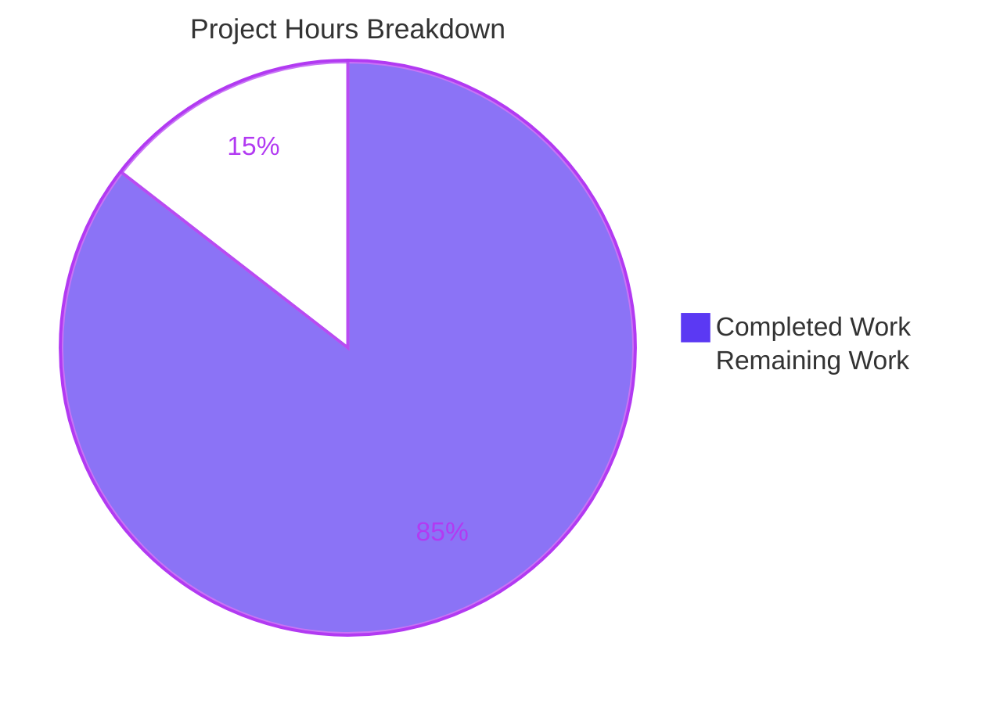
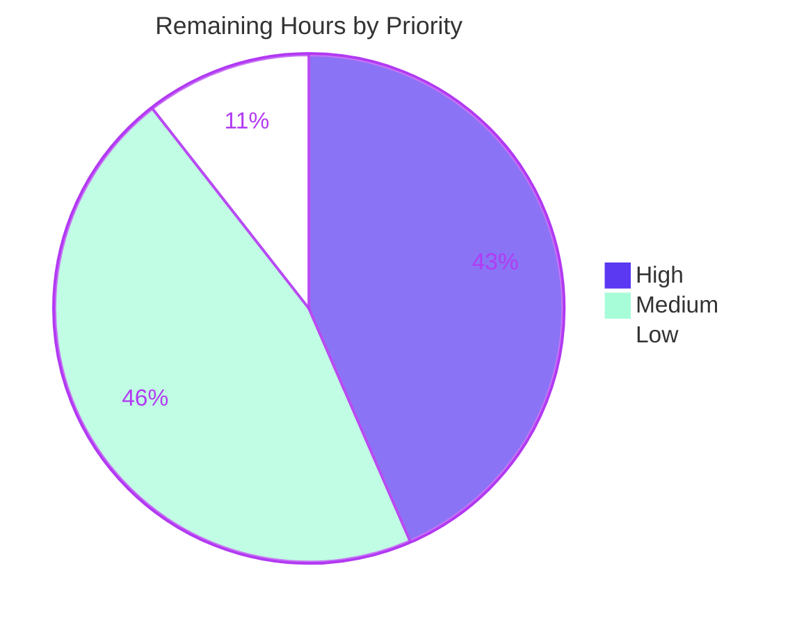
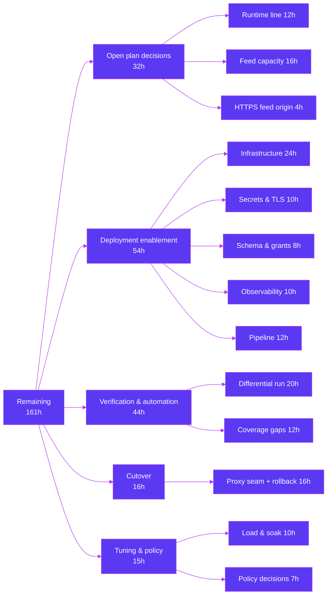

# 1. Executive Summary

## 1.1 Project Overview

Slatwall 3.1.39 is an open-source CFML commerce platform whose catalog and promotions logic sits locked inside a ColdFusion/Hibachi monolith. This project extracts a bounded slice — seven service surfaces, eighteen entities, the promotion discount engine, the price-group and currency cascades, and the Google product-feed integration — and re-expresses it as a strict-mode TypeScript service on AWS Lambda, reading and writing the existing `Sw*` MySQL schema unchanged. It lands as an isolated `slatwall-ts/` subtree beside the untouched monolith, behind a strangler-fig seam. Its consumers are the order orchestrator that already calls these services, and Google Merchant Center.

## 1.2 Completion Status

Completion measures the planned scope plus the work needed to put it into production.


| Metric | Value |
|---|---|
| **Total Hours** | **1,110** |
| Completed Hours (AI + Manual) | 949 (949 AI + 0 Manual) |
| Remaining Hours | 161 |
| **Percent Complete** | **85.5%** |

949 ÷ (949 + 161) × 100 = **85.5%**.

## 1.3 Key Accomplishments

- ✅ Seven service surfaces ported method-for-method — all 70 mapped signatures resolve in `slatwall-ts/src/`
- ✅ Promotion discount math and use-limit semantics preserved, pinned by 584 tests
- ✅ Price-group and currency cascades preserved, including undefined-never-zero price semantics
- ✅ All money arithmetic routed through one decimal value object (`src/domain/valueObjects/money.ts`)
- ✅ 6,719 tests pass at 94.03% statement coverage, needing no database and no configuration
- ✅ Five deployable CommonJS Lambda artifacts build, load and export `handler`
- ✅ Existing `Sw*` schema read and written unchanged — no migration, no DDL, no column change
- ✅ Legacy monolith untouched: all 174 changed files are additions under `slatwall-ts/`

## 1.4 Critical Unresolved Issues

Three items remain open, each needing an owner decision rather than engineering rework. Section 5.2 details them.

| Issue | Impact | Owner | ETA |
|---|---|---|---|
| Deployable artifacts target the deprecated `nodejs20.x` Lambda runtime (`.nvmrc`, `package.json`, `esbuild.config.mjs`) | No security patches, no support eligibility, and eventually no ability to deploy a change. Nothing already deployed stops working | Platform owner | 12h after approval |
| `GET /feeds/google/products` recomputes and buffers the whole eligible catalog per request, with no cache, validator, rate limit or concurrency guard | A caller within the host allow-list can repeat a ~1.97 MB, ~290 ms whole-catalog render in parallel | Platform / SRE | 16h |
| The product feed emits `http://` at all five absolute-URL sites (`src/integrations/google/rssFeedRenderer.ts`) | Cleartext links in a merchant document Google fetches and follows; terminating TLS in front does not rewrite in-document URLs | Product owner | 4h after approval |

## 1.5 Access Issues

No access issue identified. The toolchain installs from public registries with no authentication, and the build and test pipeline needs no database and no environment variable.

| System/Resource | Type of Access | Issue Description | Resolution Status | Owner |
|---|---|---|---|---|
| npm registry | Package install | None — 13 exact-pinned packages resolve with no credential | Resolved | — |
| Build / test / package pipeline | None required | None — the suite runs hermetically | Resolved | — |
| AWS Lambda, API Gateway, IAM | Deploy | Not yet provisioned; needed to deploy, not to build | Outstanding (deployment prerequisite) | Platform owner |
| Production `Slatwall` MySQL instance | Network + DML grants | Not yet reachable; the service creates no schema by design | Outstanding (deployment prerequisite) | DBA |
| Managed secret store | Credential storage | Credentials currently arrive as plain environment values | Outstanding (deployment prerequisite) | Platform owner |
| Google Merchant Center | Feed submission | Round trip to Google never exercised | Outstanding (deployment prerequisite) | Product owner |

## 1.6 Recommended Next Steps

1. **[High]** Decide the runtime line, move all six pin artifacts together, and re-prove the bundle format.
2. **[High]** Stand up the deployment: infrastructure definitions, a managed secret store, and the network path to the existing `Slatwall` schema.
3. **[High]** Put edge controls in front of the public feed route before exposing it — rate limit, concurrency limit, cache, and alarms.
4. **[Medium]** Run both implementations against the same data and diff the three must-preserve areas.
5. **[Medium]** Automate the eight scripted gates in a pipeline so they run on every change.

# 2. Project Hours Breakdown

## 2.1 Completed Work Detail

Every row is a planned deliverable that exists on disk and is exercised by the test suite.

| Component | Hours | Description |
|---|---|---|
| Toolchain, build & packaging pipeline | 24 | 13 root artifacts: maximal-strict TypeScript profile (`skipLibCheck: false`), flat ESLint with the domain-inward import boundary and a no-barrel rule, Prettier, the test runner with coverage floors, and a CommonJS/`node20` bundler that archives each capability with its licence notice and asserts the annotation floor per artifact |
| Domain entity layer (18 modules) | 120 | `src/domain/entities/` — the four-step currency cascade on `sku.ts`, option-to-SKU resolution on `product.ts`, materialized ID paths on `productType.ts` and `priceGroup.ts`, 27 include/exclude collections across the qualifier and reward entities, promotion flag logic under an explicit UTC policy, and the applied-promotion write side |
| Value objects, order views & engine types | 30 | `money.ts` as the sole arithmetic surface over an arbitrary-precision decimal, a branded currency code, materialized-path walking, three read-only order views forming the anti-corruption boundary, and three engine type contracts |
| Repository & collaborator ports (13) | 16 | `src/domain/ports/` — interfaces only, extracted from the legacy data-access and collaborator call sites; the settings port narrowed to exactly four keys; two documented stub ports for out-of-scope branches |
| Service layer (7 surfaces) | 105 | Product, SKU, brand, option, price-group (five-level cascade with its preserved asymmetries), rounding-rule (the decimal-string algorithm reproduced over decimals) and the promotion facade — public method names carried over verbatim |
| Promotion engine decomposition (9 modules) | 82 | A 489-line legacy method as nine focused modules in `src/services/promotion/`, preserving every order-dependence vector, both opposing insertion sorts, the two-pass guard and the reward-usage ledger |
| MySQL data access (6 repositories, 5 SQL builders, pool) | 112 | Hand-written prepared statements over the existing schema; in-engine query post-processing rewritten as CTEs; AND-of-EXISTS option matching; entity hydration factories; tuple-row chunking; a re-entrant transaction executor; write-conflict classification |
| Lambda handlers, router, composition root, error mapper | 100 | `src/handlers/` — an explicit composition root replacing the runtime-scanned bean factory, an explicit route table replacing convention routing, an error mapper covering 8 categories across 6 status codes, and five capability entrypoints with schema validation, authorization gating and feed host allow-listing |
| Google feed integration (5 modules) | 28 | The five-method interface contract as a union type, the nine-member adapter surface, feed repository, feed service, and a pure string-emitting RSS 2.0 renderer with a hand-rolled five-entity escaper |
| Configuration, logging & CFML parity helpers | 44 | An 18-key validating configuration surface that reports every problem at once and enforces the Lambda environment quota, structured JSON logging with fail-closed redaction, and five semantic-parity helpers for CFML truthiness, lists, case-insensitive structs, number formatting and precision |
| Test suite & traceability register | 262 | 65 suites, 5 fixture factories, a shared setup module, and an 8,112-line executable traceability register (173 cases) that fails the build when a module is unmapped, a preserved defect loses its citation, or the divergence budget moves |
| Environment contract, operator documentation & licence continuity | 26 | A 964-line environment contract, a 1,927-line operator README covering the toolchain, build, packaging and troubleshooting, and a licence notice carrying GPL v3 attribution forward and recording that the integration-services exception does not extend to this subtree |
| **Total** | **949** | |

## 2.2 Remaining Work Detail

| Category | Hours | Priority |
|---|---|---|
| Runtime platform migration off the end-of-life Node 20 line, moving all six pin artifacts together and re-proving the bundle format | 12 | High |
| Product-feed capacity controls — rate limit, concurrency limit, cache or CDN, duration and memory alarms | 16 | High |
| Infrastructure definitions — five Lambda functions, API Gateway routes and authorizer, IAM roles, network path to MySQL | 24 | High |
| Secrets management and TLS material — credentials into a managed store with rotation, trust store for verified transport | 10 | High |
| Production schema provisioning and least-privilege DML grants | 8 | High |
| Canonical HTTPS origin for the product feed — one literal plus its parity gate, once approved | 4 | Medium |
| CI/CD pipeline running the full gate set and publishing the five artifacts | 12 | Medium |
| Observability — log retention, duration and memory alarms, error-rate alarms, per-capability dashboards | 10 | Medium |
| Close the three named coverage gaps and run the live-database tier in continuous integration | 12 | Medium |
| Differential validation against a running legacy engine across the three must-preserve areas | 20 | Medium |
| Strangler-fig cutover of the order orchestrator's two consumed service calls, with a rollback path | 16 | Medium |
| Outstanding policy decisions — development-toolchain re-pin, edge security-header policy, comment-block budget measure | 7 | Low |
| Pre-production load and soak run at production catalog size, with per-function capacity sizing | 10 | Low |
| **Total** | **161** | |

Priority distribution: High **70h**, Medium **74h**, Low **17h**.

## 2.3 Reconciliation

| Check | Result |
|---|---|
| Section 2.1 completed hours | 949 |
| Section 2.2 remaining hours | 161 |
| 2.1 + 2.2 = Total Project Hours (Section 1.2) | 949 + 161 = **1,110** ✅ |
| Remaining hours match Sections 1.2, 2.2 and 7 | 161 in all three ✅ |
| Percent complete | 949 ÷ 1,110 = **85.5%** ✅ |

Of the 161 remaining hours, **31h** belong to the three open items in Section 1.4 and **12h** closes the residual coverage gap; the other **118h** is deployment work the plan placed out of scope by design — infrastructure definitions, secrets, schema provisioning, pipeline, observability, cutover, differential validation and capacity sizing.

# 3. Test Results

The full suite was executed against the delivered tree: **66 test files, 6,719 tests, 6,719 passed, 0 failed**, completing in 14 seconds. Coverage across all source is **94.03% statements / 86.18% branches / 98.11% functions / 94.02% lines** against configured floors of 80/80/80/70. The suite requires no database, no environment variables and no network, so these numbers are reproducible from a clean checkout with `npm ci && CI=true npm test`.

| Area / Category | Framework | Tests | Passed | Failed | Coverage | What This Proves |
|---|---|---|---|---|---|---|
| Domain entities (18 suites) | Vitest 4.1.10 | 2,145 | 2,145 | 0 | 98.3% | The four-step currency cascade resolves per-currency prices and returns undefined — never zero — for a missing price, and materialized ID paths and promotion flag logic behave as the legacy entities do |
| Value objects & CFML parity helpers (8 suites) | Vitest 4.1.10 | 605 | 605 | 0 | 97.7–100% | Money arithmetic is exact to the cent with no floating-point drift, and CFML truthiness, list, case-insensitive struct and number-format semantics translate deterministically |
| Catalog & pricing services (6 suites) | Vitest 4.1.10 | 578 | 578 | 0 | 93.6% | The five-level price-group cascade resolves through SKU, product and product-type ancestors with its asymmetries intact, and all ten measured rounding outcomes reproduce exactly, including the four counter-intuitive ones |
| Promotion engine & facade (10 suites) | Vitest 4.1.10 | 584 | 584 | 0 | 99.2% | Discount stacking, use-limit enforcement, both opposing sort orders and the two-pass guard behave as the legacy engine does, and the pricing pass must precede the promotion pass or the discount changes |
| Data access — repositories & SQL builders (8 suites) | Vitest 4.1.10 | 876 | 876 | 0 | 88.4–100% | Every statement is a prepared statement over the unchanged `Sw*` schema, AND-of-EXISTS option matching narrows monotonically, in-engine post-processing is faithfully rewritten as CTEs, and statement counts stay bounded as row counts grow |
| Lambda handlers, router & composition root (9 suites) | Vitest 4.1.10 | 1,138 | 1,138 | 0 | 92.8% | The dependency graph assembles once and is statically checkable, routes dispatch from an explicit table, and every failure maps to one of 8 categories across 6 status codes without leaking internals |
| Google product feed integration (4 suites) | Vitest 4.1.10 | 342 | 342 | 0 | 95.0% | The RSS 2.0 document is well formed with all five XML entities escaped, the nine-member adapter contract is satisfied, and the frozen legacy characteristics — hardcoded condition and availability, empty product category — are reproduced |
| Configuration, logging & traceability floor (3 suites) | Vitest 4.1.10 | 451 | 451 | 0 | 95.7% | Configuration reports every problem at once and never echoes a value, logs redact fail-closed, and the register mechanically holds module coverage, defect citations and the divergence budget in place |
| **Total** | **Vitest 4.1.10** | **6,719** | **6,719** | **0** | **94.03%** | |

### Not Covered

The following was delivered or relied upon but is **not** exercised by any test. A human should close or accept each before release.

- **32 of the 89 source modules declare types only** — the 13 repository and collaborator ports, the 3 read-only order views, the 3 promotion-engine type contracts and the integration interface among them. They contain no executable statement, so they report zero coverage by construction rather than by omission. No action needed.
- **No differential execution against a running legacy engine.** Behaviour parity is pinned to characterization tests written from reading the legacy source, not to observed legacy output. This is the single largest verification gap: a misreading of CFML semantics would be held in place by the very tests meant to catch it. Every preserved behaviour carries an in-code citation to its legacy file and line so it can be checked by hand, but a side-by-side run is what would settle it. → Section 2.2, 20h.
- **The default suite executes no statement against a live MySQL server.** The repository ships an integration tier for the six repositories and the SQL builders, but it is deliberately hermetic — statement text, parameter binding and shape are asserted without a server. Running that tier against a real engine in continuous integration is outstanding. → Section 2.2, 12h.
- **Three named behaviour gaps.** Option-group traversal order during SKU creation (`model/service/SkuService.cfc:L82,L106`), the product-feed missing-image existence probe (`model/service/ImageService.cfc:L81`), and the endless-sale effective-date element (`integrationServices/google/views/feed/product.cfm:L30`). Each is recorded in the traceability register as contributing zero coverage, so none is silently absent. → Section 2.2, 12h.
- **No legacy antecedent exists for almost all of this coverage.** Only two suites extend a legacy test — the brand and product entity suites, which carry their original assertions and fixtures forward. Everything else is net-new and is declared as such rather than presented as parity. The one legacy functional test touching this slice is an empty stub and contributes nothing.
- **The Google Merchant Center round trip is never made.** The adapter satisfies the full contract surface and emits a byte-stable document, but no submission to Google has been attempted. → Section 2.2, deployment prerequisite.

# 4. Runtime Validation & UI Verification

This service renders no user interface. It is a headless set of Lambda handlers behind API Gateway, so there are no screens, no flows and no visual states to verify — the one document it produces, the Google product feed, is machine-consumed RSS. Everything below was driven through the **packaged `dist/*.cjs` artifacts** against a live MySQL 8.4 instance holding the `Sw*` schema, so the evidence is the deployable bundle rather than the source tree.

**Start-up and packaging**

- ✅ **Cold start and artifacts** — all five bundles load and export `handler` as a function, the composition root assembles once and is reused across invocations, and `npm run package` emits exactly 5 `.cjs`, 5 source maps and 5 archives, each archive carrying its handler plus the licence notice with the in-code annotations still recoverable.
- ✅ **Configuration refusal** — an incomplete environment is rejected at cold start with every problem reported in one message and no value echoed; plaintext database transport is refused for any non-loopback host.

**Capability flows**

- ✅ **Catalog query** (`POST /catalog/products`) — product, brand and option queries return records for an authorized caller.
- ✅ **SKU resolution** (`POST /catalog/skus`) — SKU lookup returns the SKU with its per-currency detail map populated from the database, exercising the currency cascade end to end.
- ✅ **Price resolution** (`POST /prices/resolution`) — both the current-account path and the per-currency path resolve, the latter returning the currency-override price rather than the base price.
- ✅ **Promotion application** (`POST /promotions/application`) — sale-price details resolve for a scoped caller; the pricing pass runs before the promotion pass, and no applied-promotion row is written by a read operation.
- ✅ **Product feed** (`GET /feeds/google/products`) — returns a well-formed RSS 2.0 document with `content-type` as its only header, byte-identical across repeated renders, with the frozen legacy characteristics intact: five cleartext origins, no `https://`, and an empty product-category element.

**Refusal and authorization paths**

- ✅ **Authorization and input handling** — anonymous callers refused 401, insufficiently scoped callers refused 403, a claim forged in the request body does not elevate, unknown routes refused 404, missing fields refused 400 naming the field, malformed JSON refused 400; no request produces a 500.
- ✅ **Feed host allow-listing** — a Host outside the allow-list, an empty Host and malformed authorities all fail closed at 400 without echoing the value, while an allowed host supplied with a port or in different case is admitted and canonicalized to the same document. An unset allow-list authorizes nothing.

**External integrations**

- ⚠ **Google Merchant Center and currency conversion** — the feed adapter satisfies the full contract and produces a valid, byte-stable document, but no submission to Google has been made, so that round trip is unexercised; the eligible-currency and conversion path resolves against configured reference rates without calling a live rate provider, and the legacy source's own integration gap there is carried forward as a flagged item.

**Never exercised at runtime**

Two things were deliberately not driven. No request was made against a deployed AWS environment — there are no infrastructure definitions, and "deployable" was scoped as a successful build and package rather than a live deployment. And no request was replayed through the legacy CFML engine for comparison, so no observed output from the two implementations has been diffed.

# 5. Compliance & Quality Review

## 5.1 Compliance Matrix

Each row shows where the deliverable stands now, with evidence a reader can open.

| # | Deliverable / Benchmark | Status | Progress | Verified By |
|---|---|---|---|---|
| 1 | **Interface parity** — public method surfaces carried over verbatim in CFML camelCase | ✅ PASS | ██████████ 100% | All 70 mapped signatures resolve in `src/services/`, `src/domain/entities/` and `src/integrations/`; five misspelled legacy identifiers preserved verbatim as data contracts |
| 2 | **Behaviour preservation** at the three must-preserve boundaries — discount math with use limits, the price-group and currency cascades, option-based SKU resolution | ✅ PASS | ██████████ 100% | 584 promotion-engine tests, 578 catalog and pricing service tests, and a dedicated AND-of-EXISTS suite; a test proves that reversing the pricing and promotion passes changes the discount |
| 3 | **Decimal fidelity** — one arithmetic surface, no floating point on money | ✅ PASS | ██████████ 100% | `src/domain/valueObjects/money.ts` over an arbitrary-precision decimal; 113 tests including the reference calculation resolving to `'52.47'`; all ten measured rounding outcomes reproduce exactly |
| 4 | **Preserved-defect discipline** — legacy defects reproduced and annotated, divergence budget respected | ✅ PASS | ██████████ 100% | 110 defect annotations and 301 explanatory notes in `src/`, each citing a legacy file and line; the traceability register asserts the divergence count is exactly three at two independent gates |
| 5 | **Schema continuity** — the existing `Sw*` tables read and written unchanged | ✅ PASS | ██████████ 100% | No DDL, migration, rename or column change anywhere in the change set; abbreviated legacy link-table names preserved and gated in the register |
| 6 | **Strict compilation & type safety** | ✅ PASS | ██████████ 100% | `tsc --noEmit` clean under `strict`, `noUncheckedIndexedAccess`, `exactOptionalPropertyTypes`, `noImplicitOverride`, `noUnusedLocals` and `skipLibCheck: false`; zero `any` annotations and zero type suppressions in `src/` |
| 7 | **Architectural layer boundary** — hexagonal, dependencies flowing inward | ✅ PASS | ██████████ 100% | `eslint .` clean with a `no-restricted-imports` rule forbidding `src/domain/**` from reaching repositories, handlers or integrations, plus a no-barrel rule; zero `index.ts` files |
| 8 | **Injection safety & least privilege** | ✅ PASS | ██████████ 100% | Every statement is a prepared statement; adversarial input produces refusals rather than altered SQL; the whole surface runs under DML-only grants with DDL, DCL and system-schema access refused |
| 9 | **Secrets & configuration hygiene** | ✅ PASS | ██████████ 100% | Zero hardcoded credentials; 18 deployable keys validated at cold start with every problem reported at once and no value echoed; plaintext transport refused for any non-loopback host; log redaction fail-closed |
| 10 | **Test coverage & traceability floor** | ✅ PASS | ██████████ 100% | 6,719 tests at 94.03% statements against an 80% floor; the register maps 89 source modules with none pending, and the two legacy-extended suites are separated from net-new coverage |
| 11 | **Deployable artifact & scope containment** | ✅ PASS | ██████████ 100% | 5 CommonJS bundles, source maps and archives build, load and export `handler`, each archive carrying the licence notice; all 174 changed files are additions under `slatwall-ts/`, with the monolith intact at 418 `.cfc` and 562 `.cfm` |
| 12 | **Runtime platform currency** | ⚠ PARTIAL | ████████░░ 80% | The pin is internally coherent across all six artifacts that state it and a dependency audit reports zero known vulnerabilities, but the pinned Lambda runtime line is deprecated — see divergence 1 below |

## 5.2 AAP & Rule Divergences and Gaps

**No user-specified rules exist for this project**, so no rule divergence is possible; every divergence below is measured against the plan. Eight are recorded. In each case an explicit plan clause outranked a proposed alternative — none was a free choice, and each is annotated in the code at the site it governs.

| # | What the AAP/Rule Required | What Was Delivered Instead | Why It Diverged | Impact | Remediation |
|---|---|---|---|---|---|
| 1 | Node 20.x / Lambda `nodejs20.x` as a toolchain pass condition (AAP 0.5.1, 0.9.1) | The pin is kept although the line has reached end of life | Raising it fails an explicit plan gate and invalidates the packaging evidence proven on this runtime and driver pair | Unpatched runtime, no support eligibility, eventual inability to deploy | Amend the runtime gate, then move all six pin artifacts together — **12h** |
| 2 | No second module-scope cache (0.6.5); no object storage, CDN or edge tier (0.2.2); no invented HTTP semantics or throughput figures (0.8.1); a fixed package set (0.8.3) | The public feed route ships with no cache, validator, rate limit or concurrency guard | Four of the five closing controls each collide with one of those clauses; the fifth — never truncate — is already satisfied | A caller within the host allow-list can repeat a whole-catalog render in parallel | Provision edge controls, or amend the plan — **16h** |
| 3 | Exact feed-contract parity (0.1.1) with a divergence budget of exactly three (0.6.7), all spent | All five absolute-URL sites still emit `http://` | Changing the scheme changes a frozen document and would be a fourth divergence, which no budget authorizes | Cleartext links in a merchant feed Google fetches and follows | Approve a fourth divergence; then one literal and its parity gate — **4h** |
| 4 | `getProductSmartList` / `getSkuSmartList` mapped name-for-name (0.4.2) | Typed repository queries `findProducts` / `findSkus` | The plan's own analysis (0.6.2) sanctions the narrowing: cloning a generic query builder would reimport the framework coupling the port exists to remove | None — the concrete filters callers apply are preserved | None required (Sanctioned) |
| 5 | Schema continuity: no migration, no new table, no column change (0.8.1) | SKU-code uniqueness enforced in application code; no index DDL authored | Shipping an index is DDL, which the clause forbids, so the guard had to be correct without one | None negative — correctness no longer depends on an object the deployment may not create | None required (Sanctioned) |
| 6 | No new persistent state (0.8.1) | A concurrent write conflict answers `409`; no idempotency-key store was introduced | A key store is new persistent state; a request-scoped one cannot survive the very cross-invocation concurrency at issue | A client racing itself sees `409` rather than a replayed `200`; nothing is written and re-sending succeeds | None required (Sanctioned) |
| 7 | Exact dependency pinning and a toolchain gate asserting the manifest (0.5.1, 0.8.3, 0.9.1) | Development toolchain left exactly as pinned despite newer upstream releases | Re-pinning breaks the gate that asserts installed versions match the manifest, and none of the lagging packages is security-relevant | None today — a dependency audit reports zero known vulnerabilities | Decide whether to re-pin as a separately verified step — part of **7h** |
| 8 | Invent no non-functional requirement or policy the source lacked (0.8.1) | No `X-Content-Type-Options`, `X-Frame-Options`, CSP or HSTS headers are emitted | These are browser policy the legacy source never expressed; adding them would invent a requirement | None for the shipped deployment, which publishes no browser-consumed origin | Add at the edge if a browser-consumed origin is ever fronted — part of **7h** |

**1 — Runtime platform pin.** The five deployable artifacts target the deprecated `nodejs20.x` Lambda runtime, whose upstream Node line has reached end of life. The plan freezes that line as a pass condition of the toolchain gate, and the CommonJS-versus-ESM bundle decision was proven against this exact runtime and driver pair, so a unilateral bump fails a gate and voids that evidence. The pin is coherent: `.nvmrc`, `engines.node`, `@types/node` in manifest and lockfile, the bundler target and the register's frozen constant all agree, and a partial bump is rejected by design. A dependency audit reports zero known vulnerabilities. A human must authorize the change, choose the successor line, move all six artifacts together, and re-prove the bundle format.

**2 — Feed route capacity.** `GET /feeds/google/products` re-runs the whole-catalog selection, its hydration and a complete in-memory render for every allow-listed request. Against a 2,984-SKU catalog it produces 2,984 items and about 1.97 MB in roughly 290 ms, repeatable concurrently; a repeat request pays the cost again and returns byte-identical output, so nothing is retained. Four closing controls are each blocked by a clause: a cache is forbidden module-scope state holding one caller's data, pre-generation and the CDN tier are out of scope, and a validator or concurrency ceiling would be invented. The work is eight statements per invocation, never one per row, and nothing is truncated. Exposure is bounded by an allow-list that authorizes nothing when unset.

**3 — Cleartext feed origins.** The legacy template writes an `http://` origin at exactly five sites and contains no `https://`, and the plan requires exact feed-contract parity. A parity gate pins the scheme literal against that frozen template, and the budget of three deliberate divergences is fully spent. The exposure is contained: no forwarding header can steer the scheme or authority — five header combinations produce byte-identical documents — the authority is a selection among allow-listed hosts, malformed authorities fail closed without echoing the value, and all output is XML-escaped. Terminating TLS in front does **not** rewrite in-document URLs, so this cannot be deferred to the edge. Once approved, the change is one literal in `src/integrations/google/rssFeedRenderer.ts` plus its gate.

**4 — Smart-list narrowing.** The two smart-list methods built a generic, string-keyed, dynamically filtered query object supplied by the legacy framework. Reproducing that faithfully would mean reimplementing a small query language, reimporting exactly the framework coupling this port exists to remove, and it would be untypeable under the strict profile. They are delivered instead as typed repository queries, preserving the concrete filters the legacy callers actually apply while not reproducing the open-ended filter surface. The plan's own analysis identifies this as the one intentional narrowing in the port and sanctions it, and the register carries it as a recorded reshaping so it cannot quietly become four. Nothing is required of a reader beyond knowing the surface is narrower by design.

**5 — Uniqueness without DDL.** Concurrent creation of the same SKU code had to be made safe, and the natural remedy — a unique index — is DDL, which schema continuity forbids. Uniqueness is therefore enforced in application code, and the guard was proven correct with the index both present and dropped: three concurrent identical mutations resolve to one success and two conflicts with exactly one row written, a six-way race yields one success and five conflicts, and a retry succeeds without a second row. This preserves rather than invents policy, because the legacy entity already declares the column globally unique. The result is more robust: correctness no longer depends on an object the deployment may never have created.

**6 — Conflict rather than replay.** A retried submission could have been answered by replaying the original result from an idempotency-key store. A key store is new persistent state, which the plan forbids, and a request-scoped one would not survive between Lambda invocations — precisely the concurrency at issue. The delivered behaviour is an explicit `409 Conflict` for the concurrent case, with sequential replay remaining naturally idempotent because nothing is written on the losing path and re-sending succeeds. The response carries one fixed sentence and leaks no colliding value. If cross-invocation idempotency keys are ever wanted they need a schema decision and a product decision about key scope and lifetime; neither belongs in this port.

**7 — Toolchain pinning.** Several development-only packages have newer upstream releases. The plan pins every dependency to an exact version resolved and exercised during planning, makes exact pinning with no ranges a standard the work is held to, and asserts in a gate that installed versions match the manifest — so re-pinning here would break that gate rather than satisfy it. None of the lagging packages is security-relevant, none is inlined into any shipped bundle, and a dependency audit reports zero known vulnerabilities across both the full and production-only trees. The decision a human owes is whether to re-pin the toolchain deliberately as a separately verified step; that is a plan amendment, not a correction.

**8 — Browser security headers.** Content-type, frame, content-security and transport-security headers are absent from every response. The plan forbids inventing any non-functional requirement or policy the legacy source did not express, and these headers are browser policy that source never carried — the same clause under which the legacy runtime's own lock timeouts are noted and deliberately not implemented. The delivered header contract is instead fixed and minimal: each response class carries exactly `cache-control` and `content-type`, and the feed carries `content-type` alone. For the shipped deployment, which publishes no browser-consumed origin, the impact is nil. If API Gateway is ever fronted by one, these belong at the edge as an explicit policy decision.

Beyond these eight, four minor items are recorded rather than acted on, none affecting behaviour: two arithmetic slips inside the plan itself were aligned to its enumerations rather than edited (it says fourteen dependencies then lists thirteen, and nine verified rounding results then tabulates ten); a local-development path the plan cites does not exist in this repository, so the legacy runtime was never stood up; the repository ships no `Sw*` schema definition by design, so a deployment must point at an existing one; and a test-harness timeout plus two exported error-classification symbols are recorded in the register as deliberate, bounded additions.

# 6. Risk Assessment

These are forward-looking: what could still go wrong once this service carries production traffic.

| Risk | Category | Severity | Probability | Mitigation | Status |
|---|---|---|---|---|---|
| **End-of-life managed runtime.** The five deployable artifacts target the deprecated `nodejs20.x` Lambda runtime — no security patches, no support eligibility, and eventually no ability to deploy a change at all | Security | High | High | The pin is coherent across all six artifacts that state it and a dependency audit reports zero known vulnerabilities at every severity today; the traceability gate rejects a partial bump, forcing a coordinated move | Open — awaiting an owner decision (Section 2.2, 12h) |
| **Uncapped whole-catalog render on a public route.** `GET /feeds/google/products` recomputes and buffers the entire eligible catalog per allow-listed request, with no cache, validator, rate limit or concurrency guard | Operational | High | Medium | The allow-list authorizes no host when unset or empty; the work is eight statements per invocation rather than one per row; nothing is retained between invocations; the document is never silently truncated | Open — needs edge controls (Section 2.2, 16h) |
| **Parity is pinned to characterization, not to measurement.** The two implementations have never been run side by side on the same inputs, so a misreading of CFML semantics would be held in place by the tests meant to detect it | Technical | High | Medium | 110 in-code annotations cite the legacy file and line behind each preserved behaviour, making every one independently checkable, and 6,719 tests hold the reproduced behaviour in place | Mitigated — closes on a differential run (Section 2.2, 20h) |
| **Deliberately preserved money-affecting rounding.** The rounding path reproduces legacy outputs that read as defects: a value whose cents end in zero takes a corrupted branch, the declared default is not inert, and a short input collapses to the rounding expression itself. An engineer who "corrects" these changes prices | Technical | High | Medium | 71 tests pin all ten measured outcomes and fail a mathematically tidier implementation; every site carries an annotation naming its legacy locator and warning against repair without a product decision | Mitigated by design |
| **Cutover ordering dependency.** The promotion pass reads state the pricing pass writes — an ordering the legacy caller enforced only incidentally. Wiring the order orchestrator in the wrong order silently changes discounts | Integration | High | Medium | The ordering is explicit in the composition root and asserted by a test that proves reversing the two passes produces a different discount | Mitigated — closes at cutover (Section 2.2, 16h) |
| **Cleartext origins in the merchant feed.** All five absolute-URL sites emit `http://`, so an on-path party can alter the product and image resources a consumer retrieves | Security | Medium | Medium | No forwarding header can steer the scheme or authority; the authority is an allow-list selection; unauthorized authorities fail closed without echoing the value; all output is XML-escaped | Open — awaiting approval (Section 2.2, 4h) |
| **Credentials in plain function configuration.** Database credentials arrive as environment values with no managed store and no rotation | Security | Medium | Medium | No credential is hardcoded anywhere in the source; log redaction is fail-closed and was exercised at debug level with no credential, statement or bound value emitted; plaintext transport is refused for any non-loopback host | Open — deployment prerequisite (Section 2.2, 10h) |
| **Operational readiness gaps.** No pipeline runs the gate set or publishes artifacts; the service depends on a schema it deliberately does not create, so a deployment pointed at an unmigrated one fails at query time; the Merchant Center round trip is unexercised; and reward order is non-deterministic at a discount tie because the source query applies no ordering | Operational | Medium | High | Every gate is a single scripted command chained by one verify script; least-privilege DML-only grants are proven sufficient; configuration reports every problem at once on cold start; the feed document is byte-stable across renders | Open — Section 2.2 (12h pipeline, 8h schema, 10h observability) |

# 7. Visual Project Status

**Overall progress — 85.5% complete.** Completed work is shown in Blitzy dark blue (`#5B39F3`); remaining work in white (`#FFFFFF`).



**Remaining work by priority — 161 hours.**



**What the remaining 161 hours consists of.**



> Note: the branch groupings above are a reading aid. The authoritative figures are the thirteen rows of Section 2.2, which sum to **161**; the pipeline and observability hours appear under deployment enablement here and under Medium priority in the priority chart.

**Delivery shape.**

| Dimension | Value |
|---|---|
| Files added | 174 (all additions; zero modifications, zero deletions) |
| Lines added | 235,043 (231,704 excluding the dependency lockfile) |
| Source modules | 89 TypeScript modules under `slatwall-ts/src/` |
| Test files | 66 (65 suites plus the executable traceability register) |
| Tests passing | 6,719 of 6,719 |
| Statement coverage | 94.03% against an 80% floor |
| Deployable artifacts | 5 CommonJS bundles, 5 source maps, 5 archives |
| Legacy files modified | 0 — the monolith remains at 418 `.cfc` and 562 `.cfm` |

# 8. Summary & Recommendations

**What was delivered.** A bounded catalog and promotions slice of Slatwall 3.1.39 now exists as an independent, strict-mode TypeScript service on AWS Lambda, in an isolated `slatwall-ts/` subtree of 89 source modules and 66 test files. Seven service surfaces, eighteen behaviour-carrying entities, the promotion discount engine decomposed from one 489-line method into nine focused modules, six MySQL repositories over the unchanged `Sw*` schema, five capability handlers behind an explicit route table, and the Google product-feed integration are all in place. The four implicit services the CFML runtime used to supply — bean-factory injection, convention routing, ORM persistence with lazy traversal, and ambient request state — have been replaced by four explicit constructs a compiler can verify: a single composition root, a route table, prepared statements with declared fetch shapes, and an explicit request context. The legacy monolith is untouched; all 174 changed files are additions, so both implementations coexist behind the strangler-fig seam the plan called for.

**What was verified, and how.** The full suite runs at **6,719 of 6,719 tests passing with 94.03% statement coverage**, hermetically — no database, no environment variables, no network — so any reader can reproduce it from a clean checkout. The three behaviours the plan named as must-preserve are each pinned by tests that actually execute: discount stacking with its use-limit semantics and both opposing sort orders; the price-group and currency cascades, including the load-bearing detail that a missing price resolves to undefined rather than zero, because zero would sell products for free; and option-based SKU resolution through AND-of-EXISTS narrowing. Ten measured rounding outcomes reproduce exactly, including four that look wrong and are faithful. Beyond the suite, all five capabilities were driven through the **packaged bundles against a live MySQL instance** — catalog query, SKU resolution, price resolution, promotion application and the product feed all return correct responses, and every refusal path answers 400, 401, 403 or 404 with no request producing a 500. Behaviour fidelity extends to defects: 110 annotated sites reproduce legacy behaviour rather than repairing it, with exactly three deliberate exceptions, a budget the traceability register mechanically enforces.

**What remains, and the critical path.** Of the 161 remaining hours, **118 are deployment work the plan deliberately placed out of scope** — infrastructure definitions, secrets management, schema provisioning, a pipeline, observability, cutover and capacity sizing. Only **31 hours** attach to the three open items, and each of those is gated on a decision rather than on engineering: whether to move off the end-of-life `nodejs20.x` runtime, how to cap the public feed route, and whether to authorize a fourth deliberate divergence so the feed can publish HTTPS origins. The critical path is therefore short but sequenced: settle the runtime line first, because it forces re-proving the bundle format; stand up infrastructure, secrets and the database path in parallel; put edge controls in front of the feed route before exposing it; then cut over the order orchestrator's two consumed calls, preserving the pricing-before-promotion ordering that a test already guards.

**The one gap worth arguing about.** Parity rests on characterization tests written from reading the legacy source, not on running both implementations side by side. The repository contains no CFML runtime and no Docker definition for one, so no legacy execution has ever been compared against this port. That is the largest residual verification risk, and it is why every preserved behaviour carries an in-code citation to its legacy file and line: a reviewer can check each claim by hand, and the 20-hour differential run converts the whole set from reasoned to measured. Anyone treating this as a rehearsal for a larger ColdFusion-to-TypeScript migration should budget that step in from the start rather than at the end.

**Production readiness.** At **85.5% of the planned and path-to-production scope**, this is delivery-ready within the plan's own definition — a successful build and package producing Lambda-compatible artifacts — but it is **not yet production-ready**, and the distinction is entirely about the deployment tier rather than the code. Every build, type, lint, format, test, coverage and packaging gate passes; nothing is stubbed, no placeholder or empty error handler exists, no credential is hardcoded, and every statement is parameterized under least-privilege grants proven sufficient. Recommendation: **approve the code, hold the release** until the runtime line is settled, credentials sit in a managed store, and the public feed route has capacity controls in front of it. Those three, plus infrastructure, are the whole gap between here and a safe first deployment.

# 9. Development Guide

Every command below was executed against this tree and reported the result shown. All paths are relative to the repository root, and all work happens inside `slatwall-ts/` — the only package manifest in the repository.

## 9.1 System Prerequisites

| Requirement | Version | Notes |
|---|---|---|
| Node.js | **20.20.2** | Pinned by `slatwall-ts/.nvmrc`; `engines.node` is `>=20.19.0 <21`. A newer Node fails the engine check |
| npm | **10.8.2** | `engines.npm` is `>=10.8.2` |
| MySQL | **8.0+** | Only for the runtime tier. Validated against 8.4.11. Build and test need no database |
| Docker | any recent | Only to run MySQL locally |
| Disk | ~1 GB | `node_modules`, `build/`, `dist/` and coverage output |

> **Do this first.** If the wrong Node line is active, `npm ci` prints `npm warn EBADENGINE Unsupported engine { package: 'slatwall-ts@0.1.0' ... }` and later steps behave unpredictably.

```bash
# Activate Node 20.20.2 (adjust the path to your installation)
nvm use            # reads slatwall-ts/.nvmrc, or:
export PATH=/usr/local/node-20.20.2/bin:$PATH

node -v            # expect: v20.20.2
npm -v             # expect: 10.8.2
```

## 9.2 Environment Setup

The service reads **18 deployable environment variables**. `slatwall-ts/.env.example` documents every one, its default, its maximum length and why it exists — read it before configuring a deployment. There is nothing to configure for building or testing.

```bash
cd slatwall-ts
cat .env.example          # the full contract, 964 annotated lines
```

Keys with **no default**, which must be supplied: `DB_HOST`, `DB_USER`, `DB_PASSWORD`, `DB_TLS_MODE`, `DB_DIALECT`, `FEED_ALLOWED_HOSTS`, plus `DB_TLS_CA` and `DB_TLS_MIN_VERSION` when the chosen transport mode requires them.

Keys with defaults: `DB_PORT=3306`, `DB_NAME=Slatwall`, `DB_CONNECTION_LIMIT=10`, `DB_CONNECT_TIMEOUT_MS=10000`, `DB_MAX_IDLE=10`, `DB_IDLE_TIMEOUT_MS=60000`, `NODE_ENV=development`, `LOG_LEVEL=info`.

Do **not** create a `.env` holding a real password. Lambda injects environment variables natively, and every ignore mechanism is advisory — check `git status --porcelain` before committing.

## 9.3 Dependency Installation

```bash
cd slatwall-ts
CI=true npm ci
```

Expected: `added 174 packages, and audited 175 packages` and `found 0 vulnerabilities`. All 13 direct dependencies are pinned to exact versions with no ranges, and no registry authentication is needed. Use `npm ci`, never `npm install` — the lockfile is the contract the toolchain gate asserts.

## 9.4 Build, Test and Package

Run these in order. Measured durations are from this machine and are indicative.

```bash
cd slatwall-ts

npm run typecheck        # ~10s  -> exit 0. tsc --noEmit, full strict profile
npm run lint             # ~27s  -> exit 0. eslint . (NEVER pass --fix)
npm run format:check     # ~18s  -> "All matched files use Prettier code style!"
npm run compile          # -> build/ : 89 .js + 89 .d.ts
CI=true npm test         # ~13s  -> Test Files 66 passed (66) | Tests 6719 passed (6719)
npm run test:coverage    # -> 94.03 % Stmts | 86.18 % Branch | 98.11 % Funcs | 94.02 % Lines
npm run package          # ~11s  -> dist/ : 5 .cjs + 5 .cjs.map + 5 .zip
```

One command chains the pre-merge gate:

```bash
CI=true npm run verify   # typecheck -> lint -> format:check -> test
```

**Constraints that must not change.** The bundler emits `format: 'cjs'` at `target: 'node20'` — an ESM bundle builds cleanly and then fails at first require (see 9.7). `build/` (compiler output) and `dist/` (bundler output) stay separate, and the bundler clears `dist/` on every run. Do not strip comments or minify: the bundler asserts that the in-code annotations survive into every artifact.

## 9.5 Running the Handlers Locally

Only this tier needs a database.

```bash
# Step one - start MySQL
docker run -d --name slatwall-mysql -p 127.0.0.1:3306:3306 \
  -e MYSQL_ROOT_PASSWORD=change_me_root \
  -e MYSQL_DATABASE=Slatwall \
  -e MYSQL_USER=slatwall \
  -e MYSQL_PASSWORD=change_me \
  mysql:8.4
# (already created? just: docker start slatwall-mysql)

# Step two - confirm it is reachable and holds the Sw* tables
docker exec slatwall-mysql mysql -uslatwall -pchange_me -e \
  "SELECT COUNT(*) AS sw_tables FROM information_schema.tables
     WHERE table_schema='Slatwall' AND table_name LIKE 'Sw%';" Slatwall
```

> The subtree ships **no schema definition** — by design, since schema continuity forbids DDL. Point it at an existing `Slatwall` database.

```bash
# Step three - export the runtime contract
export DB_HOST=127.0.0.1 DB_PORT=3306 DB_NAME=Slatwall \
       DB_USER=slatwall DB_PASSWORD=change_me \
       DB_TLS_MODE=disabled DB_DIALECT=MySQL \
       NODE_ENV=development LOG_LEVEL=info \
       FEED_ALLOWED_HOSTS=shop.example.com
```

`DB_TLS_MODE=disabled` is accepted **only** with a literal loopback `DB_HOST`, and never when `NODE_ENV=production`. Use `verify-ca` or `verify-identity` with `DB_TLS_CA` anywhere else.

The five capabilities and their routes:

| Capability | Route | Artifact |
|---|---|---|
| Catalog query | `POST /catalog/products` | `dist/catalogQueryHandler.cjs` |
| SKU resolution | `POST /catalog/skus` | `dist/skuResolutionHandler.cjs` |
| Price resolution | `POST /prices/resolution` | `dist/priceResolutionHandler.cjs` |
| Promotion application | `POST /promotions/application` | `dist/promotionApplicationHandler.cjs` |
| Product feed | `GET /feeds/google/products` | `dist/productFeedHandler.cjs` |

## 9.6 Verification Steps

```bash
cd slatwall-ts

# Every bundle loads and exposes the Lambda entrypoint
for f in dist/*.cjs; do
  node -e "console.log('$f ->', typeof require('./$f').handler)"
done
# expect five lines, each ending: -> function

# Every archive carries its handler and the licence notice
for z in dist/*.zip; do
  python3 -c "import zipfile,sys; print('$z', sorted(zipfile.ZipFile('$z').namelist()))"
done
# expect: ['NOTICE-GPL.md', '<handler>.cjs']

# The annotations survive bundling (the bundler asserts this too)
grep -c 'LEGACY-DEFECT' dist/catalogQueryHandler.cjs

# Nothing outside the new subtree was touched
git diff --name-only origin/master...HEAD | grep -v '^slatwall-ts/' | wc -l
# expect: 0
```

Invoking the feed against the local database should return HTTP 200 with a well-formed RSS 2.0 document whose only response header is `content-type: application/rss+xml; charset=utf-8`, byte-identical across repeated calls. A `Host` outside `FEED_ALLOWED_HOSTS` returns 400 with a short body that never echoes the rejected value.

## 9.7 Troubleshooting

| Symptom | Cause | Resolution |
|---|---|---|
| `npm warn EBADENGINE Unsupported engine` | The wrong Node line is active | Activate 20.20.2. `.nvmrc`, `engines.node` and `node -v` must all agree |
| `Error: Dynamic require of "node:buffer" is not supported` at first require | The bundle was emitted as ESM. It builds cleanly and only fails at runtime, because the MySQL driver's CommonJS chain uses dynamic `require()` | Keep `format: 'cjs'` and `target: 'node20'` in `esbuild.config.mjs`. Confirmed reproducible with `--format=esm` |
| `slatwall-ts configuration is invalid (N problems found): 1. DB_HOST is required and has no default …` | One or more keys with no default are unset. Every problem is reported at once and no value is ever echoed | Fix all listed keys in one pass, then re-invoke |
| `DB_TLS_MODE is disabled while DB_HOST is not a loopback address …` | Plaintext transport is refused for any non-loopback host, in every environment | Use `verify-ca` or `verify-identity` with `DB_TLS_CA`, or point at literal loopback for local work |
| Feed returns `400` for a host you expected to work | The `Host` is not in `FEED_ALLOWED_HOSTS`. An unset or empty allow-list authorizes **no** host | Add the host. `:443`, `:80` and case variants of an allowed host are admitted and canonicalized |
| Handler returns `401` / `403` | The authorizer context is absent, or the caller lacks the account or scope claim the operation needs | Supply the authorizer claims; a claim placed in the request body does not elevate |
| Handler returns `404` | The route is not in the table | Use one of the five routes in 9.5 |
| `prettier --check` fails on files you did not touch | The format scripts use quoted globs deliberately; unquoted globs are shell-expanded and miss nested modules | Run `npm run format`, then re-run `npm run format:check` |
| Lint reports a domain import violation | `src/domain/**` may not import from `src/repositories/**`, `src/handlers/**` or `src/integrations/**` | Move the dependency behind a port in `src/domain/ports/` |
| A test asserts a rounding result that looks mathematically wrong | It is faithful. Ten measured legacy outcomes are pinned deliberately, four of them counter-intuitive | Do not "correct" it. Read the annotation at the site; changing it changes prices |

# 10. Appendices

## A. Command Reference

All commands run from `slatwall-ts/`.

| Command | Purpose | Expected result |
|---|---|---|
| `CI=true npm ci` | Install from the lockfile | 174 packages, 0 vulnerabilities |
| `npm run typecheck` | `tsc --noEmit`, full strict profile | exit 0 |
| `npm run compile` | `tsc -p tsconfig.build.json` → `build/` | 89 `.js` + 89 `.d.ts` |
| `npm run lint` | `eslint .` with typed rules and the layer boundary | exit 0 — never pass `--fix` |
| `npm run format:check` | Prettier check over source, tests, root config and Markdown | "All matched files use Prettier code style!" |
| `CI=true npm test` | Full suite, non-watch by configuration | 66 files / 6,719 tests passed |
| `npm run test:coverage` | Suite plus coverage against the floors | 94.03 / 86.18 / 98.11 / 94.02 |
| `npm run bundle` | esbuild → `dist/*.cjs` | 5 bundles + 5 maps |
| `npm run package` | typecheck + bundle + archive | 5 `.cjs`, 5 `.cjs.map`, 5 `.zip` |
| `CI=true npm run verify` | Pre-merge gate: typecheck → lint → format:check → test | exit 0 |
| `npm run clean` | Remove `dist/`, `build/`, `coverage/` | — |

## B. Port Reference

| Port | Service | Notes |
|---|---|---|
| 3306 | MySQL | Runtime tier only; bind to `127.0.0.1` for local work |
| 33060 | MySQL X Protocol | Exposed by the official image; unused by this service |
| — | The Lambda handlers | No listening port. They are invoked by API Gateway, or directly in-process for local verification |

## C. Key File Locations

| Path | Role |
|---|---|
| `slatwall-ts/src/handlers/bootstrap.ts` | Composition root — the whole dependency graph assembled once, replacing the runtime-scanned bean factory |
| `slatwall-ts/src/handlers/router.ts` | Explicit route table, replacing convention-based subsystem routing |
| `slatwall-ts/src/handlers/errorMapper.ts` | Domain failures → API Gateway responses; 8 categories across 6 status codes |
| `slatwall-ts/src/domain/valueObjects/money.ts` | The only arithmetic surface for money in the service |
| `slatwall-ts/src/domain/entities/sku.ts` | The four-step per-currency price cascade |
| `slatwall-ts/src/services/promotion/` | Nine modules decomposing the legacy 489-line discount method |
| `slatwall-ts/src/services/priceGroupService.ts` | The five-level price-group resolution chain |
| `slatwall-ts/src/services/roundingRuleService.ts` | The legacy decimal-string rounding algorithm, reproduced over decimals |
| `slatwall-ts/src/repositories/mysql/sql/` | Five extracted SQL statements, reviewable as SQL |
| `slatwall-ts/src/lib/cfml/` | Five CFML semantic-parity helpers |
| `slatwall-ts/tests/traceability/legacyTestMap.ts` | Executable traceability register — 173 cases holding coverage, parity, the defect register and the divergence budget in place |
| `slatwall-ts/.env.example` | The 18-key deployable environment contract, annotated |
| `slatwall-ts/README.md` | Operator documentation: toolchain, build, packaging, environment, troubleshooting |
| `slatwall-ts/NOTICE-GPL.md` | GPL v3 attribution carried forward, and the scope of the integration-services exception |

## D. Technology Versions

| Package | Version | Class |
|---|---|---|
| Node.js | 20.20.2 | runtime |
| npm | 10.8.2 | tooling |
| `decimal.js` | 10.6.0 | runtime — arbitrary-precision money arithmetic |
| `mysql2` | 3.23.1 | runtime — MySQL driver, prepared statements |
| `zod` | 4.4.3 | runtime — request and rule schema validation |
| `typescript` | 5.9.3 | dev |
| `@types/node` | 20.19.43 | dev |
| `@types/aws-lambda` | 8.10.162 | dev |
| `vitest` | 4.1.10 | dev — test runner |
| `@vitest/coverage-v8` | 4.1.10 | dev — coverage |
| `esbuild` | 0.28.1 | dev — Lambda bundler |
| `eslint` | 10.8.0 | dev — includes the layer-boundary rule |
| `typescript-eslint` | 8.65.0 | dev |
| `prettier` | 3.9.6 | dev |
| `dotenv` | 17.4.2 | dev — local and test loading only; never runs in Lambda |

Every version is pinned exactly, with no caret ranges. Legacy baseline: Slatwall **3.1.39** (`version.txt`), licensed GPL v3.

## E. Environment Variable Reference

Eighteen deployable keys, plus one that belongs to the test harness alone.

| Variable | Default | Required | Purpose |
|---|---|---|---|
| `DB_HOST` | — | Yes | MySQL host |
| `DB_PORT` | `3306` | No | MySQL port |
| `DB_NAME` | `Slatwall` | No | Schema name |
| `DB_USER` | — | Yes | Database account |
| `DB_PASSWORD` | — | Yes | Credential. Never logged, never echoed in a diagnostic |
| `DB_TLS_MODE` | — | Yes | `disabled` \| `verify-ca` \| `verify-identity`. `disabled` requires a literal loopback host and is refused when `NODE_ENV=production` |
| `DB_TLS_MIN_VERSION` | — | Mode-dependent | Minimum TLS version for a verified mode |
| `DB_TLS_CA` | — | Mode-dependent | CA material for a verified mode |
| `DB_DIALECT` | — | Yes | `MySQL`. Any other engine is refused before a repository exists |
| `DB_CONNECTION_LIMIT` | `10` | No | Pool size |
| `DB_CONNECT_TIMEOUT_MS` | `10000` | No | Connection timeout |
| `DB_MAX_IDLE` | `10` | No | Maximum idle connections |
| `DB_IDLE_TIMEOUT_MS` | `60000` | No | Idle eviction |
| `NODE_ENV` | `development` | No | Tightens transport rules when `production` |
| `LOG_LEVEL` | `info` | No | `error` \| `warn` \| `info` \| `debug` |
| `FEED_ALLOWED_HOSTS` | — | Yes | Comma-separated allow-list for the feed origin. Unset or empty authorizes **no** host |
| `ECB_REFERENCE_RATES` | — | Conditional | Reference rates for currency conversion |
| `ECB_RATES_RETRIEVED_AT` | — | Conditional | ISO-8601 instant with a mandatory zone; validated as a real calendar date |
| `TEST_LIVE_DATABASE` | `false` | No | **Test harness only.** No statement in shipped configuration names, resolves or measures it |

Configuration is validated on cold start and reports **every** problem in a single message, never echoing a value.

## F. Developer Tools Guide

| Tool | How it is used here |
|---|---|
| TypeScript | Maximal strictness: `strict`, `noUncheckedIndexedAccess`, `exactOptionalPropertyTypes`, `noImplicitOverride`, `noUnusedLocals`, `skipLibCheck: false`, `NodeNext` modules, `ES2022` target. Zero `any` and zero type suppressions in `src/` |
| ESLint | Flat config with typed rules, a `no-restricted-imports` rule enforcing domain-inward dependency flow, and a no-barrel rule. Never run with `--fix` — it can rewrite preserved annotations |
| Prettier | Quoted globs over source, tests, root TypeScript/JavaScript/JSON and Markdown. Unquoted globs are shell-expanded and silently miss nested modules |
| Vitest | Consumes the project `tsconfig` directly with no transform layer. `vitest run` is non-watch by configuration, so it is safe in automation. Coverage floors: 80/80/80/70 |
| esbuild | One CommonJS bundle per capability at `target: 'node20'`, plus a source map and an archive containing the handler and the licence notice. Asserts that in-code annotations survive into every artifact |
| Traceability register | Runs as part of the suite. Fails the build when a source module is unmapped, a preserved defect loses its citation, a cited locator does not resolve, the divergence budget moves, or a published figure drifts from the code |

## G. Glossary

| Term | Meaning |
|---|---|
| **Strangler fig** | Migration pattern where a new implementation grows beside the legacy one behind a proxy seam, so both coexist and traffic moves incrementally |
| **Anti-corruption layer** | The read-only order views. They let an out-of-scope order aggregate drive the in-scope engines as an input, without those engines ever mutating order persistence |
| **Applied-promotion intent** | What the promotion engine returns instead of mutating an order in place — a discount keyed by opaque identifiers, for the caller to apply |
| **Materialized ID path** | A comma-delimited ancestor-ID string on product types, price groups and categories, walked to test membership without recursion |
| **Currency cascade** | The four-step resolution of a per-currency price: an eligibility gate, the SKU's own columns, per-currency override rows, then on-the-fly conversion. A miss resolves to undefined, never zero |
| **Preserved defect** | Legacy behaviour that is wrong but reproduced deliberately, because correcting it would change money or observable output. Each is annotated in place with its legacy file and line |
| **Deliberate divergence** | One of exactly three authorized departures from legacy behaviour, each unsafe or structurally impossible to reproduce. The count is mechanically enforced |
| **Two-pass reward iteration** | Item-level rewards evaluated before order-level ones, because the order-level branch reads a subtotal that only exists after item discounts are applied |
| **Composition root** | The single module where every service, repository and adapter is instantiated and wired, replacing the legacy runtime-scanned bean factory |
| **Port / adapter** | A port is an interface the domain declares; an adapter implements it outside the domain. Enforced by lint, not convention |
| **Capability handler** | One Lambda entrypoint per bounded capability — catalog query, SKU resolution, price resolution, promotion application, product feed |
| **`Sw*` schema** | The existing Slatwall MySQL tables (`SwProduct`, `SwSku`, `SwPromoReward`, …), read and written unchanged. This service creates no schema |
