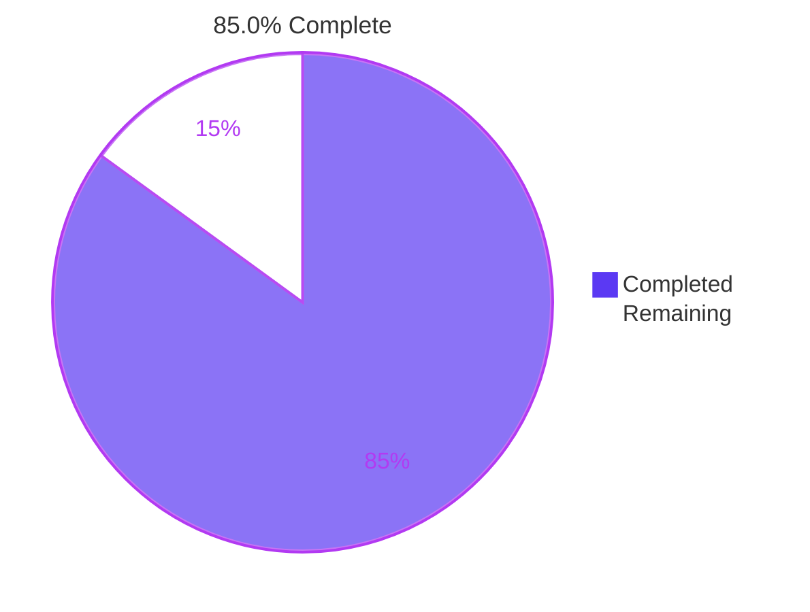
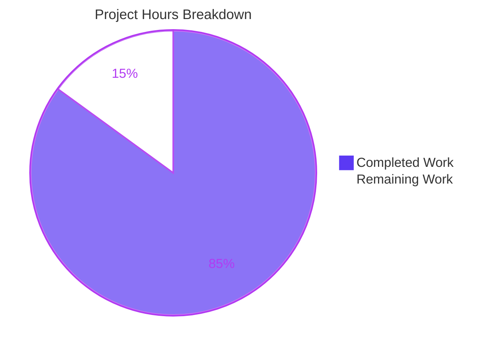
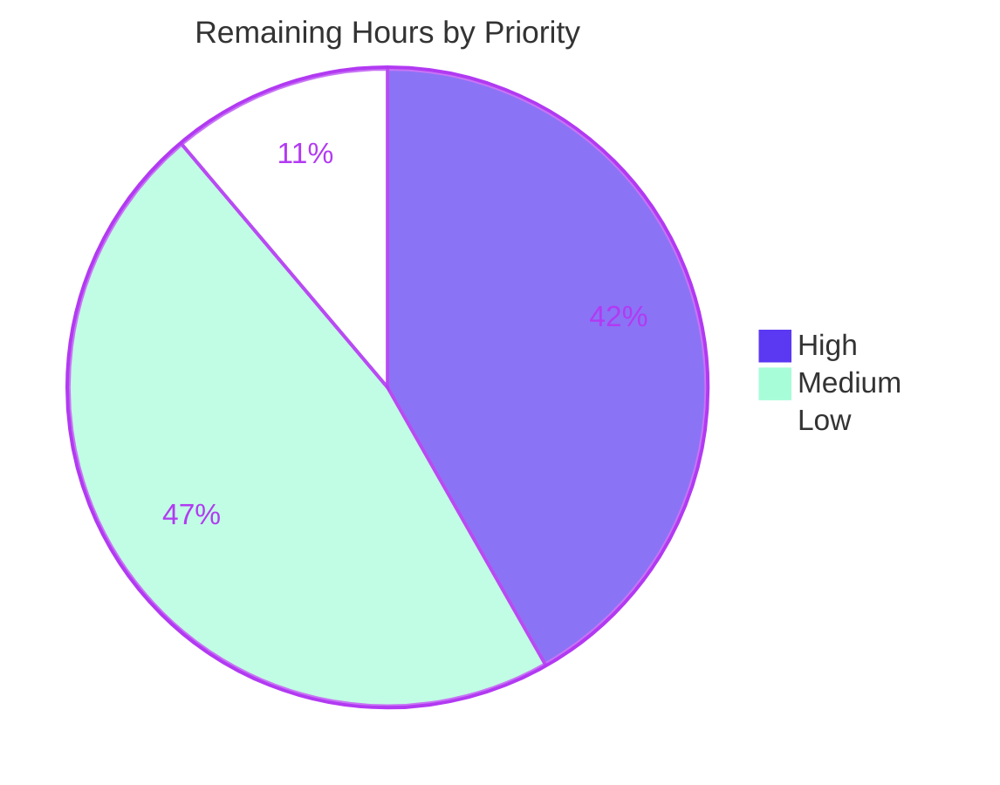
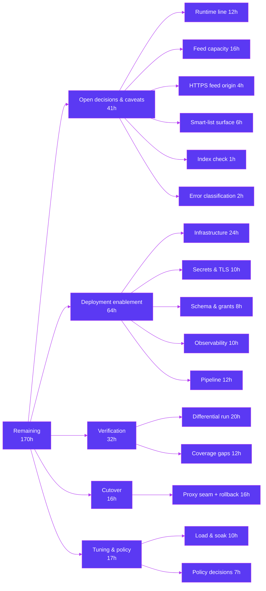

# 1. Executive Summary

## 1.1 Project Overview

Slatwall 3.1.39 is an open-source CFML commerce platform whose catalog and promotions logic sits inside a ColdFusion/Hibachi monolith. This project extracts a bounded slice — seven service surfaces, eighteen entities, the promotion engine, the price-group and currency cascades, and the Google product feed — into a strict-mode TypeScript service on AWS Lambda over the unchanged `Sw*` MySQL schema. It lands as an isolated `slatwall-ts/` subtree beside the untouched monolith, behind a strangler-fig seam, with a reviewer walkthrough. Its consumers are the existing order orchestrator and Google Merchant Center.

## 1.2 Completion Status

Completion covers the planned scope, the requested walkthrough, and the path to production.


```mermaid
%%{init: {"theme":"base","themeVariables":{"pie1":"#5B39F3","pie2":"#FFFFFF","pieStrokeColor":"#B23AF2","pieOuterStrokeColor":"#B23AF2","pieSectionTextColor":"#B23AF2","pieTitleTextSize":"18px"}}}%%
pie title 85.0% Complete
    "Completed" : 965
    "Remaining" : 170
```

| Metric | Value |
|---|---|
| **Total Hours** | **1,135** |
| Completed Hours (AI + Manual) | 965 (965 AI + 0 Manual) |
| Remaining Hours | 170 |
| **Percent Complete** | **85.0%** |

965 ÷ (965 + 170) × 100 = **85.0%**.

## 1.3 Key Accomplishments

- ✅ Seven service surfaces ported method-for-method — all 70 mapped signatures resolve in `slatwall-ts/src/`
- ✅ Promotion discount math and use-limit semantics preserved, pinned by 584 tests
- ✅ Price-group and currency cascades preserved, including undefined-never-zero price semantics
- ✅ No floating point touches money — `Money` over arbitrary-precision decimals, rounding on decimal strings
- ✅ 6,719 tests pass at 94.03% statement coverage, needing no database and no configuration
- ✅ Five CommonJS Lambda artifacts build, load, and answer live requests against MySQL 8.4
- ✅ Monolith and `Sw*` schema untouched — 176 additions, zero modifications, no DDL
- ✅ Reviewer walkthrough (`blitzy/documentation/PR Walkthrough.md`) with every command executed

## 1.4 Critical Unresolved Issues

**6 open items on 5 of the 13 components in Section 2.1**; both refinement directives are delivered (0 of 2 open). Four need an owner decision and two are small corrections (Section 5.2).

| Issue | Impact | Owner | ETA |
|---|---|---|---|
| Artifacts target the deprecated `nodejs20.x` Lambda runtime (`.nvmrc`, `package.json`, `esbuild.config.mjs`) | No security patches or support; eventually no ability to deploy a change | Platform owner | 12h after approval |
| `GET /feeds/google/products` recomputes and buffers the whole eligible catalog per request, with no cache, rate limit or concurrency guard | An allow-listed caller can repeat a ~1.97 MB, ~290 ms render in parallel | Platform / SRE | 16h |
| The product feed emits `http://` at all five absolute-URL sites (`src/integrations/google/rssFeedRenderer.ts`) | Cleartext links in a document Google fetches and follows | Product owner | 4h after approval |
| `findProducts` / `findSkus` keep only keyword, product-type and paging filters; two entity smart-list callers are not ported | Narrower than the plan's "filters callers apply are preserved" | Product owner | 6h if retained |
| SKU-code uniqueness is checked on insert only; updates rely on the existing `SwSku.skuCode` unique index (`src/repositories/mysql/mysqlSkuRepository.ts:1737`) | Without that index, an update onto a taken code is not refused | DBA | 1h |
| A mutation whose authorizer `accountID` has no `SwAccount` row answers a generic 500 (foreign-key refusal) | Client fault reported as server fault | Engineering | 2h |

## 1.5 Access Issues

No access issue blocks build or test: packages install without authentication, and the suite needs no database or environment variable. Deployment access is outstanding by design.

| System/Resource | Type of Access | Issue Description | Resolution Status | Owner |
|---|---|---|---|---|
| npm registry | Package install | None — 13 exact-pinned packages resolve with no credential | Resolved | — |
| Build / test / package pipeline | None required | None — the suite runs hermetically | Resolved | — |
| AWS Lambda, API Gateway, IAM | Deploy | Not yet provisioned; needed to deploy, not to build | Outstanding (deployment prerequisite) | Platform owner |
| Production `Slatwall` MySQL instance | Network + DML grants | Not yet reachable; the service creates no schema by design | Outstanding (deployment prerequisite) | DBA |
| Managed secret store | Credential storage | Credentials currently arrive as plain environment values | Outstanding (deployment prerequisite) | Platform owner |
| Google Merchant Center | Feed submission | Round trip to Google never exercised | Outstanding (deployment prerequisite) | Product owner |

## 1.6 Recommended Next Steps

1. **[High]** Decide the runtime line; move the pin artifacts and README together, and re-prove the bundle format.
2. **[High]** Stand up the deployment: infrastructure, a managed secret store, the network path to `Slatwall`, and confirm the `SwSku.skuCode` unique index.
3. **[High]** Put rate, concurrency and cache controls in front of the public feed route before exposing it.
4. **[Medium]** Settle the two scope decisions — HTTPS feed origins and the smart-list surface.
5. **[Medium]** Run both implementations against the same data and diff the three must-preserve areas.

# 2. Project Hours Breakdown

## 2.1 Completed Work Detail

Every row is a planned or requested deliverable that exists on disk and is exercised by the test suite or by executed commands.

| Component | Hours | Description |
|---|---|---|
| Toolchain, build & packaging pipeline | 24 | 13 root artifacts: maximal-strict TypeScript profile (`skipLibCheck: false`), flat ESLint with the domain-inward import boundary and a no-barrel rule, Prettier, the test runner with coverage floors, and a CommonJS/`node20` bundler that archives each capability with its licence notice and asserts the annotation floor per artifact |
| Domain entity layer (18 modules) | 120 | `src/domain/entities/` — the four-step currency cascade materialized at hydration on `sku.ts`, option-to-SKU resolution on `product.ts`, materialized ID paths on `productType.ts` and `priceGroup.ts`, 27 include/exclude collections across the qualifier and reward entities, promotion flag logic under an explicit UTC policy, and the applied-promotion write side |
| Value objects, order views & engine types | 30 | `money.ts` as the general money surface over an arbitrary-precision decimal, a branded three-character currency code, materialized-path walking, three read-only order views forming the anti-corruption boundary, and three engine type contracts |
| Repository & collaborator ports (13) | 16 | `src/domain/ports/` — interfaces only, extracted from the legacy data-access and collaborator call sites; the settings port narrowed to exactly four keys; two documented stub ports for out-of-scope branches |
| Service layer (7 surfaces) | 105 | Product, SKU, brand, option, price-group (five-level cascade with its preserved asymmetries), rounding-rule (the decimal-string algorithm reproduced over decimal helpers) and the promotion facade — public method names carried over verbatim |
| Promotion engine decomposition (9 modules) | 82 | A 489-line legacy method as nine focused modules in `src/services/promotion/`, preserving every order-dependence vector, both opposing insertion sorts, the two-pass guard and the reward-usage ledger |
| MySQL data access (6 repositories, 5 SQL builders, pool) | 112 | Hand-written prepared statements over the existing schema; in-engine query post-processing rewritten as CTEs; AND-of-EXISTS option matching; entity hydration factories; tuple-row chunking; a re-entrant transaction executor; write-conflict classification |
| Lambda handlers, router, composition root, error mapper | 100 | `src/handlers/` — an explicit composition root replacing the runtime-scanned bean factory, an explicit five-route table replacing convention routing, an error mapper covering 8 categories across 6 status codes, and five capability entrypoints with schema validation, authorization gating and feed host allow-listing |
| Google feed integration (5 modules) | 28 | The five-method interface contract as a union type, the adapter surface, feed repository, feed service, and a pure string-emitting RSS 2.0 renderer with a hand-rolled five-entity escaper |
| Configuration, logging & CFML parity helpers | 44 | An 18-key validating configuration surface that reports every problem at once and enforces the Lambda environment quota, structured JSON logging with fail-closed redaction, and five semantic-parity helpers for CFML truthiness, lists, case-insensitive structs, number formatting and precision |
| Test suite & traceability register | 262 | 65 suites, 5 fixture factories, a shared setup module, and an 8,112-line executable traceability register (173 cases) that fails the build when a module is unmapped, a preserved defect loses its citation, or the divergence budget moves |
| Environment contract, operator documentation & licence continuity | 26 | A 964-line environment contract, a 1,927-line operator README covering the toolchain, build, packaging and troubleshooting, and a licence notice carrying GPL v3 attribution forward and recording that the integration-services exception does not extend to this subtree |
| Reviewer PR walkthrough | 16 | `blitzy/documentation/PR Walkthrough.md`, 863 lines: change-set map, architecture diagram, layer-by-layer reading order tied to legacy sources, behaviour-preservation owners and pinning suites, measured gate commands and marker census, a secure optional runtime recipe, 17 recorded departures, open items and a reviewer checklist |
| **Total** | **965** | |

## 2.2 Remaining Work Detail

| Category | Hours | Priority |
|---|---|---|
| Runtime platform migration off the end-of-life Node 20 line — the six gated pin artifacts, `FROZEN_MAJOR` and the two runtime assertions in `tests/traceability/legacyTestMap.ts`, the README's toolchain statements, and a re-proven bundle format | 12 | High |
| Product-feed capacity controls — rate limit, concurrency limit, cache or CDN, duration and memory alarms | 16 | High |
| Infrastructure definitions — five Lambda functions, API Gateway routes and authorizer, IAM roles, network path to MySQL | 24 | High |
| Secrets management and TLS material — credentials into a managed store with rotation, trust store for verified transport | 10 | High |
| Production schema provisioning and least-privilege DML grants, including confirming the existing `SwSku.skuCode` unique index | 9 | High |
| Canonical HTTPS origin for the product feed — one literal plus its parity gate, once approved | 4 | Medium |
| Smart-list surface decision — typed queries for `ProductType.getProductsSmartList` and `Product.getDefaultProductImageFiles` if they are retained | 6 | Medium |
| CI/CD pipeline running the full gate set and publishing the five artifacts | 12 | Medium |
| Observability — log retention, duration and memory alarms, error-rate alarms, per-capability dashboards | 10 | Medium |
| Close the three named coverage gaps and run the live-database tier in continuous integration | 12 | Medium |
| Differential validation against a running legacy engine across the three must-preserve areas | 20 | Medium |
| Strangler-fig cutover of the order orchestrator's two consumed service calls, with a rollback path | 16 | Medium |
| Classify a foreign-key refusal from an unknown modifying account as a client fault rather than a 500 | 2 | Low |
| Outstanding policy decisions — development-toolchain re-pin, edge security-header policy, comment-block budget measure | 7 | Low |
| Pre-production load and soak run at production catalog size, with per-function capacity sizing | 10 | Low |
| **Total** | **170** | |

Priority distribution: High **71h**, Medium **80h**, Low **19h**.

## 2.3 Reconciliation

| Check | Result |
|---|---|
| Section 2.1 completed hours | 965 |
| Section 2.2 remaining hours | 170 |
| 2.1 + 2.2 = Total Project Hours (Section 1.2) | 965 + 170 = **1,135** ✅ |
| Remaining hours match Sections 1.2, 2.2 and 7 | 170 in all three ✅ |
| Percent complete | 965 ÷ 1,135 = **85.0%** ✅ |

Of the 170 remaining hours, **41h** belong to the six open items in Section 1.4 (12 + 16 + 4 + 6 + 1 + 2) and **12h** closes the residual coverage gap; the other **117h** is deployment and policy work the plan placed out of scope by design — infrastructure definitions, secrets, schema provisioning, pipeline, observability, cutover, differential validation, capacity sizing and the outstanding policy decisions.

# 3. Test Results

The full suite was executed against the delivered tree: **66 test files, 6,719 tests, 6,719 passed, 0 failed, 0 skipped**, completing in about 11 seconds. Coverage across all source is **94.03% statements / 86.18% branches / 98.11% functions / 94.02% lines** against configured floors of 80 / 70 / 80 / 80 (`vitest.config.ts`, whole-tree). The suite requires no database, no environment variables and no network, so these numbers are reproducible from a clean checkout with `npm ci && CI=true npm test`.

| Area / Category | Framework | Tests | Passed | Failed | Coverage | What This Proves |
|---|---|---|---|---|---|---|
| Domain entities (18 suites) | Vitest 4.1.10 | 2,145 | 2,145 | 0 | 98.3% | The four-step currency cascade resolves per-currency prices and returns undefined — never zero — for a missing price, and materialized ID paths and promotion flag logic behave as the legacy entities do |
| Value objects & CFML parity helpers (8 suites) | Vitest 4.1.10 | 605 | 605 | 0 | 97.7–100% | Money arithmetic is exact to the cent with no floating-point drift, and CFML truthiness, list, case-insensitive struct and number-format semantics translate deterministically |
| Catalog & pricing services (6 suites) | Vitest 4.1.10 | 578 | 578 | 0 | 93.6% | The five-level price-group cascade resolves through SKU, product and product-type ancestors with its asymmetries intact, and all ten measured rounding outcomes reproduce exactly, including the four counter-intuitive ones |
| Promotion engine & facade (10 suites) | Vitest 4.1.10 | 584 | 584 | 0 | 99.2% | Discount stacking, use-limit enforcement, both opposing sort orders and the two-pass guard behave as the legacy engine does, and the pricing pass must precede the promotion pass or the discount changes |
| Data access — repositories & SQL builders (8 suites) | Vitest 4.1.10 | 876 | 876 | 0 | 88.4–100% | Every statement is a prepared statement over the unchanged `Sw*` schema, AND-of-EXISTS option matching narrows monotonically, in-engine post-processing is faithfully rewritten as CTEs, and statement counts stay bounded as row counts grow |
| Lambda handlers, router & composition root (9 suites) | Vitest 4.1.10 | 1,138 | 1,138 | 0 | 92.8% | The dependency graph assembles once and is statically checkable, routes dispatch from an explicit table, and every failure maps to one of 8 categories across 6 status codes without leaking internals |
| Google product feed integration (4 suites) | Vitest 4.1.10 | 342 | 342 | 0 | 95.0% | The RSS 2.0 document is well formed with all five XML entities escaped, the adapter contract is satisfied, and the frozen legacy characteristics — hardcoded condition and availability, empty product category — are reproduced |
| Configuration, logging & traceability floor (3 suites) | Vitest 4.1.10 | 451 | 451 | 0 | 95.7% | Configuration reports every problem at once and never echoes a value, logs redact fail-closed, and the register mechanically holds module coverage, defect citations and the divergence budget in place |
| **Total** | **Vitest 4.1.10** | **6,719** | **6,719** | **0** | **94.03%** | |

### Not Covered

The following was delivered or relied upon but is **not** exercised by any test. A human should close or accept each before release.

- **20 of the 89 source modules contain no executable statement** — the 13 repository and collaborator ports, the 3 read-only order views, the 3 promotion-engine type contracts and the integration interface. They report zero coverage by construction rather than by omission. No action needed.
- **No differential execution against a running legacy engine.** Behaviour parity is pinned to characterization tests written from reading the legacy source, not to observed legacy output, so a misreading of CFML semantics would be held in place by the very tests meant to catch it. The register citation-checks all 42 recorded legacy defects against in-code annotations, which makes each claim checkable by hand but does not measure it. → Section 2.2, 20h.
- **The default suite executes no statement against a live MySQL server.** The repository suites assert statement text and bound parameters through recording executors and pure builders, and the pool suite runs against a mocked driver. Running a live-database tier in continuous integration is outstanding. → Section 2.2, 12h.
- **Three named behaviour gaps.** Option-group traversal order during SKU creation (`model/service/SkuService.cfc:L82,L106`), the product-feed missing-image existence probe (`model/service/ImageService.cfc:L81`), and the endless-sale effective-date element (`integrationServices/google/views/feed/product.cfm:L30`). Each is recorded in the register as contributing zero coverage. → Section 2.2, 12h.
- **Unenforced legacy validation rules.** Rules for artifacts the port gives no write path — `SkuCurrency` non-negative prices, `OptionGroup` save and delete, and the promotion-family entities — have no enforcing code, so no test exercises them. They become live only if a write path is added.
- **The reviewer walkthrough sits outside every automated gate.** Its commands were executed and its figures re-measured against the tree, but nothing fails the build if the code later drifts from it.
- **No legacy antecedent exists for almost all of this coverage.** Only the brand and product entity suites extend a legacy test, carrying their original assertions and fixtures forward; everything else is net-new and declared as such. The one legacy functional test touching this slice is an empty stub.
- **The Google Merchant Center round trip is never made.** The adapter emits a byte-stable document, but no submission to Google has been attempted. → Section 2.2, deployment prerequisite.

# 4. Runtime Validation & UI Verification

This service renders no user interface. It is a headless set of Lambda handlers behind API Gateway, so there are no screens or visual states to verify — the one document it produces, the Google product feed, is machine-consumed RSS. Everything below was driven through the **packaged `dist/*.cjs` artifacts** against a live MySQL 8.4 instance holding the 182-table `Sw*` schema, under a DML-only database account.

**Start-up and packaging**

- ✅ **Cold start, artifacts and configuration refusal** — all five bundles load and export `handler`, the composition root assembles once and is reused across invocations, and each archive carries its handler plus the licence notice. An incomplete environment is refused at cold start with every problem reported once and no value echoed; plaintext database transport is refused for any non-loopback host.

**Capability flows**

- ✅ **Catalog query** (`GET,POST /catalog/products`) — admin reads such as `findProducts` return records; a `saveBrand` mutation persists, reads back from the database, and reappears in the feed correctly XML-escaped; a concurrent double submit resolves last-write-wins; SQL-injection and script keywords return zero records and alter nothing.
- ✅ **SKU resolution** (`GET /catalog/skus`) — `getSkuBySkuCode` returns the SKU with its per-currency detail map, and `getProductSkusBySelectedOptions` narrows AND-wise live: two options return one SKU, one option returns both matches.
- ✅ **Price resolution** (`POST /prices/resolution`) — the base currency resolves to its price, an unpriced currency returns `resolved: false` rather than zero, the anonymous-permitted operation answers, and the price group resolves for an entitled caller.
- ✅ **Promotion application** (`POST /promotions/application`) — sale-price details resolve for a scoped caller; the pricing pass runs before the promotion pass; `applyPromotions` emits no intent when a sale-price seed ties the reward, matching the legacy strictly-larger rule; no applied-promotion row is written.
- ✅ **Product feed** (`GET /feeds/google/products`) — a well-formed RSS 2.0 document with `content-type` as its only header, one item per active SKU, byte-identical across renders, with the frozen legacy characteristics intact: `http://` origins and an empty product-category element.

**Refusal and authorization paths**

- ✅ **Authorization, routing and input handling** — no claims 401; insufficient or malformed claims 403; claims forged in headers or body do not elevate; an operation sent on the wrong method, repeated or unknown 400 without echoing input; out-of-range paging and malformed JSON 400; another capability's route 404. Feed Hosts outside the allow-list, empty or suffix-spoofed fail closed at 400; an unset allow-list authorizes nothing.
- ⚠ **Mutations by an unknown account** — a write whose authorizer `accountID` has no `SwAccount` row is refused by the database's foreign key and surfaces as a generic 500 rather than a client-fault status. Nothing is written. Every read and refusal path answers 400, 401, 403 or 404.

**External integrations and the reviewer recipe**

- ⚠ **Google Merchant Center and currency conversion** — the feed is valid and byte-stable, but no submission to Google has been made; conversion resolves against configured reference rates without calling a live rate provider, and the legacy source's own integration gap there is carried forward as a flagged item.
- ✅ **Reviewer runtime recipe** — the walkthrough's optional recipe was run end to end on a throwaway server: secrets held in 0600 files outside the checkout and absent from container configuration, a bounded authenticated readiness gate, a DML-only runtime account whose DDL attempt is refused, six invocations answering their documented statuses, and a cleanup that removes the data volume.

**Never exercised at runtime**

No request was made against a deployed AWS environment — there are no infrastructure definitions, and "deployable" was scoped as a successful build and package. No request was replayed through the legacy CFML engine for comparison, so no observed output from the two implementations has been diffed.

# 5. Compliance & Quality Review

## 5.1 Compliance Matrix

Each row shows where the deliverable stands now, with evidence a reader can open.

| # | Deliverable / Benchmark | Status | Progress | Verified By |
|---|---|---|---|---|
| 1 | **Interface parity** — public method surfaces carried over verbatim in CFML camelCase | ✅ PASS | ██████████ 100% | All 70 mapped signatures resolve in `src/services/`, `src/domain/entities/` and `src/integrations/`; three signature reshapings over five symbols and five visibility widenings, each recorded in the register |
| 2 | **Behaviour preservation** at the three must-preserve boundaries — discount math with use limits, the price-group and currency cascades, option-based SKU resolution | ✅ PASS | ██████████ 100% | 584 promotion-engine tests, 578 catalog and pricing service tests, AND-of-EXISTS pinned by `tests/integration/repositories/skusBySelectedOptions.test.ts` and `mysqlSkuRepository.test.ts` and observed live; a test proves reversing the pricing and promotion passes changes the discount |
| 3 | **Decimal fidelity** — no floating point on money | ✅ PASS | ██████████ 100% | `src/domain/valueObjects/money.ts` is the general money surface; `src/services/roundingRuleService.ts` works on decimal strings through `src/lib/cfml/precision.ts`; the reference discount resolves to `7.50` and the net to `'52.47'`; all ten measured rounding outcomes reproduce exactly |
| 4 | **Preserved-defect discipline** — legacy defects reproduced and annotated, divergence budget respected | ✅ PASS | ██████████ 100% | 103 bracketed `LEGACY-DEFECT` markers at 82 distinct legacy citations in `src/`; all 42 register entries citation-checked; the register asserts exactly three divergence subjects at five citations |
| 5 | **Schema continuity** — the existing `Sw*` tables read and written unchanged | ✅ PASS | ██████████ 100% | No DDL, migration, rename or column change anywhere in the change set; abbreviated legacy link-table names preserved and gated |
| 6 | **Strict compilation & type safety** | ✅ PASS | ██████████ 100% | `tsc --noEmit` clean under `strict`, `noUncheckedIndexedAccess`, `exactOptionalPropertyTypes`, `noImplicitOverride`, `noUnusedLocals` and `skipLibCheck: false`; zero `any` annotations and zero type suppressions in `src/` |
| 7 | **Architectural layer boundary** — hexagonal, dependencies flowing inward | ✅ PASS | ██████████ 100% | `eslint .` clean with a `no-restricted-imports` rule forbidding `src/domain/**` from reaching repositories, handlers or integrations, plus a no-barrel rule; zero `index.ts` files |
| 8 | **Injection safety & least privilege** | ✅ PASS | ██████████ 100% | Every statement is a prepared statement; adversarial keywords return zero records and metacharacters are stored literally; the whole surface runs under DML-only grants with DDL refused |
| 9 | **Secrets & configuration hygiene** | ✅ PASS | ██████████ 100% | Zero hardcoded credentials; 18 deployable keys validated at cold start with every problem reported at once and no value echoed; plaintext transport refused for any non-loopback host; log redaction fail-closed |
| 10 | **Test coverage & traceability floor** | ✅ PASS | ██████████ 100% | 6,719 tests at 94.03% statements against an 80% floor; 89 source modules mapped (64 covered, 25 exempt, 0 pending); the two legacy-extended suites are separated from net-new coverage |
| 11 | **Deployable artifact, scope containment & reviewer trail** | ✅ PASS | ██████████ 100% | 5 CommonJS bundles, source maps and archives build, load and export `handler`; all 176 changed files are additions — 174 under `slatwall-ts/` and two delivery documents in `blitzy/documentation/` — with the monolith intact at 418 `.cfc` and 562 `.cfm` |
| 12 | **Runtime platform currency** | ⚠ PARTIAL | ████████░░ 80% | The pin is coherent across every artifact that states it and a production dependency audit reports zero known vulnerabilities, but the pinned Lambda runtime line is deprecated — see divergence 1 below |

## 5.2 AAP & Rule Divergences and Gaps

**No user-specified rules exist for this project**, so no rule divergence is possible; every divergence below is measured against the plan or the user's later instructions. Eight are recorded. Three are sanctioned — rows 5, 6 and 8, the first still carrying a one-hour provisioning check; the other five need a human decision or a small piece of work.

| # | What the AAP/Rule Required | What Was Delivered Instead | Why It Diverged | Impact | Remediation |
|---|---|---|---|---|---|
| 1 | Node 20.x / Lambda `nodejs20.x` as a toolchain pass condition (AAP 0.5.1, 0.9.1) | The pin is kept although the line has reached end of life | Raising it fails an explicit plan gate and invalidates the packaging evidence proven on this runtime and driver pair | Unpatched runtime, no support eligibility, eventual inability to deploy | Amend the runtime gate, then move every pin statement together — **12h** |
| 2 | No second module-scope cache (0.6.5); no object storage, CDN or edge tier (0.2.2); no invented HTTP semantics or throughput figures (0.8.1); a fixed package set (0.8.3) | The public feed route ships with no cache, validator, rate limit or concurrency guard | Four of the five closing controls each collide with one of those clauses; the fifth — never truncate — is already satisfied | An allow-listed caller can repeat a whole-catalog render in parallel | Provision edge controls, or amend the plan — **16h** |
| 3 | Exact feed-contract parity (0.1.1) with a divergence budget of exactly three (0.6.7), all spent | All five absolute-URL sites still emit `http://` | Changing the scheme changes a frozen document and would be a fourth divergence, which no budget authorizes | Cleartext links in a merchant feed Google fetches and follows | Approve a fourth divergence; then one literal and its parity gate — **4h** |
| 4 | Smart lists narrowed to typed queries, with "the concrete filters the legacy callers actually apply" preserved (0.4.2, 0.6.2) | `findProducts` / `findSkus` keep keyword, product-type and paging filters only; two entity smart-list accessors are not ported | The generic surface was dropped as the plan sanctions; the per-caller filters were not carried into typed queries | Product search matches name only with no sub-type walk; two entity accessors absent | Decide the surface; add typed queries if retained — **6h** |
| 5 | Schema continuity: no migration, no new table, no column change (0.8.1) | SKU-code uniqueness checked in application code on insert; updates rely on the existing unique index | Creating an index is DDL; the legacy entity already declares the column unique | Insert races resolve to one row; an update onto a taken code is refused only if the index exists | Confirm the index at provisioning — **1h** (Sanctioned) |
| 6 | No new persistent state (0.8.1) | A concurrent write conflict answers `409`; no idempotency-key store | A key store is new persistent state; a request-scoped one cannot survive cross-invocation concurrency | A client racing itself sees `409` rather than a replayed `200`; re-sending succeeds | None required (Sanctioned) |
| 7 | Exact pinning with a gate asserting the manifest (0.5.1, 0.8.3, 0.9.1); invent no policy the source lacked (0.8.1) | Development toolchain left as pinned despite newer releases; no browser security headers emitted | Re-pinning breaks the manifest gate; the headers are browser policy the legacy source never expressed | None today — zero known vulnerabilities; no browser-consumed origin is published | Decide each, with the comment-block budget measure, as a separately verified step — **7h** |
| 8 | Additions confined to `slatwall-ts/` (0.2.1, 0.3.1, 0.9.5, 0.9.6) | Two delivery documents in `blitzy/documentation/`: this guide and the reviewer walkthrough | The user asked to add a PR walkthrough and to change nothing else | None — zero existing files modified; the subtree is byte-identical | None required (Sanctioned) |

**1 — Runtime platform pin.** The five artifacts target the deprecated `nodejs20.x` Lambda runtime, whose upstream Node line has reached end of life. The plan freezes that line as a pass condition, and the CommonJS-versus-ESM bundle decision was proven on this runtime and driver pair, so a unilateral bump fails a gate and voids that evidence. Moving it touches more than the six gated artifacts (`.nvmrc`, `engines.node`, `package-lock.json`, `@types/node`, `target: 'node20'`, `FROZEN_NODE_VERSION`): also `FROZEN_MAJOR` and two runtime assertions in `tests/traceability/legacyTestMap.ts`, and the README. `git grep -nE '20\.(x|19|20)|[Nn]ode(\.js)? 20|node(js)?20' -- slatwall-ts ':!slatwall-ts/package-lock.json'` lists all 43 lines across 11 files.

**2 — Feed route capacity.** `GET /feeds/google/products` re-runs the whole-catalog selection, hydration and in-memory render for every allow-listed request. Against a 2,984-SKU catalog it produces about 1.97 MB in roughly 290 ms, repeatable concurrently, and nothing is retained between requests. Four closing controls are each blocked by a plan clause: a cache is forbidden module-scope state, pre-generation and a CDN tier are out of scope, and a validator or concurrency ceiling would be invented. The work is eight statements per invocation, never one per row, nothing is truncated, and an unset allow-list authorizes no host. A human must provision edge controls or amend the plan.

**3 — Cleartext feed origins.** The legacy template writes an `http://` origin at exactly five sites and contains no `https://`, and the plan requires exact feed-contract parity. A parity gate pins the scheme literal, and the budget of three deliberate divergences is spent. Exposure is contained: no forwarding header can steer scheme or authority, the authority is an allow-list selection, malformed authorities fail closed without echo, and all output is XML-escaped. Terminating TLS in front does **not** rewrite in-document URLs, so this cannot be deferred to the edge. Once approved, the change is one literal in `src/integrations/google/rssFeedRenderer.ts` plus its gate.

**4 — Smart-list surface.** The legacy smart lists were a generic, string-keyed query builder; the plan sanctions replacing them with typed queries but also promises that the filters callers actually apply survive. `findProducts` (`src/services/productService.ts`) keeps a required keyword matched on product name, an exact product-type list with no sub-type walk, and a paging window; `findSkus` (`src/services/skuService.ts`) keeps keyword on SKU code and a product-type list, without paging. `ProductType.getProductsSmartList` (`model/entity/ProductType.cfc:L261-L267`) and `Product.getDefaultProductImageFiles` (`model/entity/Product.cfc:L497-L505`) are not ported, and tests assert their absence. A product owner must decide whether either is needed.

**5 — Uniqueness without DDL.** Concurrent creation of one SKU code had to be safe without authoring an index. On insert, `persistSku` locks the parent `SwProduct` row where a parent key is known, re-reads the code `FOR UPDATE`, and refuses a taken code with `409`; three concurrent identical inserts yield one row and two conflicts. Updates issue no such check and rely on the unique index the legacy entity already declares (`model/entity/Sku.cfc:L54`), whose duplicate-key error is also classified as `409`. A SKU without a code is not checked. Schema continuity forbids creating the index, so the deployment must confirm it exists.

**6 — Conflict rather than replay.** A retried submission could have been answered by replaying the original result from an idempotency-key store. That store is new persistent state, which the plan forbids, and a request-scoped one would not survive between Lambda invocations — precisely the concurrency at issue. The delivered behaviour is an explicit `409 Conflict` for the concurrent case; nothing is written on the losing path, so re-sending succeeds, and the response carries one fixed sentence that leaks no colliding value. Cross-invocation idempotency keys would need a schema decision and a product decision on key scope and lifetime; neither belongs in this port.

**7 — Two policy abstentions.** Several development-only packages have newer releases, but the plan pins every dependency exactly and asserts installed versions against the manifest, so re-pinning would break that gate; none of the lagging packages is inlined into a bundle, and the production audit reports zero known vulnerabilities. Separately, responses carry no content-type-options, frame, content-security or transport-security headers, because they are browser policy the legacy source never expressed; each response class carries exactly `cache-control` and `content-type`, the feed `content-type` alone. Neither affects the shipped deployment; each is a deliberate plan amendment if wanted.

**8 — Documentation outside the subtree (Sanctioned).** The plan confines every addition to `slatwall-ts/`. The user then asked to add a PR walkthrough and stated that no material change to code or validation was wanted. The walkthrough sits at `blitzy/documentation/PR Walkthrough.md`, beside the project guide, because a file at the subtree root would fail the frozen file census in `tests/traceability/legacyTestMap.ts` and force a validation change the user ruled out. `git diff --name-only origin/master...HEAD | grep -v '^slatwall-ts/'` therefore lists these two documents. No existing file was modified, and every gate result is identical to before.

Beyond these eight, several minor items are recorded rather than acted on, none affecting behaviour. Declarative validation is enforced wherever the port has a write path — the conditional `Product_UpdateSkus` schema and the save and delete checks — while rules for artifacts with no write path stay unenforced (see Section 3). `Money` is the general money surface, but the rounding algorithm works on decimal strings through the precision helpers, still without floating point. The Google adapter reports integration type `fw1`, matching the legacy component and the plan's interface table, where the plan's ambiguity notes proposed `custom`. The plan's own counts are aligned to its enumerations (thirteen dependencies, ten rounding rows); a local-development path it cites does not exist, so no legacy runtime was stood up; no `Sw*` schema definition ships by design; and a test-harness timeout plus two exported error-classification symbols are recorded as bounded additions.

# 6. Risk Assessment

These are forward-looking: what could still go wrong once this service carries production traffic.

| Risk | Category | Severity | Probability | Mitigation | Status |
|---|---|---|---|---|---|
| **End-of-life managed runtime.** The five deployable artifacts target the deprecated `nodejs20.x` Lambda runtime — no security patches, no support eligibility, and eventually no ability to deploy a change at all | Security | High | High | The pin is coherent everywhere it is stated and the production dependency audit reports zero known vulnerabilities today; the traceability gate rejects a partial bump, forcing a coordinated move | Open — awaiting an owner decision (Section 2.2, 12h) |
| **Uncapped whole-catalog render on a public route.** `GET /feeds/google/products` recomputes and buffers the entire eligible catalog per allow-listed request, with no cache, validator, rate limit or concurrency guard | Operational | High | Medium | The allow-list authorizes no host when unset or empty; the work is eight statements per invocation rather than one per row; nothing is retained between invocations; the document is never silently truncated | Open — needs edge controls (Section 2.2, 16h) |
| **Parity is pinned to characterization, not to measurement.** The two implementations have never been run side by side on the same inputs, so a misreading of CFML semantics would be held in place by the tests meant to detect it | Technical | High | Medium | 103 in-code defect markers at 82 distinct legacy citations make each preserved behaviour independently checkable, and 6,719 tests hold the reproduced behaviour in place | Mitigated — closes on a differential run (Section 2.2, 20h) |
| **Deliberately preserved money-affecting rounding.** The rounding path reproduces legacy outputs that read as defects: a value whose cents end in zero takes a corrupted branch, the declared default is not inert, and a short input collapses to the rounding expression itself. An engineer who "corrects" these changes prices | Technical | High | Medium | 71 tests pin all ten measured outcomes and fail a mathematically tidier implementation; every site carries an annotation naming its legacy locator and warning against repair without a product decision | Mitigated by design |
| **Cutover ordering dependency.** The promotion pass reads state the pricing pass writes — an ordering the legacy caller enforced only incidentally. Wiring the order orchestrator in the wrong order silently changes discounts | Integration | High | Medium | The ordering is explicit in the composition root and in the `applyPromotions` operation, and a test proves that reversing the two passes produces a different discount | Mitigated — closes at cutover (Section 2.2, 16h) |
| **Cleartext origins in the merchant feed.** All five absolute-URL sites emit `http://`, so an on-path party can alter the product and image resources a consumer retrieves | Security | Medium | Medium | No forwarding header can steer the scheme or authority; the authority is an allow-list selection; unauthorized authorities fail closed without echoing the value; all output is XML-escaped | Open — awaiting approval (Section 2.2, 4h) |
| **Credentials in plain function configuration.** Database credentials arrive as environment values with no managed store and no rotation | Security | Medium | Medium | No credential is hardcoded anywhere in the source; log redaction is fail-closed; plaintext transport is refused for any non-loopback host; a DML-only account is proven sufficient, with DDL refused | Open — deployment prerequisite (Section 2.2, 10h) |
| **Operational readiness gaps.** No pipeline runs the gate set; the service depends on a schema it does not create — including the `SwSku.skuCode` unique index that alone refuses an update onto a taken code; a write by an account absent from `SwAccount` answers 500; the Merchant Center round trip is unexercised; and reward order is non-deterministic at a discount tie because the source query applies no ordering | Operational | Medium | High | Every gate is a single scripted command chained by one verify script; configuration reports every problem at once on cold start; the feed document is byte-stable across renders; a foreign-key refusal writes nothing | Open — Section 2.2 (12h pipeline, 9h schema, 10h observability, 2h error classification) |

# 7. Visual Project Status

**Overall progress — 85.0% complete.** Completed work is shown in Blitzy dark blue (`#5B39F3`); remaining work in white (`#FFFFFF`).


```mermaid
%%{init: {"theme":"base","themeVariables":{"pie1":"#5B39F3","pie2":"#FFFFFF","pieStrokeColor":"#B23AF2","pieOuterStrokeColor":"#B23AF2","pieSectionTextColor":"#B23AF2","pieTitleTextSize":"18px"}}}%%
pie title Project Hours Breakdown
    "Completed Work" : 965
    "Remaining Work" : 170
```

**Remaining work by priority — 170 hours.**


```mermaid
%%{init: {"theme":"base","themeVariables":{"pie1":"#5B39F3","pie2":"#A8FDD9","pie3":"#FFFFFF","pieStrokeColor":"#B23AF2","pieOuterStrokeColor":"#B23AF2","pieSectionTextColor":"#B23AF2","pieTitleTextSize":"18px"}}}%%
pie title Remaining Hours by Priority
    "High" : 71
    "Medium" : 80
    "Low" : 19
```

**What the remaining 170 hours consists of.**


```mermaid
%%{init: {"theme":"base","themeVariables":{"primaryColor":"#5B39F3","primaryTextColor":"#FFFFFF","primaryBorderColor":"#B23AF2","lineColor":"#B23AF2","secondaryColor":"#A8FDD9","tertiaryColor":"#FFFFFF"}}}%%
graph LR
    R["Remaining<br/>170h"]
    R --> A["Open decisions &amp; caveats<br/>41h"]
    R --> B["Deployment enablement<br/>64h"]
    R --> C["Verification<br/>32h"]
    R --> D["Cutover<br/>16h"]
    R --> E["Tuning &amp; policy<br/>17h"]
    A --> A1["Runtime line 12h"]
    A --> A2["Feed capacity 16h"]
    A --> A3["HTTPS feed origin 4h"]
    A --> A4["Smart-list surface 6h"]
    A --> A5["Index check 1h"]
    A --> A6["Error classification 2h"]
    B --> B1["Infrastructure 24h"]
    B --> B2["Secrets &amp; TLS 10h"]
    B --> B3["Schema &amp; grants 8h"]
    B --> B4["Observability 10h"]
    B --> B5["Pipeline 12h"]
    C --> C1["Differential run 20h"]
    C --> C2["Coverage gaps 12h"]
    D --> D1["Proxy seam + rollback 16h"]
    E --> E1["Load &amp; soak 10h"]
    E --> E2["Policy decisions 7h"]
```

> Note: the branch groupings above are a reading aid. The authoritative figures are the fifteen rows of Section 2.2, which sum to **170**; the 9h schema row appears here as schema and grants (8h) plus the index check (1h).

**Delivery shape.**

| Dimension | Value |
|---|---|
| Files added | 176 (all additions; zero modifications, zero deletions) — 174 under `slatwall-ts/`, 2 in `blitzy/documentation/` |
| Lines added | 236,511 (233,172 excluding the dependency lockfile) |
| Commits | 50 |
| Source modules | 89 TypeScript modules under `slatwall-ts/src/` |
| Test files | 66 (65 suites plus the executable traceability register) |
| Tests passing | 6,719 of 6,719 |
| Statement coverage | 94.03% against an 80% floor |
| Deployable artifacts | 5 CommonJS bundles, 5 source maps, 5 archives |
| Legacy files modified | 0 — the monolith remains at 418 `.cfc` and 562 `.cfm` |

# 8. Summary & Recommendations

**What was delivered.** A bounded catalog and promotions slice of Slatwall 3.1.39 now exists as an independent, strict-mode TypeScript service on AWS Lambda, in an isolated `slatwall-ts/` subtree of 89 source modules and 66 test files. Seven service surfaces, eighteen behaviour-carrying entities, the promotion discount engine decomposed from one 489-line method into nine focused modules, six MySQL repositories over the unchanged `Sw*` schema, five capability handlers behind an explicit route table, and the Google product-feed integration are all in place. The four implicit services the CFML runtime supplied — bean-factory injection, convention routing, ORM persistence with lazy traversal, and ambient request state — are replaced by a single composition root, a route table, prepared statements with declared fetch shapes, and an explicit request context. A reviewer walkthrough (`blitzy/documentation/PR Walkthrough.md`) maps the whole change set to its legacy sources, pinning suites and verification commands. The legacy monolith is untouched: all 176 changed files are additions.

**What was verified, and how.** The full suite runs at **6,719 of 6,719 tests passing with 94.03% statement coverage**, hermetically, so any reader can reproduce it from a clean checkout. The three must-preserve behaviours are each pinned by tests that execute: discount stacking with its use-limit semantics and both opposing sort orders; the price-group and currency cascades, including the load-bearing rule that a missing price resolves to undefined rather than zero; and option-based SKU resolution through AND-of-EXISTS narrowing. Ten measured rounding outcomes reproduce exactly, including four that look wrong and are faithful. All five capabilities were driven through the **packaged bundles against a live MySQL 8.4 schema under a DML-only account** — reads, a persisted write read back through the feed, and every refusal path. Defect fidelity is explicit: 103 annotated markers reproduce legacy behaviour at 82 cited locations, with exactly three deliberate exceptions the register enforces.

**What remains, and the critical path.** Of the 170 remaining hours, **117 are deployment and policy work the plan placed out of scope** — infrastructure, secrets, schema provisioning, a pipeline, observability, differential validation, cutover, capacity sizing and three policy decisions. **41 hours** attach to the six open items: moving off the end-of-life `nodejs20.x` runtime, capping the public feed route, authorizing HTTPS feed origins, deciding the smart-list surface, confirming the `SwSku.skuCode` unique index, and classifying an unknown-account write as a client fault. The last **12 hours** close three named coverage gaps and bring the live-database tier into continuous integration. The critical path is short but sequenced: settle the runtime line first, because it forces re-proving the bundle format; stand up infrastructure, secrets and the database path in parallel; put edge controls in front of the feed route before exposing it; then cut over the order orchestrator's two consumed calls, preserving the pricing-before-promotion ordering a test already guards.

**The one gap worth arguing about.** Parity rests on characterization tests written from reading the legacy source, not on running both implementations side by side. The repository contains no CFML runtime and no container definition for one, so no legacy execution has been compared against this port. That is the largest residual verification risk, and it is why every preserved behaviour carries an in-code citation to its legacy file and line: a reviewer can check each claim by hand, and the 20-hour differential run converts the set from reasoned to measured. Anyone treating this as a rehearsal for a larger ColdFusion-to-TypeScript migration should budget that step from the start.

**Production readiness.** At **85.0% of the planned, requested and path-to-production scope**, this is delivery-ready within the plan's own definition — a successful build and package producing Lambda-compatible artifacts — but **not yet production-ready**, and the distinction is about the deployment tier rather than the code. Every build, type, lint, format, test, coverage and packaging gate passes; no placeholder or empty error handler exists; no credential is hardcoded; and every statement is parameterized under least-privilege grants proven sufficient. Recommendation: **approve the code, hold the release** until the runtime line is settled, credentials sit in a managed store, the feed route has capacity controls, and the smart-list decision is made.

# 9. Development Guide

Every command below was executed against this tree and reported the result shown. All paths are relative to the repository root, and all work happens inside `slatwall-ts/` — the only package manifest in the repository.

## 9.1 System Prerequisites

| Requirement | Version | Notes |
|---|---|---|
| Node.js | **20.20.2** | Pinned by `slatwall-ts/.nvmrc`; `engines.node` is `>=20.19.0 <21`. A newer Node fails the engine check |
| npm | **10.8.2** | `engines.npm` is `>=10.8.2` |
| MySQL | **8.0+** | Only for the runtime tier. Validated against 8.4.11. Build and test need no database |
| Docker | any recent | Only to run MySQL locally |
| Disk | ~1 GB | `node_modules`, `build/`, `dist/` and coverage output |

> **Do this first.** If the wrong Node line is active, `npm ci` prints `npm warn EBADENGINE Unsupported engine { package: 'slatwall-ts@0.1.0' ... }` and later steps behave unpredictably.

```bash
# Activate Node 20.20.2 (adjust the path to your installation)
nvm use            # reads slatwall-ts/.nvmrc, or:
export PATH=/usr/local/node-20.20.2/bin:$PATH

node -v            # expect: v20.20.2
npm -v             # expect: 10.8.2
```

## 9.2 Environment Setup

The service reads **18 deployable environment variables**. `slatwall-ts/.env.example` documents every one, its default, its maximum length and why it exists — read it before configuring a deployment. There is nothing to configure for building or testing.

```bash
cd slatwall-ts
cat .env.example          # the full contract, 964 annotated lines
```

Keys with **no default**, which must be supplied: `DB_HOST`, `DB_USER`, `DB_PASSWORD`, `DB_TLS_MODE`, `DB_DIALECT`, `FEED_ALLOWED_HOSTS`, plus `DB_TLS_CA` and `DB_TLS_MIN_VERSION` when the chosen transport mode requires them.

Keys with defaults: `DB_PORT=3306`, `DB_NAME=Slatwall`, `DB_CONNECTION_LIMIT=10`, `DB_CONNECT_TIMEOUT_MS=10000`, `DB_MAX_IDLE=10`, `DB_IDLE_TIMEOUT_MS=60000`, `NODE_ENV=development`, `LOG_LEVEL=info`.

Do **not** create a `.env` holding a real password. Lambda injects environment variables natively, and every ignore mechanism is advisory — check `git status --porcelain` before committing.

## 9.3 Dependency Installation

```bash
cd slatwall-ts
CI=true npm ci
```

Expected: `added 174 packages, and audited 175 packages` and `found 0 vulnerabilities`. All 13 direct dependencies are pinned to exact versions with no ranges, and no registry authentication is needed. Use `npm ci`, never `npm install` — the lockfile is the contract the toolchain gate asserts.

## 9.4 Build, Test and Package

Run these in order. Measured durations are from this machine and are indicative.

```bash
cd slatwall-ts

npm run typecheck        # ~10s  -> exit 0. tsc --noEmit, full strict profile
npm run lint             # ~27s  -> exit 0. eslint . (NEVER pass --fix)
npm run format:check     # ~18s  -> "All matched files use Prettier code style!"
npm run compile          # -> build/ : 89 .js + 89 .d.ts
CI=true npm test         # ~13s  -> Test Files 66 passed (66) | Tests 6719 passed (6719)
npm run test:coverage    # -> 94.03 % Stmts | 86.18 % Branch | 98.11 % Funcs | 94.02 % Lines
npm run package          # ~11s  -> dist/ : 5 .cjs + 5 .cjs.map + 5 .zip
```

One command chains the pre-merge gate:

```bash
CI=true npm run verify   # typecheck -> lint -> format:check -> test
```

**Constraints that must not change.** The bundler emits `format: 'cjs'` at `target: 'node20'` — an ESM bundle builds cleanly and then fails at first require (see 9.7). `build/` (compiler output) and `dist/` (bundler output) stay separate, and the bundler clears `dist/` on every run. Do not strip comments or minify: the bundler asserts that the in-code annotations survive into every artifact.

## 9.5 Running the Handlers Locally

Only this tier needs a database. The subtree ships **no schema definition** — schema continuity forbids DDL — so supply your own dump of an existing `Slatwall` database. The recipe keeps passwords out of command text and runs the service under a DML-only account; `blitzy/documentation/PR Walkthrough.md` section 6.3 carries an extended version with an expected-status gate.

```bash
# Step one - generate passwords into private files outside the checkout
SECRETS_DIR="$HOME/.slatwall-local"; CONTAINER=slatwall-local-mysql
( umask 077; mkdir -p "$SECRETS_DIR"
  [ -f "$SECRETS_DIR/root.pw" ] || openssl rand -hex 24 > "$SECRETS_DIR/root.pw"
  [ -f "$SECRETS_DIR/app.pw" ]  || openssl rand -hex 24 > "$SECRETS_DIR/app.pw"
  printf '[client]\nuser=root\npassword=%s\n' "$(cat "$SECRETS_DIR/root.pw")" > "$SECRETS_DIR/root.cnf"
  printf '[client]\nuser=slatwall_app\npassword=%s\n' "$(cat "$SECRETS_DIR/app.pw")" > "$SECRETS_DIR/app.cnf" )

# Step two - start MySQL 8.4 on loopback; the root password is read from a file
docker run -d --name "$CONTAINER" -p 127.0.0.1:3307:3306 \
  -v "$SECRETS_DIR":/run/secrets:ro \
  -e MYSQL_ROOT_PASSWORD_FILE=/run/secrets/root.pw -e MYSQL_DATABASE=Slatwall \
  mysql:8.4

# Step three - wait until the final server accepts authenticated TCP (expect: ready after ~5)
for i in $(seq 1 60); do
  docker exec "$CONTAINER" mysql --defaults-extra-file=/run/secrets/root.cnf --protocol=TCP \
    -h127.0.0.1 -N -e 'SELECT 1' >/dev/null 2>&1 && { echo "ready after $i"; break; }; sleep 2
done

# Step four - import your dump as root, then create the DML-only runtime account
docker exec -i "$CONTAINER" mysql --defaults-extra-file=/run/secrets/root.cnf Slatwall < your-Sw-dump.sql
printf "CREATE USER IF NOT EXISTS 'slatwall_app'@'%%' IDENTIFIED BY '%s';\nGRANT SELECT, INSERT, UPDATE, DELETE ON \`Slatwall\`.* TO 'slatwall_app'@'%%';\n" \
  "$(cat "$SECRETS_DIR/app.pw")" | docker exec -i "$CONTAINER" mysql --defaults-extra-file=/run/secrets/root.cnf
docker exec "$CONTAINER" mysql --defaults-extra-file=/run/secrets/app.cnf -N -e "SHOW GRANTS"
# expect exactly two lines: USAGE, and SELECT, INSERT, UPDATE, DELETE ON `Slatwall`.*
```

```bash
# Step five - export the runtime contract (from slatwall-ts/, after npm run package)
export DB_HOST=127.0.0.1 DB_PORT=3307 DB_NAME=Slatwall DB_USER=slatwall_app \
       DB_TLS_MODE=disabled DB_DIALECT=MySQL NODE_ENV=development LOG_LEVEL=info \
       FEED_ALLOWED_HOSTS=shop.example.com
export DB_PASSWORD="$(cat "$SECRETS_DIR/app.pw")"
```

`DB_TLS_MODE=disabled` is accepted **only** when `DB_HOST` is a loopback address — any `127.0.0.0/8` literal, `::1`, `0:0:0:0:0:0:0:1` or `localhost` — and never when `NODE_ENV=production`. Use `verify-identity` or `verify-ca` with `DB_TLS_CA` anywhere else.

The five capabilities, their routes and how each selects an operation:

| Capability | Route | Operation selector | Artifact |
|---|---|---|---|
| Catalog query | `GET,POST /catalog/products` | Required `operation` query parameter; 5 GET reads, 9 POST mutations with a JSON body | `dist/catalogQueryHandler.cjs` |
| SKU resolution | `GET /catalog/skus` | Required `operation` query parameter: `getProductSkusBySelectedOptions` or `getSkuBySkuCode` | `dist/skuResolutionHandler.cjs` |
| Price resolution | `POST /prices/resolution` | `operation` member of the JSON body; 12 operations | `dist/priceResolutionHandler.cjs` |
| Promotion application | `POST /promotions/application` | `operation` member of the JSON body: `getSalePriceDetailsForProductSkus` or `applyPromotions` | `dist/promotionApplicationHandler.cjs` |
| Product feed | `GET /feeds/google/products` | None — one fixed action; the `Host` must be allow-listed | `dist/productFeedHandler.cjs` |

Callers are identified by API Gateway authorizer claims — `accountID`, `adminAccountFlag`, `serviceScope` — never by the request body. This helper builds an API Gateway proxy event and invokes a bundle in-process; for `GET`, the JSON argument becomes the query string:

```bash
invoke() {  # invoke <bundle> <METHOD> <path> <query-or-body JSON | -> <claims JSON> [Host]
  node -e '
const [b, m, p, d, c, h = "shop.example.com"] = process.argv.slice(1);
const { handler } = require(require("node:path").resolve(b));
const q = m === "GET" && d !== "-" ? JSON.parse(d) : null;
const a = JSON.parse(c);
const ev = { resource: p, path: p, httpMethod: m, isBase64Encoded: false,
  headers: { Host: h, "Content-Type": "application/json" }, multiValueHeaders: { Host: [h] },
  queryStringParameters: q, pathParameters: null, stageVariables: null,
  multiValueQueryStringParameters: q ? Object.fromEntries(Object.entries(q).map(([k, v]) => [k, [v]])) : null,
  body: q || d === "-" ? null : d,
  requestContext: { requestId: "local-" + Date.now(), httpMethod: m, path: p, resourcePath: p,
    stage: "local", identity: { sourceIp: "127.0.0.1" }, ...(Object.keys(a).length ? { authorizer: a } : {}) } };
Promise.resolve(handler(ev, { awsRequestId: ev.requestContext.requestId, getRemainingTimeInMillis: () => 30000 }))
  .then((r) => { console.log("STATUS", r.statusCode, String(r.body).slice(0, 90)); process.exit(0); })
  .catch((e) => { console.error("FAIL", e); process.exit(1); });' "$@"
}

invoke dist/productFeedHandler.cjs GET /feeds/google/products - '{}' shop.example.com          # STATUS 200 <?xml ...
invoke dist/productFeedHandler.cjs GET /feeds/google/products - '{}' not-allowed.example       # STATUS 400
invoke dist/skuResolutionHandler.cjs GET /catalog/skus \
  '{"operation":"getSkuBySkuCode","skuCode":"<a sku code>"}' '{"accountID":"<an account id>"}'   # STATUS 200
invoke dist/catalogQueryHandler.cjs GET /catalog/products \
  '{"operation":"findProducts","keyword":"<text>","pageRecordsShow":"10"}' \
  '{"accountID":"<an account id>","adminAccountFlag":"true"}'                                   # STATUS 200 (403 without the flag)
```

When finished, remove the container **with its data volume** — the image keeps `/var/lib/mysql` in an anonymous volume that plain `docker rm` leaves on disk — and delete your dump yourself:

```bash
unset DB_PASSWORD; docker rm -f -v "$CONTAINER"; rm -r "$SECRETS_DIR"
```

## 9.6 Verification Steps

```bash
cd slatwall-ts

# Every bundle loads and exposes the Lambda entrypoint
for f in dist/*.cjs; do
  node -e "console.log('$f ->', typeof require('./$f').handler)"
done
# expect five lines, each ending: -> function

# Every archive carries its handler and the licence notice
for z in dist/*.zip; do
  python3 -c "import zipfile,sys; print('$z', sorted(zipfile.ZipFile('$z').namelist()))"
done
# expect: ['NOTICE-GPL.md', '<handler>.cjs']

# The annotations survive bundling (the bundler also counts them per source map)
grep -c 'LEGACY-DEFECT' dist/catalogQueryHandler.cjs
# expect a non-zero count (31 for this artifact)

# The production dependency tree carries no known advisory
CI=true npm audit --omit=dev
# expect: found 0 vulnerabilities (advisories change; only a same-day run counts)

# Nothing outside the subtree changed except the two delivery documents
cd .. && git diff --name-only origin/master...HEAD | grep -v '^slatwall-ts/'
# expect: blitzy/documentation/PR Walkthrough.md and blitzy/documentation/Project Guide.md
git diff --name-status origin/master...HEAD | cut -f1 | sort | uniq -c
# expect: 176 A  (additions only)
```

Invoking the feed against the local database returns HTTP 200 with a well-formed RSS 2.0 document whose only response header is `content-type: application/rss+xml; charset=utf-8`, byte-identical across repeated calls. A `Host` outside `FEED_ALLOWED_HOSTS` returns 400 with a short body that never echoes the rejected value.

## 9.7 Troubleshooting

| Symptom | Cause | Resolution |
|---|---|---|
| `npm warn EBADENGINE Unsupported engine` | The wrong Node line is active | Activate 20.20.2. `.nvmrc`, `engines.node` and `node -v` must all agree |
| `Error: Dynamic require of "node:buffer" is not supported` at first require | The bundle was emitted as ESM. It builds cleanly and only fails at runtime, because the MySQL driver's CommonJS chain uses dynamic `require()` | Keep `format: 'cjs'` and `target: 'node20'` in `esbuild.config.mjs` |
| `slatwall-ts configuration is invalid (N problems found): 1. DB_HOST is required and has no default …` | One or more keys with no default are unset. Every problem is reported at once and no value is ever echoed | Fix all listed keys in one pass, then re-invoke |
| A request answers 500 `unrecognized` and the log shows `thrownShape: ConfigurationError` | The environment was not exported in the shell that invoked the bundle | Export the runtime contract (9.5, step five) in the same shell, then re-invoke |
| `DB_TLS_MODE is disabled while DB_HOST is not a loopback address …` | Plaintext transport is refused for any host other than `127.0.0.0/8`, `::1`, `0:0:0:0:0:0:0:1` or `localhost`, and always when `NODE_ENV=production` | Use `verify-identity` or `verify-ca` with `DB_TLS_CA`, or point at a loopback address for local work |
| Readiness loop never prints `ready` | The server is still initializing, or the root option file does not match the password the container read | Check `docker logs "$CONTAINER"`; recreate the container if the secrets directory was regenerated after it started |
| Feed returns `400` for a host you expected to work | The `Host` is not in `FEED_ALLOWED_HOSTS`. An unset or empty allow-list authorizes **no** host | Add the host. `:443`, `:80` and case variants of an allowed host are admitted and canonicalized |
| Handler returns `401` / `403` | The authorizer context is absent, or the caller lacks the account, admin or scope claim the operation needs | Supply the authorizer claims; a claim placed in the request body or headers does not elevate |
| Handler returns `404` | The method and path pair is not in the route table — for example `POST /catalog/skus` | Use a route and method from the table in 9.5 |
| A catalog mutation returns `500` | The authorizer `accountID` has no `SwAccount` row, so the database refuses the foreign key on the modifying account | Use the ID of an existing account |
| `prettier --check` fails on files you did not touch | The format scripts use quoted globs deliberately; unquoted globs are shell-expanded and miss nested modules | Run `npm run format`, then re-run `npm run format:check` |
| Lint reports a domain import violation | `src/domain/**` may not import from `src/repositories/**`, `src/handlers/**` or `src/integrations/**` | Move the dependency behind a port in `src/domain/ports/` |
| A test asserts a rounding result that looks mathematically wrong | It is faithful. Ten measured legacy outcomes are pinned deliberately, four of them counter-intuitive | Do not "correct" it. Read the annotation at the site; changing it changes prices |

# 10. Appendices

## A. Command Reference

All commands run from `slatwall-ts/`.

| Command | Purpose | Expected result |
|---|---|---|
| `CI=true npm ci` | Install from the lockfile | 174 packages, 0 vulnerabilities |
| `npm run typecheck` | `tsc --noEmit`, full strict profile | exit 0 |
| `npm run compile` | `tsc -p tsconfig.build.json` → `build/` | 89 `.js` + 89 `.d.ts` |
| `npm run lint` | `eslint .` with typed rules and the layer boundary | exit 0 — never pass `--fix` |
| `npm run format:check` | Prettier check over source, tests, root config and Markdown | "All matched files use Prettier code style!" |
| `CI=true npm test` | Full suite, non-watch by configuration | 66 files / 6,719 tests passed |
| `npm run test:coverage` | Suite plus coverage against the floors | 94.03 / 86.18 / 98.11 / 94.02 |
| `npm run bundle` | esbuild → `dist/*.cjs` | 5 bundles + 5 maps |
| `npm run package` | typecheck + bundle + archive | 5 `.cjs`, 5 `.cjs.map`, 5 `.zip` |
| `CI=true npm run verify` | Pre-merge gate: typecheck → lint → format:check → test | exit 0 |
| `npm run clean` | Remove `dist/`, `build/`, `coverage/` | — |

## B. Port Reference

| Port | Service | Notes |
|---|---|---|
| 3306 | MySQL (container) | The service's default `DB_PORT` |
| 3307 | MySQL (host, local recipe) | Published on `127.0.0.1` only by the 9.5 recipe, so it cannot clash with a MySQL already on 3306 |
| 33060 | MySQL X Protocol | Exposed inside the official image; unused by this service |
| — | The Lambda handlers | No listening port. They are invoked by API Gateway, or directly in-process for local verification |

## C. Key File Locations

| Path | Role |
|---|---|
| `slatwall-ts/src/handlers/bootstrap.ts` | Composition root — the whole dependency graph assembled once, replacing the runtime-scanned bean factory |
| `slatwall-ts/src/handlers/router.ts` | Explicit five-route table (`ROUTE_TABLE`) and the capability resolvers, replacing convention-based subsystem routing |
| `slatwall-ts/src/handlers/errorMapper.ts` | Domain failures → API Gateway responses; 8 categories across 6 status codes |
| `slatwall-ts/src/domain/valueObjects/money.ts` | The general money-arithmetic surface |
| `slatwall-ts/src/domain/entities/sku.ts` | The four-step per-currency price cascade, materialized at hydration |
| `slatwall-ts/src/services/promotion/` | Nine modules decomposing the legacy 489-line discount method |
| `slatwall-ts/src/services/priceGroupService.ts` | The five-level price-group resolution chain |
| `slatwall-ts/src/services/roundingRuleService.ts` | The legacy decimal-string rounding algorithm, reproduced over decimal helpers |
| `slatwall-ts/src/repositories/mysql/sql/` | Five extracted SQL statements, reviewable as SQL |
| `slatwall-ts/src/lib/cfml/` | Five CFML semantic-parity helpers |
| `slatwall-ts/tests/traceability/legacyTestMap.ts` | Executable traceability register — 173 cases holding coverage, parity, the defect register and the divergence budget in place |
| `slatwall-ts/.env.example` | The 18-key deployable environment contract, annotated |
| `slatwall-ts/README.md` | Operator documentation: toolchain, build, packaging, environment, troubleshooting |
| `slatwall-ts/NOTICE-GPL.md` | GPL v3 attribution carried forward, and the scope of the integration-services exception |
| `blitzy/documentation/PR Walkthrough.md` | Reviewer walkthrough: reading order, preservation owners and pins, verification commands, departures, checklist |

## D. Technology Versions

| Package | Version | Class |
|---|---|---|
| Node.js | 20.20.2 | runtime |
| npm | 10.8.2 | tooling |
| `decimal.js` | 10.6.0 | runtime — arbitrary-precision money arithmetic |
| `mysql2` | 3.23.1 | runtime — MySQL driver, prepared statements |
| `zod` | 4.4.3 | runtime — request and rule schema validation |
| `typescript` | 5.9.3 | dev |
| `@types/node` | 20.19.43 | dev |
| `@types/aws-lambda` | 8.10.162 | dev |
| `vitest` | 4.1.10 | dev — test runner |
| `@vitest/coverage-v8` | 4.1.10 | dev — coverage |
| `esbuild` | 0.28.1 | dev — Lambda bundler |
| `eslint` | 10.8.0 | dev — includes the layer-boundary rule |
| `typescript-eslint` | 8.65.0 | dev |
| `prettier` | 3.9.6 | dev |
| `dotenv` | 17.4.2 | dev — local and test loading only; never runs in Lambda |

Every version is pinned exactly, with no caret ranges. Legacy baseline: Slatwall **3.1.39** (`version.txt`), licensed GPL v3.

## E. Environment Variable Reference

Eighteen deployable keys, plus one that belongs to the test harness alone.

| Variable | Default | Required | Purpose |
|---|---|---|---|
| `DB_HOST` | — | Yes | MySQL host |
| `DB_PORT` | `3306` | No | MySQL port |
| `DB_NAME` | `Slatwall` | No | Schema name |
| `DB_USER` | — | Yes | Database account; DML-only grants are sufficient |
| `DB_PASSWORD` | — | Yes | Credential. Never logged, never echoed in a diagnostic |
| `DB_TLS_MODE` | — | Yes | `disabled` \| `verify-ca` \| `verify-identity`. `disabled` requires a loopback host (`127.0.0.0/8`, `::1`, `0:0:0:0:0:0:0:1` or `localhost`) and is refused when `NODE_ENV=production` |
| `DB_TLS_MIN_VERSION` | — | Mode-dependent | Minimum TLS version for a verified mode |
| `DB_TLS_CA` | — | Mode-dependent | CA material for a verified mode |
| `DB_DIALECT` | — | Yes | `MySQL`. Any other engine is refused before a repository exists |
| `DB_CONNECTION_LIMIT` | `10` | No | Pool size |
| `DB_CONNECT_TIMEOUT_MS` | `10000` | No | Connection timeout |
| `DB_MAX_IDLE` | `10` | No | Maximum idle connections |
| `DB_IDLE_TIMEOUT_MS` | `60000` | No | Idle eviction |
| `NODE_ENV` | `development` | No | Tightens transport rules when `production` |
| `LOG_LEVEL` | `info` | No | `error` \| `warn` \| `info` \| `debug` |
| `FEED_ALLOWED_HOSTS` | — | Yes | Comma-separated allow-list for the feed origin. Unset or empty authorizes **no** host |
| `ECB_REFERENCE_RATES` | — | Conditional | Reference rates for currency conversion; must be set together with `ECB_RATES_RETRIEVED_AT` |
| `ECB_RATES_RETRIEVED_AT` | — | Conditional | ISO-8601 instant with a mandatory zone; validated as a real calendar date |
| `TEST_LIVE_DATABASE` | `false` | No | **Test harness only.** Accepts only `true` or `false`; no statement in shipped configuration names, resolves or measures it |

Configuration is validated on cold start and reports **every** problem in a single message, never echoing a value.

## F. Developer Tools Guide

| Tool | How it is used here |
|---|---|
| TypeScript | Maximal strictness: `strict`, `noUncheckedIndexedAccess`, `exactOptionalPropertyTypes`, `noImplicitOverride`, `noUnusedLocals`, `skipLibCheck: false`, `NodeNext` modules, `ES2022` target. Zero `any` and zero type suppressions in `src/` |
| ESLint | Flat config with typed rules, a `no-restricted-imports` rule enforcing domain-inward dependency flow, and a no-barrel rule. Never run with `--fix` — it can rewrite preserved annotations |
| Prettier | Quoted globs over source, tests, root TypeScript/JavaScript/JSON and Markdown. Unquoted globs are shell-expanded and silently miss nested modules |
| Vitest | Consumes the project `tsconfig` directly with no transform layer. `vitest run` is non-watch by configuration, so it is safe in automation. Whole-tree coverage floors in `vitest.config.ts`: lines 80, statements 80, functions 80, branches 70, enforced by `npm run test:coverage` (not by `verify`) |
| esbuild | One CommonJS bundle per capability at `target: 'node20'`, plus a source map and an archive containing the handler and the licence notice. Asserts that in-code annotations survive into every artifact |
| Traceability register | Runs as part of the suite. Fails the build when a source module is unmapped, a subtree file is added outside its frozen census, a preserved defect loses its citation, a cited locator does not resolve, the divergence budget moves, or a published figure drifts from the code. Its defect inventories are explicit lists cross-checked against in-code markers; they cannot discover an unannotated defect |

## G. Glossary

| Term | Meaning |
|---|---|
| **Strangler fig** | Migration pattern where a new implementation grows beside the legacy one behind a proxy seam, so both coexist and traffic moves incrementally |
| **Anti-corruption layer** | The read-only order views. They let an out-of-scope order aggregate drive the in-scope engines as an input, without those engines ever mutating order persistence |
| **Applied-promotion intent** | What the promotion engine returns instead of mutating an order in place — a discount keyed by opaque identifiers, for the caller to apply |
| **Materialized ID path** | A comma-delimited ancestor-ID string on product types, price groups and categories, walked to test membership without recursion |
| **Currency cascade** | The four-step resolution of a per-currency price: an eligibility gate, the SKU's own columns, per-currency override rows, then on-the-fly conversion. A miss resolves to undefined, never zero |
| **Preserved defect** | Legacy behaviour that is wrong but reproduced deliberately, because correcting it would change money or observable output. Each is annotated in place with its legacy file and line |
| **Deliberate divergence** | One of exactly three authorized departures from legacy *behaviour*, each unsafe or structurally impossible to reproduce; the count is mechanically enforced. Distinct from the departures from the plan recorded in Section 5.2 |
| **Two-pass reward iteration** | Item-level rewards evaluated before order-level ones, because the order-level branch reads a subtotal that only exists after item discounts are applied |
| **Composition root** | The single module where every service, repository and adapter is instantiated and wired, replacing the legacy runtime-scanned bean factory |
| **Port / adapter** | A port is an interface the domain declares; an adapter implements it outside the domain. Enforced by lint, not convention |
| **Capability handler** | One Lambda entrypoint per bounded capability — catalog query, SKU resolution, price resolution, promotion application, product feed |
| **`Sw*` schema** | The existing Slatwall MySQL tables (`SwProduct`, `SwSku`, `SwPromoReward`, …), read and written unchanged. This service creates no schema |
